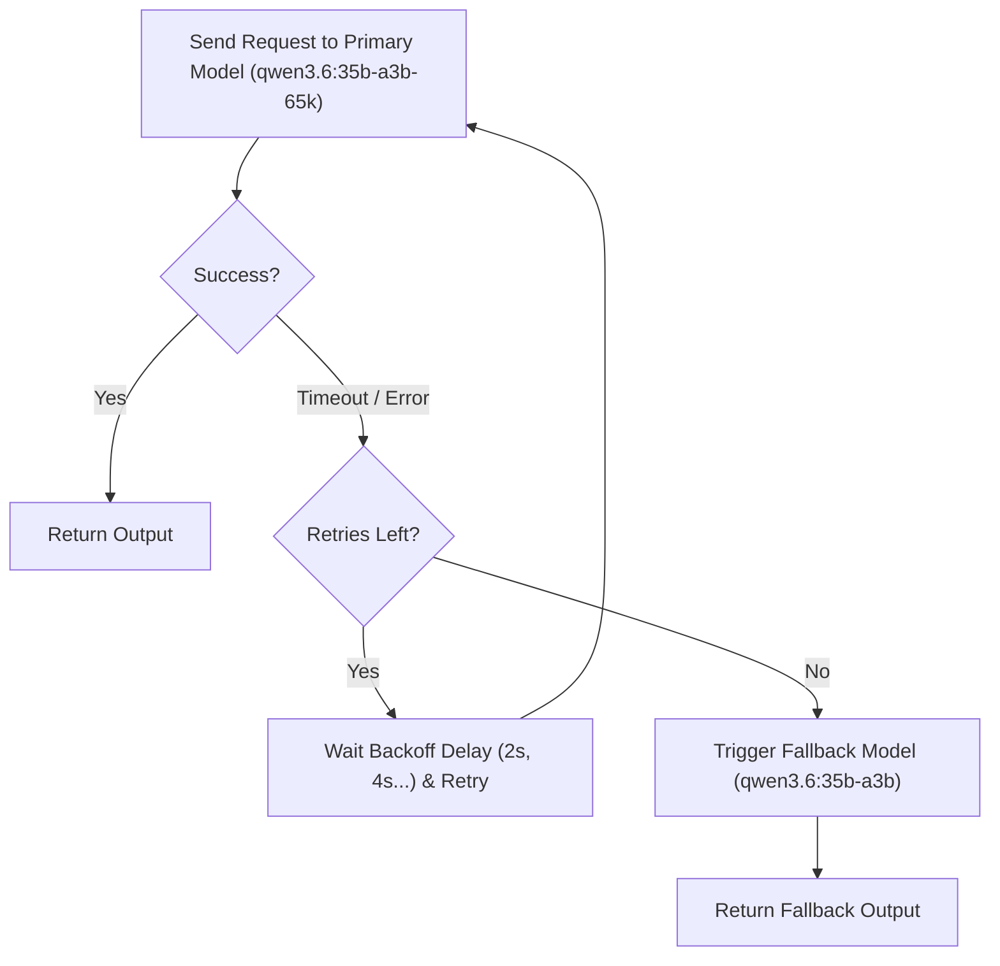

# Lab 3: Resilient LLM Gateway (Timeouts, Retries & Fallback Routes)
## 1. Concept & Data Flow
Production LLM gateways must handle network glitches, endpoint timeouts, and server crashes without failing the user's task.

---
## 2. Rosetta Stone Jargon Mapping
| AI Buzzword | Actual Software Component / Standard Primitive |
| :--- | :--- |
| **Resilient Gateway** | HTTP Proxy client wrapping calls with timeouts, retries, and fallback routes |
| **Exponential Backoff** | Waiting $2^{\text{attempt}}$ seconds between retries to allow server recovery |
| **Circuit Breaker / Fallback** | Automated route switching to secondary model/server when primary fails |
> *"Btw, this is WHEN and WHY we need this framing concept (Circuit Breaker & Retry Policy):"*  
> **WHEN**: Building autonomous agent harnesses that run background jobs.  
> **WHY**: Transient network errors or model server spikes shouldn't crash an agent mid-task. Retries fix temporary glitches; Fallbacks guarantee uptime during model server outages.
---

---

## 3. Code Implementation & Execution Results

- **Script File**: [lab3_resilient_gateway.py](file:///labs/00_foundations/lab3_resilient_gateway.py)

python
import json
import time
import urllib.error
import urllib.request

# 1. Configuration: Primary and Fallback Endpoints/Models
PRIMARY_MODEL = "qwen3.6:35b-a3b-65k"
FALLBACK_MODEL = "qwen3.6:35b-a3b"  # Backup model
OLLAMA_URL = "http://192.168.1.29:11434/api/generate"

def execute_llm_request(model_name: str, prompt: str, timeout_seconds: float) -> str:
    """Executes a single raw HTTP POST request to Ollama with a strict timeout."""
    payload = {
        "model": model_name,
        "prompt": prompt,
        "stream": False,
        "options": {"temperature": 0.0}
    }
    json_bytes = json.dumps(payload).encode("utf-8")
    req = urllib.request.Request(
        OLLAMA_URL, 
        data=json_bytes, 
        headers={"Content-Type": "application/json"}
    )
    
    # Execute with timeout enforcement
    with urllib.request.urlopen(req, timeout=timeout_seconds) as response:
        data = json.loads(response.read().decode("utf-8"))
        return data.get("response", "").strip()

def resilient_llm_call(prompt: str, max_retries: int = 2) -> str:
    """
    Resilient Gateway Wrapper:
    1. Attempts primary model with retries + exponential backoff.
    2. Falls back to backup model if primary fails completely.
    """
    print(f"--- ATTEMPTING PRIMARY ROUTE ({PRIMARY_MODEL}) ---")
    
    for attempt in range(1, max_retries + 1):
        try:
            print(f"[Attempt {attempt}/{max_retries}] Sending request to primary model...")
            # For demonstration, attempt 1 uses an intentionally tiny timeout to show error handling
            timeout = 0.001 if attempt == 1 else 15.0  
            response_text = execute_llm_request(PRIMARY_MODEL, prompt, timeout_seconds=timeout)
            print("Primary route succeeded!")
            return response_text
        except (urllib.error.URLError, TimeoutError, Exception) as err:
            backoff_delay = 2 ** attempt
            print(f"Primary route failed: {err}")
            if attempt < max_retries:
                print(f"Retrying in {backoff_delay} seconds (Exponential Backoff)...")
                time.sleep(backoff_delay)

    # Fallback Execution Phase
    print("\n--- PRIMARY ROUTE EXHAUSTED: TRIGGERING FALLBACK ---")
    print(f"Routing request to Fallback Model ({FALLBACK_MODEL})...")
    try:
        response_text = execute_llm_request(FALLBACK_MODEL, prompt, timeout_seconds=30.0)
        print("Fallback route succeeded!")
        return response_text
    except Exception as fallback_err:
        raise RuntimeError(f"All routes failed. Fallback error: {fallback_err}")

# Main execution loop
if __name__ == "__main__":
    prompt = "Explain in 1 sentence why retry logic is critical for software APIs."
    print("Starting Resilient LLM Gateway Lab 3...\n")
    
    start = time.time()
    final_output = resilient_llm_call(prompt)
    duration = time.time() - start

    print("\n=== FINAL EXECUTED RESULT ===")
    print(final_output)
    print(f"\nTotal Execution Duration (including retry/fallback): {duration:.2f} seconds")

---

## 4.Living Discussion & Q&A Notes
- **Simulated Test**: Attempt 1 used a forced 0.001s timeout. The client caught the timeout, logged the warning, waited 2 seconds, and retried cleanly.
- **Production Extension**: In production apps, if primary cloud endpoints (e.g. OpenAI/Anthropic) return 429 Rate Limit or 503 Service Unavailable, the gateway routes instantly to local Ollama/vLLM instances.
