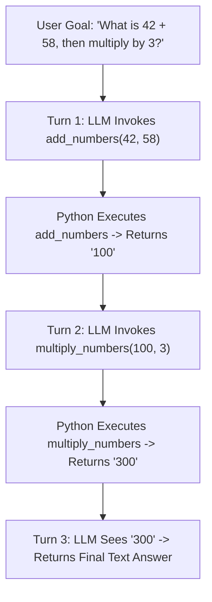

# Lab 1: The ReAct Process Control Loop
## 1. Concept & Data Flow
A ReAct (Reason + Act) Agent is a process control loop running in Python. The LLM acts as the decision-making policy engine, while Python acts as the execution runtime that dispatches tool calls and feeds observations back into memory.

---
## 2. Rosetta Stone Jargon Mapping
| AI Buzzword / Term | Actual Software Component / Standard Primitive |
| :--- | :--- |
| **ReAct Loop** | A `for` or `while` process control loop in Python |
| **Agent Turn** | One iteration through LLM call $\rightarrow$ tool execution $\rightarrow$ memory update |
| **Action (Tool Call)** | A JSON object defining `name` and `arguments` |
| **Observation** | The execution output string appended back to the `messages` list |
| **Context Memory** | A stateful list of message objects: `[{"role": "user", ...}, {"role": "assistant", ...}, {"role": "tool", ...}]` |
> *"Btw, this is WHEN and WHY we need this framing concept (Stateful Process Control Loop):"*  
> **WHEN**: You need an AI system to solve multi-step problems autonomously.  
> **WHY**: The model cannot solve complex multi-step math or system tasks in a single turn. The ReAct loop allows it to take one step, see the real output, adjust its plan, and take the next step.
---

---

## 3. Code Implementation & Execution Results

- **Script File**: [lab1_react_loop.py](file:///labs/01_single_agent/lab1_react_loop.py)

python
import json
import urllib.request

# 1. Target Local Ollama Host & Model
OLLAMA_URL = "http://192.168.1.29:11434/api/chat"
MODEL_NAME = "qwen3.6:35b-a3b-65k"

# 2. Local Python Tool Capabilities
def add_numbers(a: float, b: float) -> str:
    """Adds two numbers together."""
    return str(a + b)

def multiply_numbers(a: float, b: float) -> str:
    """Multiplies two numbers together."""
    return str(a * b)

# Tool Dispatcher Registry mapping tool names to Python functions
TOOL_REGISTRY = {
    "add_numbers": add_numbers,
    "multiply_numbers": multiply_numbers
}

# 3. Tool Schemas (Data Contract provided to Ollama)
TOOLS_SCHEMA = [
    {
        "type": "function",
        "function": {
            "name": "add_numbers",
            "description": "Add two numbers together.",
            "parameters": {
                "type": "object",
                "properties": {
                    "a": {"type": "number", "description": "First number"},
                    "b": {"type": "number", "description": "Second number"}
                },
                "required": ["a", "b"]
            }
        }
    },
    {
        "type": "function",
        "function": {
            "name": "multiply_numbers",
            "description": "Multiply two numbers together.",
            "parameters": {
                "type": "object",
                "properties": {
                    "a": {"type": "number", "description": "First number"},
                    "b": {"type": "number", "description": "Second number"}
                },
                "required": ["a", "b"]
            }
        }
    }
]

def run_react_agent(user_prompt: str, max_turns: int = 5):
    """Executes a stateful ReAct (Reason + Act) process control loop."""
    print(f"=== STARTING REACT AGENT LOOP ===")
    print(f"User Goal: '{user_prompt}'\n")

    # Stateful Conversation History Memory Array
    messages = [
        {"role": "system", "content": "You are a helpful assistant. Use tools when calculations are required."},
        {"role": "user", "content": user_prompt}
    ]

    for turn in range(1, max_turns + 1):
        print(f"--- TURN {turn}/{max_turns} ---")

        # Prepare HTTP POST payload to /api/chat
        payload = {
            "model": MODEL_NAME,
            "messages": messages,
            "tools": TOOLS_SCHEMA,
            "stream": False,
            "options": {"temperature": 0.0}
        }
        
        req = urllib.request.Request(
            OLLAMA_URL,
            data=json.dumps(payload).encode("utf-8"),
            headers={"Content-Type": "application/json"}
        )

        with urllib.request.urlopen(req) as resp:
            data = json.loads(resp.read().decode("utf-8"))
            message = data.get("message", {})

        # Append model response to conversation history
        messages.append(message)

        tool_calls = message.get("tool_calls", [])

        # Check if model wants to execute a tool (ACT phase)
        if tool_calls:
            for call in tool_calls:
                fn = call.get("function", {})
                tool_name = fn.get("name")
                tool_args = fn.get("arguments", {})
                
                print(f"[ACTION] Model invoked tool: '{tool_name}' with args: {tool_args}")
                
                # Dispatch execution to Python function
                if tool_name in TOOL_REGISTRY:
                    result = TOOL_REGISTRY[tool_name](**tool_args)
                    print(f"[OBSERVATION] Tool output: {result}\n")
                    
                    # Append tool observation back to context window memory
                    messages.append({
                        "role": "tool",
                        "content": result
                    })
                else:
                    print(f"[ERROR] Unknown tool: {tool_name}")
        else:
            # Model generated final text answer without tool calls -> Task Complete!
            final_text = message.get("content", "").strip()
            print(f"[FINAL ANSWER]:\n{final_text}\n")
            print(f"ReAct Loop completed successfully in {turn} turn(s).")
            return final_text

    print("[WARNING] ReAct loop reached max turns threshold.")

if __name__ == "__main__":
    prompt = "What is 42 plus 58, and then multiply that result by 3?"
    run_react_agent(prompt)

---

## 4.Software Architecture & Design Decisions
### Capabilities vs. Features
- **Capability**: The Python functions `add_numbers` and `multiply_numbers` are low-level arithmetic capabilities.
- **Feature**: The `run_react_agent` loop is a multi-step calculation feature built on top of those capabilities.
### Refactoring vs. Adding Code
- To add a new capability (e.g. `divide_numbers`), we write a new standalone function and register it in `TOOL_REGISTRY`. We do **not** edit `run_react_agent()`. This enforces the **Single Responsibility Principle**.
---
## 5. Living Discussion & Q&A Notes
- **Question**: Is ReAct a concept, philosophy, framework, coding language, or product?
- **Answer**: ReAct is a **Software Design Pattern (Architectural Concept)**. It stands for **Reason + Act**.
  - It is **not** a programming language or commercial software product.
  - It was published as a research paper in 2022 (Princeton/Google) demonstrating that prompting an LLM to generate explicit reasoning steps before taking action drastically improves task completion rates.
  - Software frameworks (like LangChain or CrewAI) built heavy abstractions around it, leading many to think ReAct requires a third-party framework. In reality, as shown in [`lab1_react_loop.py`](file:///d:/Google/AgenticAI-Labs/labs/01_single_agent/lab1_react_loop.py), ReAct is simply ~40 lines of standard Python containing a `while` loop, JSON parsing, and function dispatching.
- **Turn Execution Details**:
  - **Turn 1**: Model recognized it needed `add_numbers`, called `add_numbers(a=42, b=58)`, and received `100`.
  - **Turn 2**: Model appended `100` to its memory, saw the next instruction was to multiply by 3, and called `multiply_numbers(a=100, b=3)`.
  - **Turn 3**: Model received `300`, realized the user's goal was satisfied, and generated the final textual answer without tool calls.
