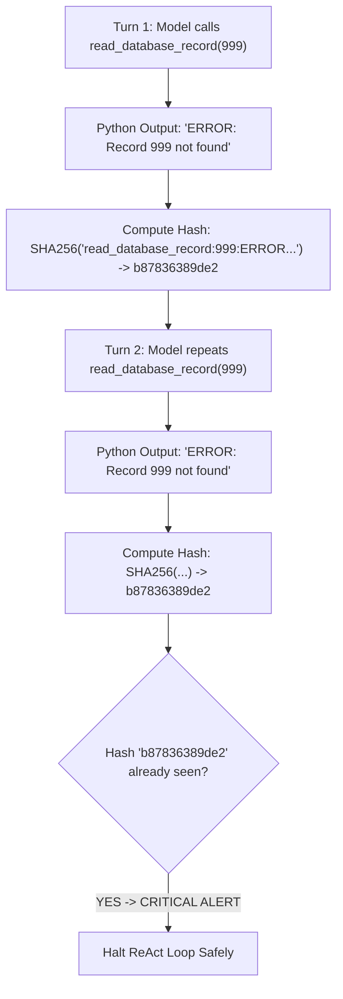

# Lab 2: Trajectory Hashing & Infinite Loop Protection
## 1. Concept & Data Flow
When LLMs encounter errors or failing tools, they can get trapped in repetitive infinite loops (calling the exact same tool with the exact same inputs repeatedly). **Trajectory Hashing** converts each turn's tool execution into a unique digital fingerprint (SHA-256 hash). If the fingerprint repeats consecutively, the harness safely halts execution.

---
## 2. Rosetta Stone Jargon Mapping
| AI Buzzword | Actual Software Component / Standard Primitive |
| :--- | :--- |
| **Cycle Detection** | Stateful array tracking duplicate turn hashes to stop infinite `while` loops |
| **Trajectory Hashing** | Cryptographic hash function (`hashlib.sha256()`) encoding `tool_name + args + output` |
| **Runaway Prevention** | Subprocess termination condition overriding LLM control |
> *"Btw, this is WHEN and WHY we need this framing concept (Cycle Detection / Trajectory Hashing):"*  
> **WHEN**: Any production agent that executes bash scripts, edits code, or calls external APIs.  
> **WHY**: Non-deterministic LLMs can hallucinate repetitive action loops. Trajectory hashing provides a deterministic mathematical fallback that forces the loop to terminate cleanly instead of wasting tokens and compute.
---

---

## 3. Code Implementation & Execution Results

- **Script File**: [lab2_cycle_detection.py](file:///labs/01_single_agent/lab2_cycle_detection.py)

python
import hashlib
import json
import urllib.request

OLLAMA_URL = "http://192.168.1.29:11434/api/chat"
MODEL_NAME = "qwen3.6:35b-a3b-65k"

# 1. Capability: A tool that returns an error when record is missing
def read_database_record(record_id: int) -> str:
    """Reads a database record by ID."""
    if record_id == 999:
        return "ERROR: Record 999 not found in table 'users'."
    return f"Data for record {record_id}: User Active."

TOOL_REGISTRY = {"read_database_record": read_database_record}

TOOLS_SCHEMA = [{
    "type": "function",
    "function": {
        "name": "read_database_record",
        "description": "Fetch user database record by ID.",
        "parameters": {
            "type": "object",
            "properties": {"record_id": {"type": "integer"}},
            "required": ["record_id"]
        }
    }
}]

def compute_step_hash(tool_name: str, tool_args: dict, tool_output: str) -> str:
    """Generates a unique SHA-256 fingerprint of a single tool execution step."""
    serialized = f"{tool_name}:{json.dumps(tool_args, sort_keys=True)}:{tool_output}"
    return hashlib.sha256(serialized.encode("utf-8")).hexdigest()

def run_loop_with_cycle_detection(user_prompt: str, max_turns: int = 5):
    print("=== STARTING REACT AGENT WITH TRAJECTORY HASHING ===")
    print(f"Goal: '{user_prompt}'\n")

    messages = [
        {"role": "system", "content": "You are a database assistant. Use tools to look up records."},
        {"role": "user", "content": user_prompt}
    ]

    # Trajectory Hashing Memory
    seen_hashes = []

    for turn in range(1, max_turns + 1):
        print(f"--- TURN {turn}/{max_turns} ---")

        payload = {
            "model": MODEL_NAME,
            "messages": messages,
            "tools": TOOLS_SCHEMA,
            "stream": False,
            "options": {"temperature": 0.0}
        }

        req = urllib.request.Request(
            OLLAMA_URL,
            data=json.dumps(payload).encode("utf-8"),
            headers={"Content-Type": "application/json"}
        )

        with urllib.request.urlopen(req) as resp:
            data = json.loads(resp.read().decode("utf-8"))
            message = data.get("message", {})

        messages.append(message)
        tool_calls = message.get("tool_calls", [])

        if tool_calls:
            for call in tool_calls:
                fn = call.get("function", {})
                tool_name = fn.get("name")
                tool_args = fn.get("arguments", {})
                
                print(f"[ACTION] Invoking: {tool_name}({tool_args})")
                
                if tool_name in TOOL_REGISTRY:
                    result = TOOL_REGISTRY[tool_name](**tool_args)
                    print(f"[OBSERVATION] Output: {result}")

                    # Compute digital fingerprint of this step
                    step_hash = compute_step_hash(tool_name, tool_args, result)
                    print(f"[TRAJECTORY HASH] SHA-256: {step_hash[:12]}...")

                    # CYCLE DETECTION CHECK
                    if step_hash in seen_hashes:
                        print(f"\n[CRITICAL ALERT] INFINITE LOOP DETECTED!")
                        print(f"Step hash {step_hash[:12]}... was repeated consecutively.")
                        print("Terminating ReAct loop safely to prevent infinite execution cycle.")
                        return "HALTED_BY_CYCLE_DETECTOR"
                    
                    seen_hashes.append(step_hash)
                    messages.append({"role": "tool", "content": result})
        else:
            final_text = message.get("content", "").strip()
            print(f"\n[FINAL ANSWER]: {final_text}")
            return final_text

    print("[WARNING] ReAct loop reached max turns limit.")

if __name__ == "__main__":
    # Prompting to fetch a missing record to observe cycle behavior
    run_loop_with_cycle_detection("Fetch user record 999. If it fails, try fetching record 999 again.")


---

## 4.Software Architecture & Design Decisions
### Capabilities vs. Features
- **Capability**: Cryptographic SHA-256 hashing (`compute_step_hash`).
- **Feature**: Harness Cycle Detector (`seen_hashes` checking loop guard).
### Refactoring vs. Adding Code
- We added `seen_hashes` state tracking directly to the ReAct loop without altering `TOOL_REGISTRY` or `read_database_record()`. The tool capability remains decoupled from the harness safety rules.
---
## 5. Living Discussion & Q&A Notes
- **How Hashing Works**:
  ````
`python
  serialized = f"{tool_name}:{json.dumps(tool_args, sort_keys=True)}:{tool_output}"
  step_hash = hashlib.sha256(serialized.encode("utf-8")).hexdigest()
  ```
- **Cycle Recovery Options in Production**:
  Instead of halting execution immediately, enterprise harnesses can inject a system warning message back into the context window: *"WARNING: You have attempted this exact tool call twice and it failed. Choose a different tool or report failure."*
