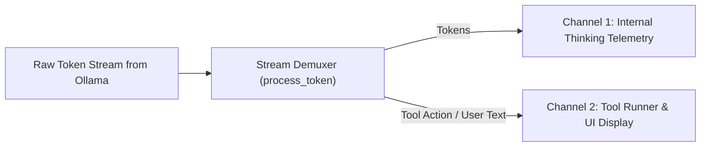

# Lab 3: Reasoning Token Demuxing (Stream Separation)
## 1. Concept & Data Flow
Modern reasoning models (e.g. `qwen3.6`, `deepseek-r1`, `o1`, `o3`) generate two types of tokens during a turn:
1. **Internal Chain-of-Thought (Thinking Tokens)**: Planning steps enclosed in `<think>...</think>` tags or hidden telemetry fields.
2. **External Content / Tool Actions**: User-facing text answers or JSON tool call payloads.
**Demuxing** (Demultiplexing) parses the incoming token stream and routes thinking tokens to backend telemetry logs while routing content/tool tokens to the UI and tool dispatcher.

---
## 2. Rosetta Stone Jargon Mapping
| AI Buzzword | Actual Software Component / Standard Primitive |
| :--- | :--- |
| **Stream Demuxing** | Data stream demultiplexer splitting a single socket input into multiple output channels |
| **Reasoning Tokens (CoT)** | Hidden token buffer logged internally for audit trails |
| **Action Stream** | Filtered token stream containing only executable JSON payloads or final answer text |
> *"Btw, this is WHEN and WHY we need this framing concept (Stream Demuxing / Telemetry Separation):"*  
> **WHEN**: Working with reasoning models (Qwen 3.6, DeepSeek-R1) that output thinking tokens.  
> **WHY**: You don't want internal thinking text cluttering tool execution payloads or polluting user UI widgets. Demuxing keeps telemetry clean and separate from tool invocation logic.
---

---

## 3. Code Implementation & Execution Results

- **Script File**: [lab3_reasoning_demux.py](file:///labs/01_single_agent/lab3_reasoning_demux.py)

python
import json
import re
import urllib.request

OLLAMA_URL = "http://192.168.1.29:11434/api/generate"
MODEL_NAME = "qwen3.6:35b-a3b-65k"

class StreamDemuxer:
    """
    Stream Demuxer (Demultiplexer):
    Splits incoming token stream into two separate outputs:
    1. Thinking Stream -> Telemetry Log
    2. Content/Action Stream -> Console Output / Tool Dispatcher
    """
    def __init__(self):
        self.in_think_block = False
        self.think_buffer = []
        self.content_buffer = []

    def process_token(self, token: str):
        # Check for start of reasoning block <think>
        if "<think>" in token:
            self.in_think_block = True
            token = token.replace("<think>", "")
        
        # Check for end of reasoning block </think>
        if "</think>" in token:
            parts = token.split("</think>")
            self.think_buffer.append(parts[0])
            self.in_think_block = False
            token = parts[1] if len(parts) > 1 else ""

        # Route token to correct output channel
        if self.in_think_block:
            self.think_buffer.append(token)
            # Channel 1: Internal Thinking Telemetry Stream
            print(f"\033[90m[THINK STREAM] {token}\033[0m", end="", flush=True)
        else:
            if token:
                self.content_buffer.append(token)
                # Channel 2: Action / User Content Stream
                print(f"\033[92m[CONTENT STREAM] {token}\033[0m", end="", flush=True)

def run_demux_lab():
    print("=== STARTING REASONING TOKEN DEMUXER LAB ===")
    print(f"Model: {MODEL_NAME}\n")

    payload = {
        "model": MODEL_NAME,
        "prompt": "Analyze why token demuxing is essential for AI harnesses in 2 short bullet points.",
        "stream": True,
        "options": {"temperature": 0.0}
    }

    json_bytes = json.dumps(payload).encode("utf-8")
    req = urllib.request.Request(
        OLLAMA_URL,
        data=json_bytes,
        headers={"Content-Type": "application/json"}
    )

    demuxer = StreamDemuxer()

    with urllib.request.urlopen(req) as resp:
        for line in resp:
            if not line:
                continue
            chunk = json.loads(line.decode("utf-8"))
            token = chunk.get("response", "")
            demuxer.process_token(token)

    print("\n\n=== DEMUXED SUMMARY ===")
    print(f"Captured Thinking Tokens (Length): {len(''.join(demuxer.think_buffer))} chars")
    print(f"Captured Content Tokens (Length) : {len(''.join(demuxer.content_buffer))} chars")

if __name__ == "__main__":
    run_demux_lab()


---

## 4.Software Architecture & Design Decisions
### Capabilities vs. Features
- **Capability**: Stream parser state machine (`StreamDemuxer` tracking `in_think_block`).
- **Feature**: Live terminal output router splitting text into color-coded streams (`[THINK STREAM]` vs `[CONTENT STREAM]`).
### Refactoring vs. Adding Code
- Demuxing is implemented as an independent parser class. It wraps around any raw HTTP stream reader without requiring changes to the underlying LLM client or tool dispatcher.
---
## 5. Living Discussion & Q&A Notes
- **Stream Demuxing WHEN & WHY Takeaway**:
  - **WHEN**: Any time you build an agent harness using reasoning models (e.g., `qwen3.6`, `deepseek-r1`, `o1`, `o3`) that output internal Chain-of-Thought thinking tokens (`<think>...</think>`).
  - **WHY**:
    1. **Prevents Tool Syntax Crashes**: If internal thinking tokens leak into a JSON tool call argument (e.g. inside a bash command string), the JSON parser or tool execution will fail. Demuxing strips thinking tokens before passing data to the tool dispatcher.
    2. **Keeps User Interface Clean**: Users expect clean, formatted answers or status badges, not raw unformatted scratchpad notes cluttering their screen.
    3. **Enables Developer Observability**: Developers still need to inspect *how* the model reasoned. Demuxing routes internal thinking tokens to a background log file (`telemetry.log`) for debugging without polluting the user UI or tool execution pipeline.
- **Parsing Logic**:
  ````
`python
  if "<think>" in token:
      self.in_think_block = True
  if "</think>" in token:
      self.in_think_block = False
  ```
- **Harness Telemetry Integration**: In production AI apps (Claude Code, Hermes), `think_buffer` is saved to an OpenTelemetry log file for developer debugging, while `content_buffer` is streamed over WebSockets to the user interface.
