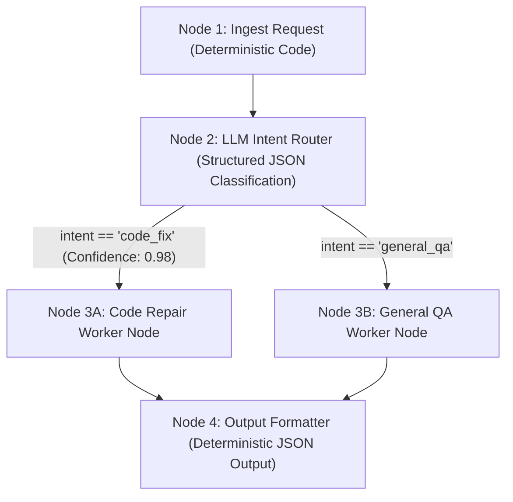

# Lab 1: Deterministic DAG Pipelines & LLM Router Nodes
## 1. Concept & Data Flow
A **Directed Acyclic Graph (DAG) Pipeline** structures multi-step AI workflows into a hardcoded topological execution chain ($Node_1 \rightarrow Node_2 \rightarrow Node_3 \rightarrow Node_4$). 
Deterministic Python code handles data ingestion and output formatting, while the LLM is restricted strictly to high-ambiguity decision nodes (like intent classification).

---
## 2. Rosetta Stone Jargon Mapping
| AI Buzzword | Actual Software Component / Standard Primitive |
| :--- | :--- |
| **DAG Engine** | Topological workflow pipeline runner executing nodes in guaranteed sequence |
| **Router Node** | A software `switch` / `if/else` block evaluated against validated LLM JSON |
| **Schema Contract** | Boundary validation (`json.loads()`) catching malformed LLM responses |
| **Fallback Cascade** | Exception block redirecting to a safe default node if model call fails |
> *"Btw, this is WHEN and WHY we need this framing concept (Directed Acyclic Graph / DAG Pipeline):"*  
> **WHEN**: Enterprise software tasks where execution steps must happen in a strict, audited sequence (e.g., Ingest $\rightarrow$ Classify $\rightarrow$ Process $\rightarrow$ Format).  
> **WHY**: Single-agent ReAct loops can drift or skip steps. A DAG forces predictable topological execution while using the LLM only where fuzzy decision-making is needed.
---

---

## 3. Code Implementation & Execution Results

- **Script File**: [lab1_dag_pipeline.py](file:///labs/02_orchestration/lab1_dag_pipeline.py)

python
import json
import time
import urllib.request
from typing import Dict, Any

OLLAMA_URL = "http://192.168.1.29:11434/api/generate"
MODEL_NAME = "qwen3.6:35b-a3b-65k"

# --- NODE 1: Ingestion (Deterministic Code) ---
def node_ingest_request(raw_user_input: str) -> Dict[str, Any]:
    print("[NODE 1: INGESTION] Normalizing input payload...")
    return {
        "raw_input": raw_user_input,
        "timestamp": time.time(),
        "status": "INGESTED"
    }

# --- NODE 2: LLM Intent Router (Structured JSON Node) ---
def node_route_intent(state: Dict[str, Any]) -> Dict[str, Any]:
    print("[NODE 2: LLM ROUTER] Classifying user intent via Ollama...")
    
    prompt = f"""You are a strict JSON classifier.
Analyze the following user input and return ONLY a raw JSON object (no markdown formatting, no extra text):
{{"intent": "code_fix" OR "general_qa", "confidence": 0.0 to 1.0}}

User Input: "{state['raw_input']}"
"""
    payload = {
        "model": MODEL_NAME,
        "prompt": prompt,
        "stream": False,
        "options": {"temperature": 0.0}
    }
    
    json_bytes = json.dumps(payload).encode("utf-8")
    req = urllib.request.Request(
        OLLAMA_URL, data=json_bytes, headers={"Content-Type": "application/json"}
    )
    
    try:
        with urllib.request.urlopen(req) as resp:
            data = json.loads(resp.read().decode("utf-8"))
            raw_text = data.get("response", "").strip()
            
            # Clean possible markdown wrapping
            if raw_text.startswith("```json"):
                raw_text = raw_text.replace("```json", "").replace("```", "").strip()
            
            # Schema Validation Boundary
            parsed = json.loads(raw_text)
            intent = parsed.get("intent", "general_qa")
            confidence = parsed.get("confidence", 0.5)
            
            print(f"[NODE 2: LLM ROUTER] Classified Intent: '{intent}' (Confidence: {confidence:.2f})")
            state["intent"] = intent
            state["confidence"] = confidence
            return state
            
    except Exception as err:
        print(f"[NODE 2: FALLBACK CASCADE] Routing failed ({err}). Falling back to 'general_qa'")
        state["intent"] = "general_qa"
        state["confidence"] = 0.0
        return state

# --- NODE 3A & 3B: Specialized Branch Workers ---
def node_worker_code_fix(state: Dict[str, Any]) -> Dict[str, Any]:
    print("[NODE 3A: CODE WORKER] Executing specialized code-repair pipeline...")
    state["worker_output"] = f"Generated code patch stub for query: '{state['raw_input']}'"
    return state

def node_worker_general_qa(state: Dict[str, Any]) -> Dict[str, Any]:
    print("[NODE 3B: QA WORKER] Executing general Q&A pipeline...")
    state["worker_output"] = f"Retrieved answer response for query: '{state['raw_input']}'"
    return state

# --- NODE 4: Output Formatter (Deterministic Code) ---
def node_format_output(state: Dict[str, Any]) -> Dict[str, Any]:
    print("[NODE 4: FORMATTER] Compiling final pipeline summary payload...")
    state["final_payload"] = {
        "status": "COMPLETED",
        "processed_intent": state["intent"],
        "result": state["worker_output"],
        "pipeline_duration_seconds": round(time.time() - state["timestamp"], 2)
    }
    return state

# --- DETERMINISTIC DAG PIPELINE RUNNER ---
def run_dag_pipeline(user_prompt: str):
    print("=== STARTING DETERMINISTIC DAG PIPELINE ENGINE ===")
    print(f"User Request: '{user_prompt}'\n")
    
    # Topological Execution Chain: Node 1 -> Node 2 -> (Node 3A or 3B) -> Node 4
    state = node_ingest_request(user_prompt)
    state = node_route_intent(state)
    
    # Conditional Branch Dispatch
    if state["intent"] == "code_fix":
        state = node_worker_code_fix(state)
    else:
        state = node_worker_general_qa(state)
        
    state = node_format_output(state)
    
    print("\n=== PIPELINE EXECUTION SUCCESSFUL ===")
    print(json.dumps(state["final_payload"], indent=2))
    return state

if __name__ == "__main__":
    test_prompt = "Fix the syntax error on line 42 in main.py where a closing parenthesis is missing."
    run_dag_pipeline(test_prompt)


---

## 4.Software Architecture & Design Decisions
### Capabilities vs. Features
- **Capability**: Node 1 (Ingestion) and Node 4 (Formatting) are static deterministic processing capabilities.
- **Feature**: The DAG Pipeline Engine (`run_dag_pipeline`) orchestrates multi-step classification, branching, and execution into a complete vertical slice.
### Refactoring vs. Adding Code
- To add a new intent branch (e.g. `"database_query"`), we create a new `node_worker_db_query()` function and add a branch condition in Node 3. The ingestion and formatting nodes remain untouched.
---
## 5. Living Discussion & Q&A Notes
- **Boundary Validation**:
  ````
`python
  parsed = json.loads(raw_text)
  intent = parsed.get("intent", "general_qa")
  ```
  If Ollama returns invalid JSON or fails, the `except` block catches the exception and falls back safely to `"general_qa"`, preventing the pipeline from crashing.
