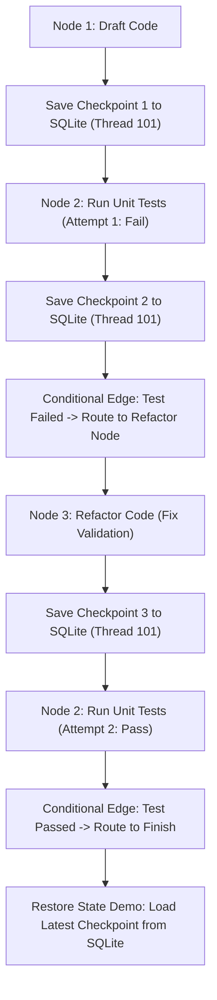

# Lab 2: Stateful Graph Workflows & SQLite Checkpointing
## 1. Concept & Data Flow
Graph-based workflow engines (like LangGraph or XState) structure agent execution as a state machine. Unlike linear DAGs, state graphs allow **cyclic loops** (Draft $\rightarrow$ Test $\rightarrow$ Refactor $\rightarrow$ Test) and commit a **persistent state checkpoint** to a database (SQLite/PostgreSQL) after every single node execution step.

---
## 2. Rosetta Stone Jargon Mapping
| AI Buzzword | Actual Software Component / Standard Primitive |
| :--- | :--- |
| **State Graph** | Finite State Machine (FSM) maintaining a shared state dictionary |
| **Conditional Edge** | Pure Python function evaluating state attributes to return target node name |
| **Checkpointer** | Database snapshot serializer (`json.dumps()`) committing state dicts to SQLite/Postgres |
| **Fault Tolerance / Resume** | Reloading state by `thread_id` to continue execution after app restarts |
> *"Btw, this is WHEN and WHY we need this framing concept (State Checkpointing / Persistence):"*  
> **WHEN**: Multi-step agent tasks that take time, run asynchronously in the background, or require human review before executing irreversible side-effects.  
> **WHY**: Without checkpointing, if the app crashes or container restarts mid-task, all progress is lost. With SQLite checkpointing, every transition is saved to disk so the agent can resume instantly from where it left off.
---

---

## 3. Code Implementation & Execution Results

- **Script File**: [lab2_state_checkpointer.py](file:///labs/02_orchestration/lab2_state_checkpointer.py)

python
import json
import os
import sqlite3
import time

DB_PATH = "labs/02_orchestration/checkpoints.db"

# 1. Zero-Magic SQLite State Checkpointer Engine
def init_sqlite_checkpointer():
    """Initializes SQLite database table for state snapshot persistence."""
    os.makedirs(os.path.dirname(DB_PATH), exist_ok=True)
    conn = sqlite3.connect(DB_PATH)
    cursor = conn.cursor()
    cursor.execute("""
        CREATE TABLE IF NOT EXISTS checkpoints (
            thread_id TEXT,
            step_name TEXT,
            checkpoint_id INTEGER PRIMARY KEY AUTOINCREMENT,
            state_data TEXT,
            timestamp REAL
        )
    """)
    conn.commit()
    conn.close()

def save_checkpoint(thread_id: str, step_name: str, state: dict):
    """Commits a JSON state snapshot to SQLite database."""
    conn = sqlite3.connect(DB_PATH)
    cursor = conn.cursor()
    cursor.execute(
        "INSERT INTO checkpoints (thread_id, step_name, state_data, timestamp) VALUES (?, ?, ?, ?)",
        (thread_id, step_name, json.dumps(state), time.time())
    )
    conn.commit()
    conn.close()
    print(f"  [CHECKPOINT SAVED] Thread '{thread_id}' | Step '{step_name}' committed to SQLite.")

def load_latest_checkpoint(thread_id: str) -> dict:
    """Loads the most recent state snapshot from SQLite for a given thread_id."""
    conn = sqlite3.connect(DB_PATH)
    cursor = conn.cursor()
    cursor.execute(
        "SELECT step_name, state_data FROM checkpoints WHERE thread_id = ? ORDER BY checkpoint_id DESC LIMIT 1",
        (thread_id,)
    )
    row = cursor.fetchone()
    conn.close()
    if row:
        step_name, state_data = row
        print(f"  [CHECKPOINT LOADED] Resuming Thread '{thread_id}' from Step '{step_name}'.")
        return json.loads(state_data)
    return {}

# 2. Graph State Machine Nodes
def node_draft_code(state: dict) -> dict:
    print("\n[NODE: DRAFT CODE] Writing initial code implementation...")
    state["code"] = "def calculate_total(price, tax): return price + tax"
    state["test_passed"] = False
    return state

def node_run_tests(state: dict) -> dict:
    print("[NODE: RUN TESTS] Executing unit tests against code...")
    state["attempts"] = state.get("attempts", 0) + 1
    
    # Simulate test failure on Attempt 1, pass on Attempt 2
    if state["attempts"] < 2:
        print("  [FAIL] Tests Failed: Missing parameter validation.")
        state["test_passed"] = False
    else:
        print("  [PASS] Tests Passed: Code meets requirements!")
        state["test_passed"] = True
    return state


def node_refactor_code(state: dict) -> dict:
    print("[NODE: REFACTOR CODE] Refactoring code based on test failure feedback...")
    state["code"] = "def calculate_total(price, tax):\n    if price < 0: raise ValueError()\n    return price + tax"
    return state

# 3. State Graph Runner with SQLite Persistence & Cyclic Loop
def run_stateful_graph(thread_id: str, max_retries: int = 3):
    print(f"=== STARTING STATEFUL GRAPH WORKFLOW (Thread: {thread_id}) ===")
    init_sqlite_checkpointer()

    # Step 1: Draft Code Node
    state = {"code": "", "attempts": 0, "test_passed": False}
    state = node_draft_code(state)
    save_checkpoint(thread_id, "draft_code", state)

    # Cyclic Loop: Run Tests -> (Passed? Finish : Refactor & Loop)
    while state["attempts"] < max_retries:
        state = node_run_tests(state)
        save_checkpoint(thread_id, f"run_tests_attempt_{state['attempts']}", state)

        # Conditional Edge Evaluator
        if state["test_passed"]:
            print("\n[CONDITIONAL EDGE] Tests Passed! Transitioning to Publish Node.")
            break
        else:
            print("[CONDITIONAL EDGE] Tests Failed! Transitioning to Refactor Node (Looping Back).\n")
            state = node_refactor_code(state)
            save_checkpoint(thread_id, f"refactor_attempt_{state['attempts']}", state)

    print("\n=== FINAL PERSISTED WORKFLOW STATE ===")
    print(json.dumps(state, indent=2))
    return state

if __name__ == "__main__":
    thread = "task_session_101"
    run_stateful_graph(thread)
    
    print("\n--- FAULT-TOLERANCE DEMO: RESTORING FROM SQLITE CHECKPOINT ---")
    restored_state = load_latest_checkpoint(thread)
    print(f"Restored Code:\n{restored_state.get('code')}")


---

## 4.Software Architecture & Design Decisions
### Capabilities vs. Features
- **Capability**: SQLite Checkpointer (`save_checkpoint` / `load_latest_checkpoint`).
- **Feature**: The Stateful Refactoring Loop (`run_stateful_graph`) that uses checkpointer snapshots to survive crashes and drive cyclic transitions.
### Refactoring vs. Adding Code
- The checkpointer is an independent storage module (`init_sqlite_checkpointer()`). It can be attached to any graph node without altering the node's internal business logic.
---
## 5. Living Discussion & Q&A Notes
- **SQLite Schema Contract**:
  ```sql
  CREATE TABLE checkpoints (
      thread_id TEXT,
      step_name TEXT,
      checkpoint_id INTEGER PRIMARY KEY AUTOINCREMENT,
      state_data TEXT,
      timestamp REAL
  )
  ```
- **Windows Terminal Fix**: Replaced Unicode emoji characters with `[FAIL]` and `[PASS]` tags to ensure compatibility with Windows console `cp1252` encoding.
