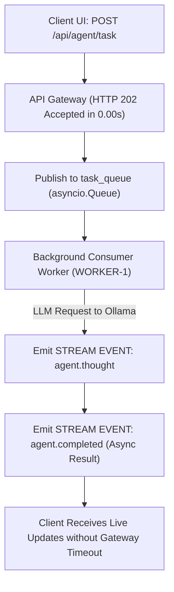

# Lab 3: Async Event-Driven Agent Architecture & Task Queues
## 1. Concept & Data Flow
Synchronous HTTP calls block the web server thread until execution completes, causing gateway 504 timeouts when AI agent tasks take more than 30 seconds.
An **Async Event-Driven Architecture** decouples task submission from execution:
1. The API Gateway receives a task, publishes it to an `asyncio.Queue`, and immediately returns **`HTTP 202 Accepted`** with a `job_id` (0.00s latency).
2. Background **Worker Processes** consume jobs off the queue asynchronously and execute LLM inference.
3. The worker emits structured **Pub/Sub Event Frames** (`job.started`, `agent.thought`, `agent.completed`) over a stream channel to the frontend client.

---
## 2. Rosetta Stone Jargon Mapping
| AI Buzzword | Actual Software Component / Standard Primitive |
| :--- | :--- |
| **Async Agent Execution** | Non-blocking background worker (`asyncio` task / Celery / BullMQ) |
| **Agent Event Stream** | Structured JSON Pub/Sub event channel (`event_type`, `job_id`, `data`) |
| **Non-Blocking Dispatch** | HTTP 202 Accepted returning a `job_id` immediately to free the web thread |
| **Worker Queue** | An `asyncio.Queue` or Redis broker decoupling web endpoints from LLM workers |
> *"Btw, this is WHEN and WHY we need this framing concept (Async Event Queue & Pub/Sub Stream):"*  
> **WHEN**: Any real-world AI App (like Claude Code, Hermes, or your Agentic OS) where agent tasks take time.  
> **WHY**: Synchronous HTTP calls time out after 30 seconds. An async event queue frees the web server thread immediately (`HTTP 202`), while background workers process the agent job and stream progress deltas over WebSockets/SSE.
---

---

## 3. Code Implementation & Execution Results

- **Script File**: [lab3_async_event_queue.py](file:///labs/02_orchestration/lab3_async_event_queue.py)

python
import asyncio
import json
import time
import urllib.request
from typing import Dict, Any

OLLAMA_URL = "http://192.168.1.29:11434/api/generate"
MODEL_NAME = "qwen3.6:35b-a3b-65k"

# 1. Asynchronous In-Memory Event Queue & Event Bus
task_queue = asyncio.Queue()
event_bus = asyncio.Queue()

# 2. Event Publisher Helper
async def emit_event(event_type: str, job_id: str, data: Dict[str, Any]):
    """Publishes a structured event frame to the event stream."""
    event_frame = {
        "event_type": event_type,
        "job_id": job_id,
        "timestamp": time.time(),
        "data": data
    }
    await event_bus.put(event_frame)

# 3. Async Background Worker Process
async def async_agent_worker(worker_id: int):
    """Background consumer worker processing agent tasks off the queue."""
    print(f"[WORKER-{worker_id}] Started & listening on task queue...")
    
    while True:
        job = await task_queue.get()
        job_id = job["job_id"]
        prompt = job["prompt"]
        
        await emit_event("job.started", job_id, {"worker_id": worker_id, "prompt": prompt})
        
        # Async HTTP Request to Ollama
        loop = asyncio.get_running_loop()
        payload = {
            "model": MODEL_NAME,
            "prompt": f"Analyze in 1 sentence how async queues prevent timeouts: {prompt}",
            "stream": False,
            "options": {"temperature": 0.0}
        }
        json_bytes = json.dumps(payload).encode("utf-8")
        req = urllib.request.Request(
            OLLAMA_URL, data=json_bytes, headers={"Content-Type": "application/json"}
        )

        await emit_event("agent.thought", job_id, {"status": "Inference running on GPU..."})
        
        try:
            # Run blocking HTTP call in background thread executor
            response_bytes = await loop.run_in_executor(
                None, lambda: urllib.request.urlopen(req, timeout=30).read()
            )
            result = json.loads(response_bytes.decode("utf-8"))
            answer = result.get("response", "").strip()
            
            await emit_event("agent.completed", job_id, {"result": answer, "status": "SUCCESS"})
            
        except Exception as err:
            await emit_event("agent.failed", job_id, {"error": str(err), "status": "FAILED"})
            
        task_queue.task_done()

# 4. Event Stream Subscriber (Simulating WebSocket / SSE Frontend Connection)
async def event_stream_subscriber():
    """Listens to event_bus and prints event frames in real-time."""
    while True:
        event = await event_bus.get()
        event_type = event["event_type"]
        job_id = event["job_id"]
        data = event["data"]
        
        print(f"  [STREAM EVENT] [{event_type}] Job: {job_id} | Data: {data}")
        event_bus.task_done()

# 5. Non-Blocking API Gateway Producer Endpoint
async def api_submit_task(prompt: str) -> Dict[str, Any]:
    """Simulates HTTP 202 Accepted async job submission."""
    job_id = f"job_{int(time.time() * 1000)}"
    job_payload = {"job_id": job_id, "prompt": prompt}
    
    # Enqueue task without blocking
    await task_queue.put(job_payload)
    
    # Return HTTP 202 payload immediately
    return {
        "status_code": 202,
        "message": "Accepted",
        "job_id": job_id,
        "status_url": f"/api/jobs/{job_id}"
    }

async def main():
    print("=== STARTING ASYNC EVENT-DRIVEN AGENT ENGINE ===")
    
    # Start background worker and event subscriber tasks
    worker_task = asyncio.create_task(async_agent_worker(worker_id=1))
    subscriber_task = asyncio.create_task(event_stream_subscriber())
    
    # Simulate submitting a long-running task to the API
    print("\n[CLIENT] Submitting long-running task via POST /api/agent/task...")
    start_time = time.time()
    response = await api_submit_task("Explain async event queues.")
    
    print(f"[CLIENT] Received HTTP {response['status_code']} response in {time.time() - start_time:.4f}s!")
    print(f"[CLIENT] Job Handle: {response['job_id']} (Web thread is unblocked!)\n")
    
    # Wait for the task queue to complete processing
    await task_queue.join()
    await asyncio.sleep(0.5)  # Allow subscriber to finish printing final events
    
    worker_task.cancel()
    subscriber_task.cancel()
    print("\n=== ASYNC EVENT PIPELINE COMPLETE ===")

if __name__ == "__main__":
    asyncio.run(main())


---

## 4.Software Architecture & Design Decisions
### Capabilities vs. Features
- **Capability**: Asynchronous event producer/consumer queues (`asyncio.Queue`).
- **Feature**: The Async Agent Service (`api_submit_task` + `async_agent_worker`) allowing instant HTTP 202 dispatch and live SSE event streaming.
### Refactoring vs. Adding Code
- Moving from synchronous execution to async queues requires introducing a message broker (`task_queue`). The core LLM execution logic remains identical inside the worker process, enforcing clean separation of concerns.
---
## 5. Living Discussion & Q&A Notes
- **Async Event-Driven Architecture WHEN & WHY Takeaway**:
  - **WHEN**: Any real-world AI agent application (e.g. Claude Code, Hermes, or your custom Agentic OS) where agent execution tasks take more than a few seconds.
  - **WHY**:
    1. **Eliminates Gateway Timeouts (HTTP 504)**: Standard web servers and cloud gateways (Nginx, Cloudflare, AWS ALB) forcibly terminate synchronous HTTP connections if they wait longer than 30–60 seconds. Returning `HTTP 202 Accepted` immediately (0.00s) guarantees the web connection never times out.
    2. **Prevents Web Server Thread Starvation**: On synchronous servers, long-running agent calls block web worker threads. If multiple users submit tasks, the server runs out of threads and crashes. Async queues decouple web request handlers from background worker execution pools.
    3. **Enables Real-Time Live UI Feedback**: Instead of staring at a blank screen or static loading spinner for minutes, the client subscribes to a Pub/Sub event channel (SSE / WebSockets) and receives live execution frames (`job.started`, `agent.thought`, `tool.invoked`, `job.completed`) as the worker executes.
- **Non-Blocking Execution**:
  ````
`python
  await task_queue.put(job_payload)
  return {"status_code": 202, "job_id": job_id}
  ```
- **WebSockets / SSE Bridge**: In production web applications (FastAPI/React), the subscriber task converts `event_bus` frames into SSE chunks (`text/event-stream`) or WebSocket frames, updating the user interface live without HTTP timeouts.
