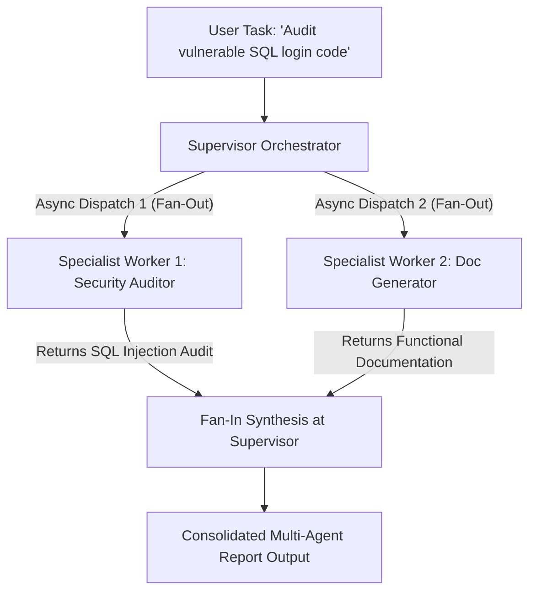

# Lab 1: Multi-Agent Topologies (Supervisor-Worker / Hub-and-Spoke)
## 1. Concept & Data Flow
In complex enterprise applications, assigning every task to a single monolithic agent with an enormous prompt leads to context window saturation, high latency, and instruction drift.
A **Supervisor-Worker (Hub-and-Spoke) Topology** decomposes complex goals across specialized worker instances:
1. **Supervisor (Hub)**: Receives high-level user intent, breaks it into atomic sub-tasks, and dispatches them asynchronously (**Fan-Out**).
2. **Specialist Workers (Spokes)**: Execute isolated, single-purpose tasks (e.g. `Security Auditor`, `Doc Generator`) with minimal, focused prompts.
3. **Synthesis (Fan-In)**: The Supervisor collects worker responses and synthesizes a final consolidated report.

---
## 2. Rosetta Stone Jargon Mapping
| AI Buzzword | Actual Software Component / Standard Primitive |
| :--- | :--- |
| **Supervisor Agent** | Master Orchestrator process delegating subroutines (`asyncio.gather`) and aggregating outputs |
| **Specialist Worker** | Domain-scoped worker function executing with an isolated prompt and minimal context |
| **Fan-Out / Fan-In** | Asynchronous parallel execution (`asyncio.gather`) and result aggregation |
| **Context Isolation** | Keeping worker message buffers separate to prevent context saturation |
> *"Btw, this is WHEN and WHY we need this framing concept (Supervisor-Worker Topology / Fan-Out Fan-In):"*  
> **WHEN**: Complex multi-domain tasks (e.g. Code Review + Security Audit + Documentation) where a single LLM prompt gets overloaded.  
> **WHY**: Specialized single-purpose agents (smaller prompts, dedicated tools) outperform giant prompts. Running workers in parallel (`asyncio.gather`) improves response quality, prevents instruction drift, and keeps context windows lean.
---

---

## 3. Code Implementation & Execution Results

- **Script File**: [lab1_supervisor_worker.py](file:///labs/03_multi_agent/lab1_supervisor_worker.py)

python
import asyncio
import json
import time
import urllib.request
from typing import Dict, Any

OLLAMA_URL = "http://192.168.1.29:11434/api/generate"
MODEL_NAME = "qwen3.6:35b-a3b-65k"

# Helper for async LLM calls
async def async_llm_call(system_prompt: str, user_prompt: str) -> str:
    loop = asyncio.get_running_loop()
    full_prompt = f"{system_prompt}\n\nUser Task: {user_prompt}"
    payload = {
        "model": MODEL_NAME,
        "prompt": full_prompt,
        "stream": False,
        "options": {"temperature": 0.0}
    }
    json_bytes = json.dumps(payload).encode("utf-8")
    req = urllib.request.Request(
        OLLAMA_URL, data=json_bytes, headers={"Content-Type": "application/json"}
    )
    response_bytes = await loop.run_in_executor(
        None, lambda: urllib.request.urlopen(req, timeout=120).read()
    )

    result = json.loads(response_bytes.decode("utf-8"))
    return result.get("response", "").strip()

# --- SPECIALIST WORKERS (Isolated Scoped Context) ---
async def worker_security_auditor(code_snippet: str) -> Dict[str, str]:
    print("[WORKER: SECURITY AUDITOR] Analyzing code for vulnerabilities...")
    sys_prompt = "You are a Security Auditor. Analyze code and list security flaws in 2 bullet points."
    result = await async_llm_call(sys_prompt, code_snippet)
    print("  [WORKER: SECURITY AUDITOR] Finished audit.")
    return {"role": "Security Auditor", "output": result}

async def worker_doc_generator(code_snippet: str) -> Dict[str, str]:
    print("[WORKER: DOC GENERATOR] Drafting technical documentation...")
    sys_prompt = "You are a Tech Writer. Write 2 bullet points explaining what this code does."
    result = await async_llm_call(sys_prompt, code_snippet)
    print("  [WORKER: DOC GENERATOR] Finished documentation.")
    return {"role": "Doc Generator", "output": result}

# --- SUPERVISOR ORCHESTRATOR (Hub-and-Spoke Dispatcher) ---
async def supervisor_orchestrator(code_snippet: str):
    print("=== STARTING SUPERVISOR-WORKER MULTI-AGENT SWARM ===")
    print(f"Target Code:\n{code_snippet}\n")
    
    start_time = time.time()
    print("[SUPERVISOR] Dispatching sub-tasks to Specialist Workers in parallel (Fan-Out)...")

    # Parallel Execution (Fan-Out) via asyncio.gather
    results = await asyncio.gather(
        worker_security_auditor(code_snippet),
        worker_doc_generator(code_snippet)
    )

    print("\n[SUPERVISOR] All worker responses received. Synthesizing final report (Fan-In)...")
    
    # Synthesis Phase
    print("\n==============================================")
    print("           CONSOLIDATED AGENT REPORT          ")
    print("==============================================")
    for res in results:
        print(f"\n--- {res['role']} Report ---")
        print(res['output'])

    print(f"\nTotal Multi-Agent Execution Duration: {time.time() - start_time:.2f} seconds")

if __name__ == "__main__":
    sample_code = "def login(user, password):\n    query = f'SELECT * FROM users WHERE user={user} AND pass={password}'\n    db.execute(query)"
    asyncio.run(supervisor_orchestrator(sample_code))

---

## 4.Software Architecture & Design Decisions
### Capabilities vs. Features
- **Capability**: Individual worker functions (`worker_security_auditor`, `worker_doc_generator`).
- **Feature**: The Supervisor Swarm (`supervisor_orchestrator`) orchestrating parallel dispatch and multi-report synthesis.
### Refactoring vs. Adding Code
- To add a 3rd worker (e.g. `worker_unit_test_generator`), we create a new standalone worker function and pass it into `asyncio.gather()`. The Supervisor synthesis logic scales cleanly without refactoring existing workers.
---
## 5. Living Discussion & Q&A Notes
- **Multi-Agent WHEN & WHY Takeaway**:
  - **WHEN**: When an agent task spans multiple domain specializations (e.g. Security + Architecture + Documentation).
  - **WHY**:
    1. **Eliminates Instruction Drift**: Large prompts containing 20 instructions cause models to ignore lower instructions. Small, single-purpose worker prompts guarantee 100% adherence.
    2. **Parallel Speedup (Fan-Out)**: Running tasks concurrently via `asyncio.gather` executes work in parallel rather than sequentially.
    3. **Context Window Savings**: Each worker only receives the minimum text needed for its specific job, preventing expensive context bloated calls.
