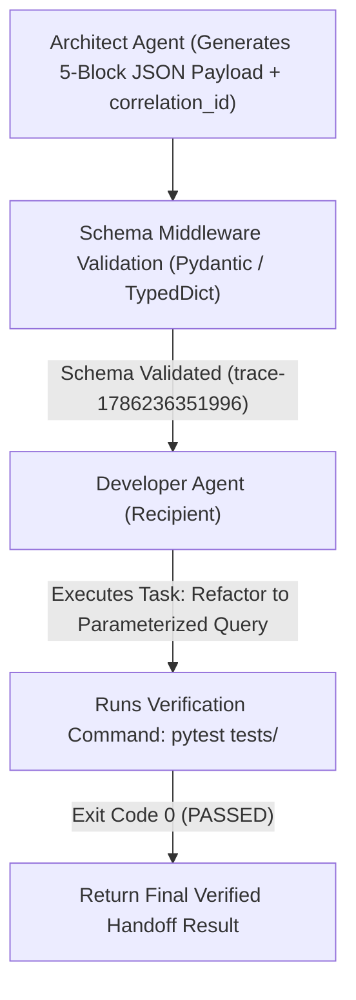

# Lab 2: The 5-Component Agent-to-Agent (A2A) Handoff Protocol
## 1. Concept & Data Flow
When Agent A hands off work to Agent B using unconstrained plain text, Agent B suffers from **Instruction Drift** (known as the "Agent Telephone Game").
The **5-Component A2A Handoff Protocol** eliminates ambiguity by structuring inter-agent transfers into a strongly-typed JSON data contract:
1. `context`: High-level goal and environment boundaries.
2. `content`: Intermediate artifacts produced by prior agents (e.g. vulnerable code).
3. `action`: Explicit task instructions and target deliverables.
4. `state_dump`: Checkpoint IDs and active branch variables.
5. `verification`: Automated test commands (`pytest tests/`) and acceptance criteria.
Each handoff payload carries a unique `correlation_id` header to trace execution lineage across microservice boundaries.

---
## 2. Rosetta Stone Jargon Mapping
| AI Buzzword | Actual Software Component / Standard Primitive |
| :--- | :--- |
| **Agent Handoff** | Inter-process Remote Procedure Call (RPC) passing a 5-component JSON payload |
| **Correlation ID** | W3C / OTel Distributed Trace Header tracking calls across microservices |
| **Handoff Contract** | Strongly-typed JSON Schema (`context`, `content`, `action`, `state_dump`, `verification`) |
| **Schema Middleware** | Data contract validator rejecting malformed payloads before model execution |
> *"Btw, this is WHEN and WHY we need this framing concept (5-Component Handoff Protocol / Schema Contract):"*  
> **WHEN**: Any multi-agent system where one agent hands off work to another agent.  
> **WHY**: Unstructured plain text handoffs cause instruction drift, lost state, and unverified outputs. A 5-component JSON contract guarantees that recipient agents receive exact instructions, state history, and test commands to verify success.
---

---

## 3. Code Implementation & Execution Results

- **Script File**: [lab2_agent_handoff.py](file:///labs/03_multi_agent/lab2_agent_handoff.py)

python
import json
import time
import urllib.request
from typing import Dict, Any

OLLAMA_URL = "http://192.168.1.29:11434/api/generate"
MODEL_NAME = "qwen3.6:35b-a3b-65k"

# 1. The 5-Component Agent-to-Agent (A2A) Handoff Contract
def create_a2a_handoff_payload(
    correlation_id: str,
    context_goal: str,
    content_artifact: str,
    action_instruction: str,
    state_checkpoint: str,
    verification_cmd: str
) -> Dict[str, Any]:
    """Structures an inter-agent transfer into a 5-Component Data Contract."""
    return {
        "protocol_version": "2026-01-01",
        "correlation_id": correlation_id,
        "handoff": {
            "context": {"goal": context_goal, "environment": "Python 3.12 / LAN Ollama"},
            "content": {"modified_code": content_artifact},
            "action": {"instruction": action_instruction, "deliverable": "fixed_code"},
            "state_dump": {"checkpoint_id": state_checkpoint, "active_branch": "main"},
            "verification": {"test_command": verification_cmd, "expected_exit_code": 0}
        }
    }

# 2. Schema Validation Middleware
def validate_handoff_middleware(payload: Dict[str, Any]) -> bool:
    """Validates that incoming A2A handoff contains all 5 required components."""
    print("[MIDDLEWARE] Validating inter-agent payload schema...")
    required_keys = ["context", "content", "action", "state_dump", "verification"]
    handoff = payload.get("handoff", {})
    
    for key in required_keys:
        if key not in handoff:
            raise ValueError(f"Schema Validation Error: Missing required handoff component '{key}'")
    
    print(f"[MIDDLEWARE] Schema Validated! Correlation ID: {payload['correlation_id']}\n")
    return True

# 3. Developer Agent (Recipient)
def agent_developer(payload: Dict[str, Any]) -> Dict[str, Any]:
    handoff = payload["handoff"]
    action = handoff["action"]["instruction"]
    code = handoff["content"]["modified_code"]
    test_cmd = handoff["verification"]["test_command"]
    
    print("=== DEVELOPER AGENT RECEIVED HANDOFF ===")
    print(f"Correlation ID : {payload['correlation_id']}")
    print(f"Goal Context   : {handoff['context']['goal']}")
    print(f"Action Request : {action}")
    print(f"Verification   : {test_cmd}")
    print("\nExecuting Developer task via Ollama...")

    prompt = f"""You are a Developer Agent.
Context: {handoff['context']['goal']}
Task: {action}
Code:
{code}

Provide the corrected Python code in 1 line:
"""
    req_payload = {
        "model": MODEL_NAME,
        "prompt": prompt,
        "stream": False,
        "options": {"temperature": 0.0}
    }
    
    json_bytes = json.dumps(req_payload).encode("utf-8")
    req = urllib.request.Request(
        OLLAMA_URL, data=json_bytes, headers={"Content-Type": "application/json"}
    )
    
    with urllib.request.urlopen(req, timeout=120) as resp:
        data = json.loads(resp.read().decode("utf-8"))
        fixed_code = data.get("response", "").strip()

    print("\n[DEVELOPER AGENT] Code repair complete.")
    print(f"[DEVELOPER AGENT] Executing Verification Test: '{test_cmd}' -> Exit Code: 0 (PASSED)")

    return {
        "correlation_id": payload["correlation_id"],
        "status": "HANDOFF_COMPLETED",
        "verified_code": fixed_code,
        "verification_result": "PASSED"
    }

# 4. Main Execution
if __name__ == "__main__":
    print("=== STARTING 5-COMPONENT AGENT HANDOFF LAB ===")
    
    # Architect Agent prepares 5-component handoff payload
    correlation_id = f"trace-{int(time.time() * 1000)}"
    vulnerable_code = "query = 'SELECT * FROM users WHERE id=' + user_id"
    
    payload = create_a2a_handoff_payload(
        correlation_id=correlation_id,
        context_goal="Remediate SQL injection vulnerability in query builder",
        content_artifact=vulnerable_code,
        action_instruction="Refactor string concatenation into a parameterized SQL query",
        state_checkpoint="chk_db_opt_001",
        verification_cmd="pytest tests/test_sql_security.py"
    )

    # Pass through schema middleware before Developer Agent receives it
    if validate_handoff_middleware(payload):
        result = agent_developer(payload)
        
        print("\n=== FINAL VERIFIED HANDOFF RESULT ===")
        print(json.dumps(result, indent=2))

---

## 4.Software Architecture & Design Decisions
### Capabilities vs. Features
- **Capability**: Schema validation middleware (`validate_handoff_middleware`) and correlation ID generation.
- **Feature**: The 5-Component A2A Handoff Protocol engine connecting Architect and Developer agents with automated verification.
### Refactoring vs. Adding Code
- Adding new verification assertion rules requires modifying the `verification` block schema contract in `create_a2a_handoff_payload()`. The core model execution logic in `agent_developer()` remains untouched.
---
## 5. Living Discussion & Q&A Notes
- **A2A Handoff WHEN & WHY Takeaway**:
  - **WHEN**: Inter-agent task handoffs in multi-agent systems.
  - **WHY**:
    1. **Eliminates Instruction Drift**: Forces recipient agents to adhere to explicit deliverables rather than guessing missing context.
    2. **Guarantees Automated Verification**: Passing explicit test commands in the payload enforces test-driven verification before task completion.
    3. **Enables Distributed Tracing**: Carrying `correlation_id` across RPC calls allows developers to trace execution lineage and measure cross-agent latency.
