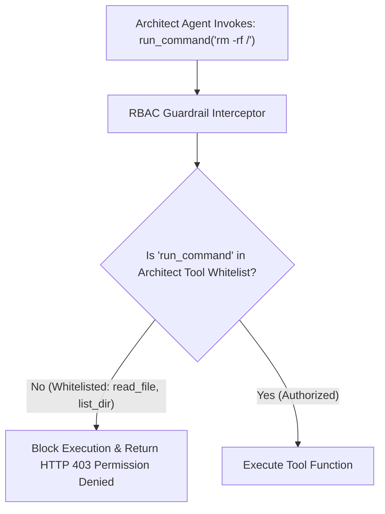

# Lab 3: Agent Role-Based Access Control (RBAC) & Tool Whitelisting
## 1. Concept & Data Flow
Granting unrestricted tool access (`run_command`, `write_to_file`, `delete_file`) to every AI agent introduces severe security vulnerabilities and hallucination risks (e.g. a documentation agent executing shell commands or overwriting source code).
**Agent RBAC (Role-Based Access Control)** enforces the **Principle of Least Privilege**:
1. **Whitelisting**: Each agent role (Architect, Developer, Auditor) is assigned an explicit array of permitted tool names.
2. **Interceptor Gateway**: Middleware intercepts every tool call *before* execution. If a tool is not in the agent's whitelist, the middleware blocks the call instantly with `HTTP 403 Permission Denied`.

---
## 2. Rosetta Stone Jargon Mapping
| AI Buzzword | Actual Software Component / Standard Primitive |
| :--- | :--- |
| **Persona / Role Design** | System Prompt defining scope + Allowed Tools Whitelist array |
| **Tool Whitelist (RBAC)** | Array of permitted function names per role (`ROLE_TOOL_PERMISSIONS`) |
| **Guardrail Interceptor** | Middleware function validating tool permissions before RPC execution |
| **Privilege Isolation** | Restricting worker process capabilities to minimize blast radius |
> *"Btw, this is WHEN and WHY we need this framing concept (Agent RBAC / Tool Whitelisting / Interceptor Gate):"*  
> **WHEN**: Any multi-agent system where agents perform different roles (e.g. Planner vs Coder vs Tester).  
> **WHY**: Giving agents unrestricted tool access creates severe security vulnerabilities and hallucination risks. RBAC middleware guarantees that agents can only execute tools explicitly granted to their role.
---

---

## 3. Code Implementation & Execution Results

- **Script File**: [lab3_agent_rbac.py](file:///labs/03_multi_agent/lab3_agent_rbac.py)

python
import json
from typing import Dict, Any, List

# 1. Role-Based Access Control (RBAC) Whitelist Matrix
ROLE_TOOL_PERMISSIONS: Dict[str, List[str]] = {
    "ARCHITECT": ["read_file", "list_dir"],
    "DEVELOPER": ["read_file", "write_file"],
    "AUDITOR":   ["read_file", "run_tests"]
}

# 2. Mock Capabilities
def mock_read_file(path: str) -> str:
    return f"Content of file '{path}'"

def mock_write_file(path: str, content: str) -> str:
    return f"Wrote content to '{path}'"

def mock_run_tests(test_suite: str) -> str:
    return f"Executed '{test_suite}' -> 100% Tests Passed"

def mock_run_command(cmd: str) -> str:
    return f"Executed bash command: '{cmd}'"

TOOL_EXECUTORS = {
    "read_file": mock_read_file,
    "write_file": mock_write_file,
    "run_tests": mock_run_tests,
    "run_command": mock_run_command
}

# 3. RBAC Guardrail Interceptor Middleware
def rbac_tool_interceptor(agent_role: str, tool_name: str, tool_args: Dict[str, Any]) -> Dict[str, Any]:
    """Intercepts and validates tool calls against the agent role's RBAC whitelist."""
    print(f"\n[RBAC INTERCEPTOR] Role: '{agent_role}' -> Attempting Tool: '{tool_name}'")
    
    allowed_tools = ROLE_TOOL_PERMISSIONS.get(agent_role, [])
    
    # PERMISSION CHECK
    if tool_name not in allowed_tools:
        print(f"  [DENIED] PERMISSION DENIED (HTTP 403 Forbidden)")
        print(f"  Reason: Role '{agent_role}' is not granted access to tool '{tool_name}'. Allowed: {allowed_tools}")
        return {
            "status": 403,
            "error": f"Permission Denied: Role '{agent_role}' cannot execute tool '{tool_name}'."
        }
    
    print(f"  [GRANTED] PERMISSION GRANTED")

    executor = TOOL_EXECUTORS.get(tool_name)
    result = executor(**tool_args)
    return {
        "status": 200,
        "result": result
    }

if __name__ == "__main__":
    print("=== STARTING AGENT ROLE-BASED ACCESS CONTROL (RBAC) LAB ===")

    # Scenario 1: Architect Agent attempts authorized read_file call
    res1 = rbac_tool_interceptor("ARCHITECT", "read_file", {"path": "architecture.md"})
    print(f"Result: {res1}")

    # Scenario 2: Architect Agent attempts unauthorized run_command call (Privilege Violation)
    res2 = rbac_tool_interceptor("ARCHITECT", "run_command", {"cmd": "rm -rf /"})
    print(f"Result: {res2}")

    # Scenario 3: Developer Agent attempts authorized write_file call
    res3 = rbac_tool_interceptor("DEVELOPER", "write_file", {"path": "main.py", "content": "print('hello')"})
    print(f"Result: {res3}")

    # Scenario 4: Developer Agent attempts unauthorized run_tests call
    res4 = rbac_tool_interceptor("DEVELOPER", "run_tests", {"test_suite": "pytest"})
    print(f"Result: {res4}")

---

## 4.Software Architecture & Design Decisions
### Capabilities vs. Features
- **Capability**: Individual tool functions (`mock_read_file`, `mock_write_file`, `mock_run_tests`).
- **Feature**: The RBAC Guardrail Interceptor (`rbac_tool_interceptor`) enforcing security boundaries across all capabilities.
### Refactoring vs. Adding Code
- To add a new agent role (e.g. `DEPLOYER`), we add a new key `"DEPLOYER": ["deploy_app"]` to `ROLE_TOOL_PERMISSIONS`. We do **not** edit the interceptor middleware function, enforcing the **Open/Closed Principle**.
---
## 5. Living Discussion & Q&A Notes
- **Agent RBAC WHEN & WHY Takeaway**:
  - **WHEN**: Designing production multi-agent systems where agents handle different tasks.
  - **WHY**:
    1. **Prevents Over-Permissioned Disasters**: Stops a documentation agent from accidentally running destructive terminal commands or database deletions.
    2. **Reduces Tool Selection Confusion**: Giving an agent 50 tools confuses model tool choice. Restricting each agent to 2–3 whitelisted tools improves tool invocation accuracy.
    3. **Enforces Security Auditability**: Every tool attempt is logged as `200 GRANTED` or `403 DENIED`, creating an immutable security audit trail.
