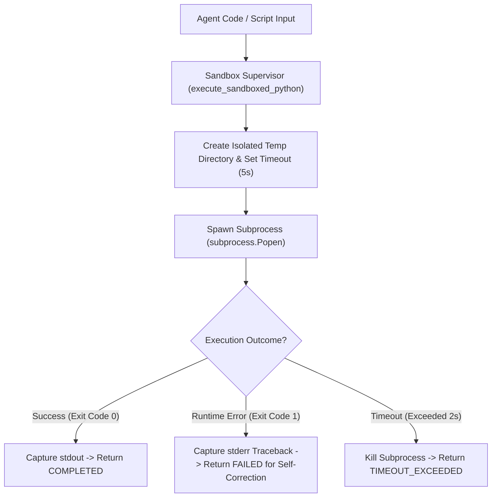

# Lab 1: Isolated Subprocess Code Execution Sandboxing
## 1. Concept & Data Flow
Allowing an AI agent to execute Python code or shell commands directly on your primary host operating system introduces severe security and stability risks (e.g. file exfiltration, host corruption, runaway CPU loops).
An **Execution Sandbox** isolates code execution into an ephemeral subprocess with 4 mandatory POSIX resource boundaries:
1. **Isolated Workspace**: Code executes inside a temporary working directory (`tempfile.TemporaryDirectory`).
2. **Timeout Enforcement**: A hard subprocess timer kills execution if it exceeds $N$ seconds.
3. **Stdout & Stderr Capture**: Captures execution outputs and error tracebacks.
4. **Exit Code Extraction**: Extracts the numeric return code (`0` = SUCCESS, `!= 0` = FAILED).

---
## 2. Rosetta Stone Jargon Mapping
| AI Buzzword | Actual Software Component / Standard Primitive |
| :--- | :--- |
| **Execution Sandbox** | Subprocess worker spawned inside a temporary workspace with POSIX resource limits |
| **Exit Code Forcing Function** | Subprocess validator checking return code `0` before marking tasks complete |
| **Resource Boundaries** | Execution ceilings (`timeout=5.0s`, working directory isolation, non-root user) |
| **Traceback Ingestion** | Capturing `stderr` streams to feed error tracebacks back to the LLM for self-repair |
> *"Btw, this is WHEN and WHY we need this framing concept (Execution Sandbox / Subprocess Isolation):"*  
> **WHEN**: Any AI harness or application that runs user code or agent-generated scripts (like Hermes, Claude Code, or OpenClaw).  
> **WHY**: Running un-sandboxed code on your primary host OS creates security risks and crash vulnerabilities. A sandbox isolates execution into a bounded subprocess, capturing outputs and exit codes (`0` vs `!= 0`) to allow safe execution and automated self-correction.
---

---

## 3. Code Implementation & Execution Results

- **Script File**: [lab1_code_sandbox.py](file:///labs/04_autonomous_platforms/lab1_code_sandbox.py)

python
import os
import subprocess
import sys
import tempfile
import time
from typing import Dict, Any

def execute_sandboxed_python(code_snippet: str, timeout_seconds: float = 5.0) -> Dict[str, Any]:
    """
    Executes Python code inside an isolated subprocess sandbox with:
    1. Isolated temporary directory workspace.
    2. Hard timeout enforcement.
    3. Stdout / Stderr capture.
    4. Exact exit code extraction.
    """
    print(f"\n[SANDBOX] Initializing isolated subprocess environment (Timeout: {timeout_seconds}s)...")
    
    # Create isolated temporary directory for file isolation
    with tempfile.TemporaryDirectory(prefix="agent_sandbox_") as temp_dir:
        script_path = os.path.join(temp_dir, "sandbox_script.py")
        
        # Write untrusted code to isolated script file
        with open(script_path, "w", encoding="utf-8") as f:
            f.write(code_snippet)

        start_time = time.time()
        
        try:
            # Spawn isolated subprocess with captured stdout/stderr in temp_dir
            process = subprocess.Popen(
                [sys.executable, script_path],
                cwd=temp_dir,
                stdout=subprocess.PIPE,
                stderr=subprocess.PIPE,
                text=True
            )

            # Wait for execution with hard timeout enforcement
            stdout, stderr = process.communicate(timeout=timeout_seconds)
            duration = time.time() - start_time
            exit_code = process.returncode

            print(f"  [SANDBOX] Execution Finished in {duration:.2f}s | Exit Code: {exit_code}")
            return {
                "status": "COMPLETED" if exit_code == 0 else "FAILED",
                "exit_code": exit_code,
                "stdout": stdout.strip(),
                "stderr": stderr.strip(),
                "duration_seconds": round(duration, 2)
            }

        except subprocess.TimeoutExpired:
            process.kill()
            process.communicate()
            duration = time.time() - start_time
            print(f"  [TIMEOUT] [SANDBOX ALERT] Timeout Exceeded ({timeout_seconds}s)! Subprocess Terminated.")

            return {
                "status": "TIMEOUT_EXCEEDED",
                "exit_code": -1,
                "stdout": "",
                "stderr": f"Error: Execution exceeded timeout limit of {timeout_seconds} seconds.",
                "duration_seconds": round(duration, 2)
            }

if __name__ == "__main__":
    print("=== STARTING SUBPROCESS CODE EXECUTION SANDBOX LAB ===")

    # Test 1: Valid Code Execution
    print("\n--- TEST 1: Valid Code Execution ---")
    valid_code = "print('Calculating 15 * 3...'); result = 15 * 3; print(f'Result: {result}')"
    res1 = execute_sandboxed_python(valid_code)
    print(f"Sandbox Output:\n{res1}")

    # Test 2: Runtime Error Code Execution (Traceback Capture)
    print("\n--- TEST 2: Runtime Error Code Execution ---")
    error_code = "data = [1, 2, 3]; print(data[10])"  # IndexError
    res2 = execute_sandboxed_python(error_code)
    print(f"Sandbox Output:\n{res2}")

    # Test 3: Infinite Loop Code Execution (Timeout Enforcement)
    print("\n--- TEST 3: Infinite Loop Code Execution ---")
    infinite_loop_code = "import time\nprint('Starting infinite loop...');\nwhile True: time.sleep(0.1)"
    res3 = execute_sandboxed_python(infinite_loop_code, timeout_seconds=2.0)
    print(f"Sandbox Output:\n{res3}")

---

## 4.Software Architecture & Design Decisions
### Capabilities vs. Features
- **Capability**: Subprocess creation (`subprocess.Popen`), signal killing (`process.kill()`), and temp directory management.
- **Feature**: The Code Execution Sandbox (`execute_sandboxed_python`) providing structured JSON execution telemetry (`exit_code`, `duration`, `stdout`, `stderr`).
### Refactoring vs. Adding Code
- To add Docker container isolation instead of local subprocesses, we implement a `execute_docker_sandbox()` function with the exact same return dictionary signature (`status`, `exit_code`, `stdout`, `stderr`). The calling agent loop remains completely unchanged.
---
## 5. Living Discussion & Q&A Notes
- **Execution Sandbox WHEN & WHY Takeaway**:
  - **WHEN**: Building any agent harness (Claude Code, Hermes, Kiro) that runs code or shell scripts.
  - **WHY**:
    1. **Protects Host Infrastructure**: Prevents infinite loops (`while True: pass`) from consuming 100% CPU or locking up the host system.
    2. **Enables Autonomous Self-Correction**: Capturing `stderr` tracebacks allows the agent harness to feed error messages back into the LLM context so it can fix its own code bugs.
    3. **Enforces Deterministic Quality Gates**: Uses exit codes (`0` vs `!= 0`) as a binary forcing function before accepting agent work.
