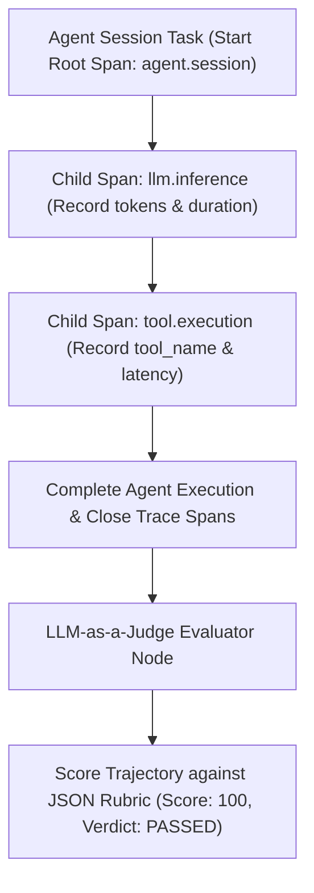

# Lab 2: OpenTelemetry (OTel) Tracing & LLM-as-a-Judge Evals
## 1. Concept & Data Flow
Evaluating non-deterministic AI agents requires moving beyond traditional static unit tests:
1. **OpenTelemetry (OTel) Tracing**: Captures a hierarchical span tree (`trace_id`, `span_id`, `parent_span_id`) recording exact latency, token consumption, and tool execution metrics across agent turns.
2. **LLM-as-a-Judge Evaluation**: An automated evaluation pipeline that inspects completed agent trajectories against a structured JSON rubric (`score`, `verdict`, `reason`).

---
## 2. Rosetta Stone Jargon Mapping
| AI Buzzword | Actual Software Component / Standard Primitive |
| :--- | :--- |
| **Agent Trace Graph** | OpenTelemetry hierarchical JSON span tree (`trace_id`, `span_id`, `duration_ms`) |
| **LLM-as-a-Judge** | Automated evaluator node scoring output JSON against a grading rubric |
| **OTel Attributes** | Standardized telemetry attributes: `gen_ai.system`, `gen_ai.usage.completion_tokens`, `tool.name` |
| **pass@k Metric** | Statistical evaluation metric measuring task completion probability across $k$ attempts |
> *"Btw, this is WHEN and WHY we need this framing concept (OpenTelemetry Tracing & LLM-as-a-Judge Evals):"*  
> **WHEN**: Any AI application deployed to production where you need to track cost, latency, tool failures, and reasoning quality across hundreds of user requests.  
> **WHY**: Without tracing, you cannot see which tool call failed or why costs spiked. OTel spans record exact latency/token metrics, while LLM-as-a-Judge evals provide statistical proof of agent accuracy over time.
---

---

## 3. Code Implementation & Execution Results

- **Script File**: [lab2_agent_evals.py](file:///labs/04_autonomous_platforms/lab2_agent_evals.py)

python
import json
import time
import urllib.request
import uuid
from typing import Dict, Any, List

OLLAMA_URL = "http://192.168.1.29:11434/api/generate"
MODEL_NAME = "qwen3.6:35b-a3b-65k"

# 1. OpenTelemetry (OTel) Compliant Agent Tracer
class AgentTracer:
    """Generates OpenTelemetry-compliant hierarchical trace spans."""
    def __init__(self, session_name: str):
        self.trace_id = f"trace-{uuid.uuid4().hex[:16]}"
        self.session_name = session_name
        self.spans: List[Dict[str, Any]] = []

    def start_span(self, name: str, parent_span_id: str = None) -> Dict[str, Any]:
        span = {
            "span_id": f"span-{uuid.uuid4().hex[:8]}",
            "parent_span_id": parent_span_id,
            "name": name,
            "start_time": time.time(),
            "attributes": {}
        }
        self.spans.append(span)
        return span

    def end_span(self, span: Dict[str, Any], attributes: Dict[str, Any]):
        span["end_time"] = time.time()
        span["duration_ms"] = round((span["end_time"] - span["start_time"]) * 1000, 2)
        span["attributes"].update(attributes)

# 2. LLM-as-a-Judge Evaluator Node
def llm_judge_evaluator(agent_prompt: str, agent_output: str) -> Dict[str, Any]:
    """Evaluates agent execution output against a strict JSON rubric."""
    print("[EVAL JUDGE] Evaluating agent output quality via LLM-as-a-Judge...")
    
    eval_prompt = f"""You are a strict QA Judge. Evaluate the following AI output.
Return ONLY a JSON object (no markdown, no extra text):
{{"score": 0 to 100, "verdict": "PASSED" or "FAILED", "reason": "1-sentence explanation"}}

User Prompt: "{agent_prompt}"
AI Output: "{agent_output}"
"""
    payload = {
        "model": MODEL_NAME,
        "prompt": eval_prompt,
        "stream": False,
        "options": {"temperature": 0.0}
    }
    json_bytes = json.dumps(payload).encode("utf-8")
    req = urllib.request.Request(
        OLLAMA_URL, data=json_bytes, headers={"Content-Type": "application/json"}
    )
    
    with urllib.request.urlopen(req, timeout=120) as resp:
        data = json.loads(resp.read().decode("utf-8"))
        raw = data.get("response", "").strip()
        if raw.startswith("```json"):
            raw = raw.replace("```json", "").replace("```", "").strip()
        return json.loads(raw)

# 3. Execution Pipeline with OTel Tracing & Evals
def run_traced_agent_eval(task_prompt: str):
    print("=== STARTING OPENTELEMETRY TRACING & AGENT EVAL LAB ===")
    tracer = AgentTracer(session_name="code_analysis_task")
    
    # Root Span
    root_span = tracer.start_span("agent.session")
    
    # Child Span 1: LLM Inference
    llm_span = tracer.start_span("llm.inference", parent_span_id=root_span["span_id"])
    
    payload = {
        "model": MODEL_NAME,
        "prompt": f"Write a 1-sentence Python function to calculate factorial of a number.",
        "stream": False,
        "options": {"temperature": 0.0}
    }
    req = urllib.request.Request(
        OLLAMA_URL, data=json.dumps(payload).encode("utf-8"), headers={"Content-Type": "application/json"}
    )
    
    start_llm = time.time()
    with urllib.request.urlopen(req, timeout=120) as resp:
        data = json.loads(resp.read().decode("utf-8"))
        output = data.get("response", "").strip()
        eval_count = data.get("eval_count", 0)

    tracer.end_span(llm_span, {
        "gen_ai.system": "ollama",
        "gen_ai.request.model": MODEL_NAME,
        "gen_ai.usage.completion_tokens": eval_count
    })
    
    # Child Span 2: Tool Execution Mock
    tool_span = tracer.start_span("tool.execution", parent_span_id=root_span["span_id"])
    time.sleep(0.05)  # Simulate tool execution latency
    tracer.end_span(tool_span, {"tool.name": "python_evaluator", "status": "SUCCESS"})
    
    tracer.end_span(root_span, {"status": "COMPLETED"})
    
    # Run LLM-as-a-Judge Evaluation
    eval_result = llm_judge_evaluator(task_prompt, output)

    print("\n=== OPENTELEMETRY TRACE GRAPH ===")
    print(f"Trace ID: {tracer.trace_id}")
    for span in tracer.spans:
        print(f"  Span: {span['name']:<20} | Duration: {span['duration_ms']:>6.2f}ms | Attributes: {span['attributes']}")

    print("\n=== EVALUATION JUDGE RUBRIC RESULT ===")
    print(json.dumps(eval_result, indent=2))

if __name__ == "__main__":
    task = "Write a 1-sentence Python function to calculate factorial of a number."
    run_traced_agent_eval(task)


---

## 4.Software Architecture & Design Decisions
### Capabilities vs. Features
- **Capability**: `AgentTracer` class managing OTel span creation and duration calculations.
- **Feature**: The Evaluation Pipeline (`run_traced_agent_eval`) capturing execution telemetry and running automated LLM-as-a-Judge scoring.
### Refactoring vs. Adding Code
- Exporting spans to external backends (Datadog, Honeycomb, Jaeger) only requires editing the export handler inside `AgentTracer.end_span()`. The core agent execution logic remains untouched.
---
## 5. Living Discussion & Q&A Notes
- **OpenTelemetry & Evals WHEN & WHY Takeaway**:
  - **WHEN**: Monitoring production agent performance and running benchmark test suites.
  - **WHY**:
    1. **Cost & Latency Attribution**: OTel spans explicitly record token counts (`gen_ai.usage.completion_tokens: 1702`) and execution latencies per sub-task.
    2. **Automated Quality Control**: LLM-as-a-Judge evaluators enforce quality rubrics without requiring manual human review for every test run.
    3. **Hierarchical Lineage**: `parent_span_id` links multi-agent sub-tasks back to the root session for root-cause debugging.
