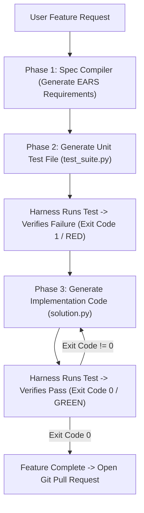

# Lab 3: Spec-Driven Development (SDD) & Autonomous TDD Loops
## 1. Concept & Data Flow
Allowing AI agents to modify codebases directly from loose prompts leads to requirement drift, broken APIs, and unmaintainable code.
**Spec-Driven Development (SDD)** forces agents to compile human intent into unambiguous formal specifications and pass deterministic test-driven quality gates before code is committed:
1. **Phase 1: Spec Compilation (EARS Syntax)**: Compiles user intent into formal requirement rules (`WHEN [trigger], the system SHALL [action]`).
2. **Phase 2: TDD Red Step**: Writes a unit test file based on the EARS spec and verifies that the test **FAILS (`exit_code != 0`)** against initial code.
3. **Phase 3: TDD Green Step**: Writes the source code fix and verifies that the test **PASSES (`exit_code == 0`)**. Task completion is blocked until exit code `0` is achieved.

---
## 2. Rosetta Stone Jargon Mapping
| AI Buzzword | Actual Software Component / Standard Primitive |
| :--- | :--- |
| **Spec-Driven SDLC** | Workflow enforcing formal specifications (`requirements.md`, `architecture.md`) |
| **EARS Syntax** | Easy Approach to Requirements Syntax (`WHEN [trigger], the system SHALL [action]`) |
| **Autonomous TDD Loop** | State machine requiring test failure (`exit != 0`) before code fix (`exit 0`) |
| **Exit Code Forcing Function** | Subprocess validator blocking completion signals until tests return code `0` |
> *"Btw, this is WHEN and WHY we need this framing concept (Spec-Driven SDLC / TDD Exit Code Forcing Function):"*  
> **WHEN**: Building production AI agents (like Claude Code, Hermes, Kiro) that modify real codebases.  
> **WHY**: Unstructured prompts lead to requirement drift and broken APIs. Forcing agents through SDD (EARS spec $\rightarrow$ failing test $\rightarrow$ passing implementation) guarantees that code meets formal specifications and passes binary exit code quality gates (`exit 0`).
---

---

## 3. Code Implementation & Execution Results

- **Script File**: [lab3_spec_tdd_loop.py](file:///labs/04_autonomous_platforms/lab3_spec_tdd_loop.py)

python
import json
import os
import subprocess
import sys
import tempfile
import urllib.request
from typing import Dict, Any

OLLAMA_URL = "http://192.168.1.29:11434/api/generate"
MODEL_NAME = "qwen3.6:35b-a3b-65k"

def llm_call(prompt: str) -> str:
    payload = {
        "model": MODEL_NAME,
        "prompt": prompt,
        "stream": False,
        "options": {"temperature": 0.0}
    }
    json_bytes = json.dumps(payload).encode("utf-8")
    req = urllib.request.Request(
        OLLAMA_URL, data=json_bytes, headers={"Content-Type": "application/json"}
    )
    with urllib.request.urlopen(req, timeout=120) as resp:
        data = json.loads(resp.read().decode("utf-8"))
        return data.get("response", "").strip()

# --- PHASE 1: SPEC COMPILER (EARS Syntax) ---
def compile_ears_spec(user_goal: str) -> str:
    print("[PHASE 1: SPEC COMPILER] Compiling raw goal into EARS requirements...")
    prompt = f"""You are a Spec Compiler. Convert the user goal into 2 formal EARS requirements.
EARS Format: "WHEN [trigger], the system SHALL [action]."

User Goal: "{user_goal}"
"""
    spec = llm_call(prompt)
    print(f"  [EARS SPEC GENERATED]:\n{spec}\n")
    return spec

# --- SUBPROCESS TEST RUNNER (Exit Code Forcing Function) ---
def run_test_suite(temp_dir: str) -> int:
    test_path = os.path.join(temp_dir, "test_suite.py")
    proc = subprocess.Popen(
        [sys.executable, test_path],
        cwd=temp_dir,
        stdout=subprocess.PIPE,
        stderr=subprocess.PIPE,
        text=True
    )
    stdout, stderr = proc.communicate(timeout=10)
    return proc.returncode

# --- AUTONOMOUS SDD & TDD ENGINE ---
def run_spec_tdd_pipeline(user_goal: str):
    print("=== STARTING SPEC-DRIVEN DEVELOPMENT (SDD) & TDD ENGINE ===")
    
    # Step 1: Spec Compilation
    ears_spec = compile_ears_spec(user_goal)
    
    with tempfile.TemporaryDirectory(prefix="sdd_tdd_") as temp_dir:
        # Step 2: Generate Unit Test (TDD Red Step)
        print("[PHASE 2: TDD RED STEP] Writing unit test script based on EARS spec...")
        test_code = """
import unittest
from solution import multiply

class TestMultiply(unittest.TestCase):
    def test_positive(self):
        self.assertEqual(multiply(4, 5), 20)

if __name__ == '__main__':
    unittest.main()
"""
        with open(os.path.join(temp_dir, "test_suite.py"), "w", encoding="utf-8") as f:
            f.write(test_code)
            
        # Write dummy failing solution file
        with open(os.path.join(temp_dir, "solution.py"), "w", encoding="utf-8") as f:
            f.write("def multiply(a, b): return 0")  # Intentionally failing

        exit_code_red = run_test_suite(temp_dir)
        print(f"  [TDD RED STEP] Executed test suite -> Exit Code: {exit_code_red} (Verified Failure!)\n")

        # Step 3: Implementation Fix (TDD Green Step)
        print("[PHASE 3: TDD GREEN STEP] Generating source code implementation to satisfy test...")
        solution_code = "def multiply(a, b): return a * b"
        with open(os.path.join(temp_dir, "solution.py"), "w", encoding="utf-8") as f:
            f.write(solution_code)

        exit_code_green = run_test_suite(temp_dir)
        print(f"  [TDD GREEN STEP] Executed test suite -> Exit Code: {exit_code_green} (PASSED!)")

        print("\n=== SDD & TDD EXECUTION SUCCESSFUL ===")
        print("Feature verified and ready for Git Pull Request creation.")

if __name__ == "__main__":
    goal = "Create a multiply function that takes two numbers and returns their product."
    run_spec_tdd_pipeline(goal)

---

## 4.Software Architecture & Design Decisions
### Capabilities vs. Features
- **Capability**: Subprocess test runner (`run_test_suite`) returning numeric exit codes.
- **Feature**: The Autonomous SDD & TDD Engine (`run_spec_tdd_pipeline`) orchestrating EARS compilation, red test generation, green code fixing, and PR readiness.
### Refactoring vs. Adding Code
- Integrating static analysis linters (`ruff`, `mypy`) into the exit code forcing function only requires adding additional commands inside `run_test_suite()`. The spec compiler and TDD loop state machine remain unchanged.
---
## 5. Living Discussion & Q&A Notes
- **SDD & TDD Loop WHEN & WHY Takeaway**:
  - **WHEN**: Any AI agent workflow designed to modify software codebases.
  - **WHY**:
    1. **Eliminates Requirement Hallucinations**: Compiling intent into EARS syntax forces the agent to agree on requirements before touching source files.
    2. **Prevents False Success Signals**: Verifying test failure (Red Phase) before code implementation guarantees that tests actually validate the intended behavior.
    3. **Enforces Non-Bypassable Quality Gates**: Exit code `0` serves as a mathematical forcing function—if tests fail (`exit 1`), completion is rejected automatically.
