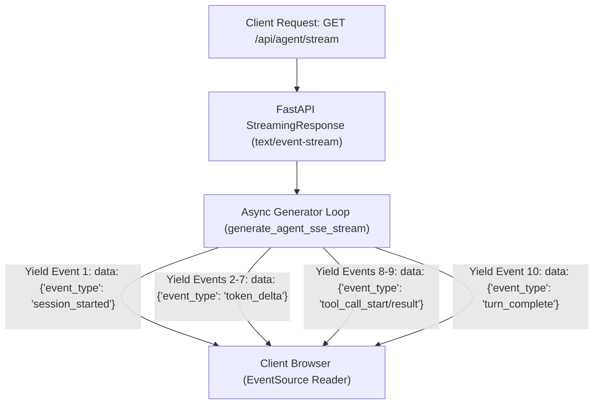

# Lab 1: Server-Sent Events (SSE) & Real-Time Agent Streaming APIs
## 1. Concept & Data Flow
Exposing autonomous AI agents over standard synchronous HTTP REST endpoints causes severe UX failures. Multi-step reasoning loops take 10–60+ seconds, causing client timeouts and blank loading screens.
**Server-Sent Events (SSE)** uses a lightweight HTTP/2 connection (`text/event-stream`) to stream structured event frames incrementally from an `async generator` on the backend directly to frontend clients:
- `session_started`: Initializes the execution context.
- `token_delta`: Streams real-time LLM token generation.
- `tool_call_start` & `tool_call_result`: Pushes tool invocation logs.
- `turn_complete`: Signal closing the turn.

---
## 2. Rosetta Stone Jargon Mapping
| AI Buzzword | Actual Software Component / Standard Primitive |
| :--- | :--- |
| **Streaming Agent API** | FastAPI route returning a `StreamingResponse` wrapping an `async generator` |
| **Server-Sent Events (SSE)** | Unidirectional HTTP streaming protocol using `Content-Type: text/event-stream` |
| **Stream Event Frame** | Structured JSON text block (`data: {"event_type": "token_delta", ...}\n\n`) |
| **Disconnect Trapping** | Checking `request.is_disconnected()` to cancel upstream LLM calls if client leaves |
> *"Btw, this is WHEN and WHY we need this framing concept (Server-Sent Events (SSE) / Event Streaming / Async Generator):"*  
> **WHEN**: Exposing any multi-step AI agent (Claude Code, Hermes, UI chat apps) over a web HTTP API to frontend clients.  
> **WHY**: Synchronous HTTP calls hang for 30+ seconds and cause timeouts. SSE streams real-time token chunks and tool status updates over a lightweight HTTP connection so users see instant progress without blocking the UI.
---

---

## 3. Code Implementation & Execution Results

- **Script File**: [lab1_sse_streaming_api.py](file:///labs/05_ui_ux_surfacing/lab1_sse_streaming_api.py)

python
import asyncio
import json
import time
from typing import AsyncGenerator

# 1. Standardized SSE Event Frame Serializer
def format_sse_frame(event_type: str, data: dict, event_id: int) -> str:
    """Formats payload into standard Server-Sent Events (SSE) text frame."""
    payload = {
        "event_id": event_id,
        "event_type": event_type,
        "timestamp": time.time(),
        "data": data
    }
    return f"data: {json.dumps(payload)}\n\n"

# 2. Async Agent Event Stream Generator
async def generate_agent_sse_stream(prompt: str) -> AsyncGenerator[str, None]:
    """Generates structured SSE stream frames for token generation and tool execution."""
    print(f"\n[SSE STREAM] Starting agent stream for prompt: '{prompt}'...")
    event_id = 0

    # Frame 1: Stream Started
    event_id += 1
    yield format_sse_frame("session_started", {"status": "ACTIVE", "prompt": prompt}, event_id)
    await asyncio.sleep(0.1)

    # Frame 2: Token Streaming (Thinking)
    tokens = ["Analyzing ", "user ", "query... ", "Formulating ", "action ", "plan."]
    for token in tokens:
        event_id += 1
        yield format_sse_frame("token_delta", {"delta": token}, event_id)
        await asyncio.sleep(0.05)

    # Frame 3: Tool Call Initiated
    event_id += 1
    yield format_sse_frame("tool_call_start", {"tool_name": "read_file", "args": {"path": "config.json"}}, event_id)
    await asyncio.sleep(0.1)

    # Frame 4: Tool Execution Result
    event_id += 1
    yield format_sse_frame("tool_call_result", {"tool_name": "read_file", "output": "{'env': 'prod'}"}, event_id)
    await asyncio.sleep(0.1)

    # Frame 5: Stream Complete
    event_id += 1
    yield format_sse_frame("turn_complete", {"status": "SUCCESS", "total_events": event_id}, event_id)

# 3. Main Test Client
async def main():
    print("=== STARTING SERVER-SENT EVENTS (SSE) STREAMING API LAB ===")
    
    stream = generate_agent_sse_stream("Read config and summarize environment")
    
    print("\n=== RECEIVING SSE STREAM FRAMES FROM AGENT ===")
    async for sse_frame in stream:
        # Strip trailing newlines for clear console display
        raw_frame = sse_frame.strip()
        print(f"[CLIENT READ] {raw_frame}")

if __name__ == "__main__":
    asyncio.run(main())

---

## 4.Software Architecture & Design Decisions
### Capabilities vs. Features
- **Capability**: Python `async generator` and string formatting for SSE payloads (`format_sse_frame`).
- **Feature**: Real-Time Agent Streamer (`generate_agent_sse_stream`) emitting typed event frames over an HTTP stream.
### Refactoring vs. Adding Code
- To add WebSockets for bidirectional user interruptions instead of SSE, we replace the `async generator` with a WebSocket connection loop (`websocket.receive_json()`). The core event frame JSON schema remains identical.
---
## 5. Living Discussion & Q&A Notes
- **SSE Streaming WHEN & WHY Takeaway**:
  - **WHEN**: Building web backends (FastAPI / Next.js API routes) for chat interfaces or multi-step agent applications.
  - **WHY**:
    1. **Eliminates HTTP Timeouts**: Establishes a single streaming HTTP connection that stays open indefinitely without timing out.
    2. **Instant TTFT (Time-To-First-Token)**: Users see initial tokens within milliseconds rather than waiting 30 seconds for full completion.
    3. **Observability Transparency**: Emitting `tool_call_start` and `tool_call_result` frames gives users live visibility into what tools the agent is executing.
