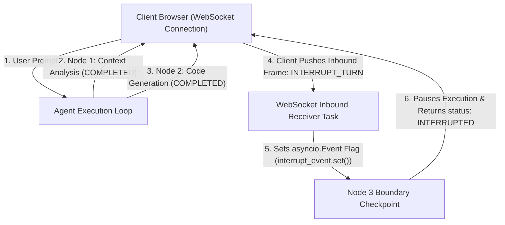

# Lab 2: Full-Duplex WebSockets & Mid-Turn Interruption Harness
## 1. Concept & Data Flow
While HTTP/SSE streams data unidirectionally (server to client), interactive agent platforms require **Full-Duplex WebSockets (`ws://`)** so clients can push control frames (`INTERRUPT_TURN`, `STEER_PROMPT`) into active execution loops.
**Mid-Turn Interruption Architecture**:
1. **Inbound Receiver Task**: Listens on the WebSocket channel for incoming client control frames (`INTERRUPT_TURN`).
2. **Async Event Trapping**: Upon receiving `INTERRUPT_TURN`, the receiver sets an `asyncio.Event` flag (`interrupt_event.set()`).
3. **Graph Node Boundary Checkpoint**: The agent execution loop inspects `interrupt_event.is_set()` before starting each node. If set, it safely pauses graph execution, saves state, and awaits user guidance.

---
## 2. Rosetta Stone Jargon Mapping
| AI Buzzword | Actual Software Component / Standard Primitive |
| :--- | :--- |
| **Interactive Agent Harness** | WebSocket server multiplexing inbound control frames and outbound event streams |
| **Mid-Turn Interruption** | Setting an `asyncio.Event` flag when receiving `INTERRUPT_TURN` frame |
| **Full-Duplex Socket** | TCP WebSocket framing (`ws://`) allowing concurrent read/write streams |
| **Stateful Pause Gate** | Checking `event.is_set()` at node boundaries before executing model inference |
> *"Btw, this is WHEN and WHY we need this framing concept (Full-Duplex WebSockets / Mid-Turn Interrupt Handler):"*  
> **WHEN**: Any interactive AI agent interface (like Claude Code, Hermes, or interactive IDE tools) where users need to cancel runaway agent execution or steer prompts mid-turn.  
> **WHY**: Unidirectional HTTP/SSE cannot receive client input while an HTTP request is active. WebSockets provide full-duplex socket channels, allowing clients to send instant `INTERRUPT_TURN` control signals that pause backend `asyncio` execution loops immediately.
---

---

## 3. Code Implementation & Execution Results

- **Script File**: [lab2_websocket_interrupt.py](file:///labs/05_ui_ux_surfacing/lab2_websocket_interrupt.py)

python
import asyncio
import json
import time

# 1. Stateful Agent Execution Loop with Interrupt Checkpoints
async def run_agent_graph(interrupt_event: asyncio.Event):
    print("[AGENT ENGINE] Starting multi-step graph execution...")
    nodes = ["Node 1: Context Analysis", "Node 2: Code Generation", "Node 3: Security Verification"]

    for idx, node_name in enumerate(nodes, start=1):
        # GRAPH NODE CHECKPOINT: Check for client interrupt signal
        if interrupt_event.is_set():
            print(f"\n[INTERRUPT HANDLER] [STOP] Interrupt Flag SET! Pausing graph execution at boundary before '{node_name}'.")

            print("[INTERRUPT HANDLER] Status: AGENT_INTERRUPTED_AWAITING_USER_INPUT")
            return {
                "status": "INTERRUPTED",
                "stopped_at_node": node_name,
                "completed_nodes": idx - 1
            }

        print(f"  [NODE EXECUTION] Running {node_name}...")
        await asyncio.sleep(0.1)  # Simulate node work latency

    print("[AGENT ENGINE] All graph nodes completed successfully.")
    return {"status": "COMPLETED", "completed_nodes": len(nodes)}

# 2. Simulated WebSocket Inbound Control Receiver Task
async def simulate_client_interrupt_receiver(interrupt_event: asyncio.Event, delay_seconds: float):
    await asyncio.sleep(delay_seconds)
    print(f"\n[WEBSOCKET CLIENT] Pushing Inbound Control Frame: 'INTERRUPT_TURN'")
    interrupt_event.set()

# 3. Main Orchestrator
async def main():
    print("=== STARTING WEBSOCKET INTERACTIVE INTERRUPTION LAB ===")
    
    # Test Scenario 1: Normal Uninterrupted Run
    print("\n--- SCENARIO 1: Uninterrupted Agent Execution ---")
    event_no_interrupt = asyncio.Event()
    res1 = await run_agent_graph(event_no_interrupt)
    print(f"Result: {res1}")

    # Test Scenario 2: Mid-Turn Client Interruption
    print("\n--- SCENARIO 2: Mid-Turn Client Interruption ---")
    event_with_interrupt = asyncio.Event()
    
    # Launch agent graph execution and client interrupt receiver concurrently
    agent_task = asyncio.create_task(run_agent_graph(event_with_interrupt))
    client_task = asyncio.create_task(simulate_client_interrupt_receiver(event_with_interrupt, delay_seconds=0.15))

    res2 = await asyncio.gather(agent_task, client_task)
    print(f"Result: {res2[0]}")

if __name__ == "__main__":
    asyncio.run(main())

---

## 4.Software Architecture & Design Decisions
### Capabilities vs. Features
- **Capability**: Python `asyncio.Event` synchronization primitives and `asyncio.gather` concurrent task execution.
- **Feature**: Interactive Agent Interruption Engine (`run_agent_graph`) enabling mid-turn client cancellation and state pausing.
### Refactoring vs. Adding Code
- To support mid-turn prompt steering (`STEER_PROMPT`) instead of just cancellation, we add a `prompt_queue = asyncio.Queue()` to pass user message deltas directly into active node context windows. The node boundary checkpoint pattern remains unchanged.
---
## 5. Living Discussion & Q&A Notes
- **WebSocket Interruption WHEN & WHY Takeaway**:
  - **WHEN**: Building interactive developer agent platforms or long-horizon coding assistants.
  - **WHY**:
    1. **Saves Token & API Costs**: Immediately stops model inference when a user realizes the agent is heading down a wrong trajectory.
    2. **Graceful State Preservation**: Checking flags at node boundaries (rather than killing raw threads) allows the agent to commit current checkpoints to SQLite before pausing.
    3. **Enables Human-in-the-Loop Steering**: Users can pause execution, modify constraints, and resume the graph without losing prior step context.
