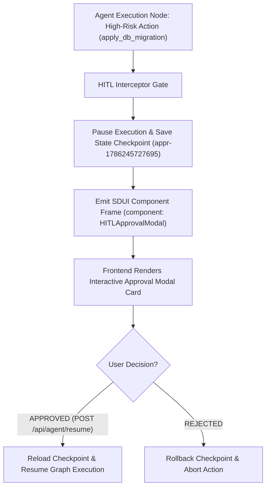

# Lab 3: Generative UI & Human-in-the-Loop (HITL) Approval Engine
## 1. Concept & Data Flow
Unstructured text chat is unsuitable for high-risk operations (such as database migrations, source code edits, or deployment scripts).
**Generative UI & HITL Approval Engine** combines Server-Driven UI (SDUI) component streaming with stateful Human-in-the-Loop pause/resume checkpoints:
1. **Low-Risk Actions**: Executed automatically without human intervention.
2. **High-Risk Actions**: Pauses backend execution, persists state checkpoint (`approval_id`), and emits a Server-Driven UI component frame (`HITLApprovalModal`) to render interactive UI cards.
3. **RPC Resume Postback**: Awaits human decision (`APPROVED` vs `REJECTED`) via `/api/agent/resume`, reloading checkpoint and resuming execution upon authorization.

---
## 2. Rosetta Stone Jargon Mapping
| AI Buzzword | Actual Software Component / Standard Primitive |
| :--- | :--- |
| **Generative UI** | Server-Driven UI (SDUI) protocol mapping tool names to UI Component JSON schemas |
| **HITL Approval Gate** | Stateful pause handler creating a checkpoint and awaiting REST/WebSocket postback |
| **Diff Inspection Card** | UI component rendering side-by-side proposed code changes |
| **Resume RPC Payload** | REST endpoint (`POST /api/agent/resume`) accepting `{ approval_id, decision }` |
> *"Btw, this is WHEN and WHY we need this framing concept (Generative UI / Server-Driven UI (SDUI) / Human-in-the-Loop (HITL) Gate):"*  
> **WHEN**: Any enterprise AI agent platform performing high-risk operations (file modifications, database writes, deployments).  
> **WHY**: Plain text chat causes cognitive overload and human error. SDUI component frames render clean interactive visual cards (Diff Viewers / Approval Modals), while HITL pause/resume gates ensure high-risk actions never run without explicit human authorization.
---

---

## 3. Code Implementation & Execution Results

- **Script File**: [lab3_hitl_generative_ui.py](file:///labs/05_ui_ux_surfacing/lab3_hitl_generative_ui.py)

python
import json
import time
from typing import Dict, Any, List

# 1. Server-Driven UI (SDUI) Component Registry Protocol
def render_sdui_component_frame(component_name: str, props: Dict[str, Any]) -> Dict[str, Any]:
    """Serializes tool outputs into structured Server-Driven UI (SDUI) component payloads."""
    return {
        "type": "GENERATIVE_UI_FRAME",
        "component": component_name,
        "props": props,
        "timestamp": time.time()
    }

# 2. Stateful Human-in-the-Loop (HITL) Gate Engine
class AgentHITLEngine:
    """Manages pause/resume checkpoints and approval RPC handoffs."""
    def __init__(self):
        self.checkpoints: Dict[str, Dict[str, Any]] = {}

    def execute_action_with_hitl_gate(
        self, action_name: str, payload: Dict[str, Any], is_high_risk: bool
    ) -> Dict[str, Any]:
        print(f"\n[HITL GATE] Intercepted Action: '{action_name}' (High Risk: {is_high_risk})")
        
        # LOW RISK: Execute immediately
        if not is_high_risk:
            print("  [APPROVED] Low-risk action approved automatically.")
            return {"status": "EXECUTED", "action": action_name}

        # HIGH RISK: Pause graph and save state checkpoint
        approval_id = f"appr-{int(time.time() * 1000)}"
        self.checkpoints[approval_id] = {
            "action": action_name,
            "payload": payload,
            "status": "PAUSED_AWAITING_APPROVAL"
        }

        # Generate SDUI Approval Modal Component Frame
        sdui_frame = render_sdui_component_frame(
            component_name="HITLApprovalModal",
            props={
                "approval_id": approval_id,
                "action": action_name,
                "proposed_changes": payload,
                "warning": "CRITICAL: This action modifies persistent production state!"
            }
        )

        print(f"  [PAUSED] HIGH-RISK ACTION PAUSED! Created Checkpoint ID: {approval_id}")
        print(f"  [SDUI FRAME EMITTED TO FRONTEND UI]:\n{json.dumps(sdui_frame, indent=2)}")
        return {
            "status": "PAUSED",
            "approval_id": approval_id,
            "sdui_frame": sdui_frame
        }

    def resume_agent_execution(self, approval_id: str, decision: str) -> Dict[str, Any]:
        """RPC postback endpoint resuming agent graph after human approval."""
        print(f"\n[HITL RPC RESUME] Processing Human Clearance for ID: '{approval_id}' -> Decision: '{decision}'")
        
        if approval_id not in self.checkpoints:
            raise KeyError(f"Invalid Approval ID: '{approval_id}'")

        checkpoint = self.checkpoints[approval_id]

        if decision == "APPROVED":
            checkpoint["status"] = "APPROVED_AND_EXECUTED"
            print(f"  [APPROVED] Action '{checkpoint['action']}' AUTHORIZED by user. Graph execution resumed!")
            return {
                "status": "RESUMED_SUCCESS",
                "action": checkpoint["action"],
                "execution_result": "Database migration script applied successfully."
            }
        else:
            checkpoint["status"] = "REJECTED_BY_USER"
            print(f"  [REJECTED] Action '{checkpoint['action']}' REJECTED by user. Graph state aborted!")
            return {
                "status": "ABORTED",
                "action": checkpoint["action"],
                "reason": "Human operator rejected execution."
            }

if __name__ == "__main__":
    print("=== STARTING GENERATIVE UI & HITL APPROVAL GATE LAB ===")
    engine = AgentHITLEngine()

    # Scenario 1: Low-Risk Action (Auto Executed)
    engine.execute_action_with_hitl_gate(
        action_name="read_schema",
        payload={"table": "users"},
        is_high_risk=False
    )

    # Scenario 2: High-Risk Action (HITL Gate Pauses & Emits SDUI Frame)
    res_high_risk = engine.execute_action_with_hitl_gate(
        action_name="apply_db_migration",
        payload={"sql": "ALTER TABLE users DROP COLUMN legacy_auth_hash"},
        is_high_risk=True
    )

    # Extract approval_id from paused checkpoint
    appr_id = res_high_risk["approval_id"]

    # Scenario 3: Human Operator Approves Action via RPC Resume Postback
    engine.resume_agent_execution(approval_id=appr_id, decision="APPROVED")

---

## 4.Software Architecture & Design Decisions
### Capabilities vs. Features
- **Capability**: State checkpoint storage (`self.checkpoints[approval_id]`) and SDUI JSON frame rendering (`render_sdui_component_frame`).
- **Feature**: The Generative UI & HITL Approval Engine (`AgentHITLEngine`) managing automatic low-risk authorization vs high-risk interactive pause/resume gates.
### Refactoring vs. Adding Code
- Adding custom component types (e.g. `CodeDiffCard`, `FinancialTransactionCard`) only requires adding new component string mappings in `render_sdui_component_frame()`. The core stateful pause/resume checkpoint engine remains untouched.
---
## 5. Living Discussion & Q&A Notes
- **Generative UI & HITL Gate WHEN & WHY Takeaway**:
  - **WHEN**: Building enterprise AI agent products operating on production databases, financial APIs, or source code repositories.
  - **WHY**:
    1. **Eliminates Unintentional Destructive Actions**: Prevents agents from executing dangerous commands (`DROP TABLE`, `rm -rf`, `git push --force`) without explicit human authorization.
    2. **Rich Component Rendering**: Replaces raw text dumps with structured Server-Driven UI (SDUI) frames that render interactive forms, modals, and diff views.
    3. **Durable Asynchronous Resumption**: Pausing graph state to SQLite checkpoints allows human operators to take hours or days to review approval requests before resuming graph execution via REST RPC.
