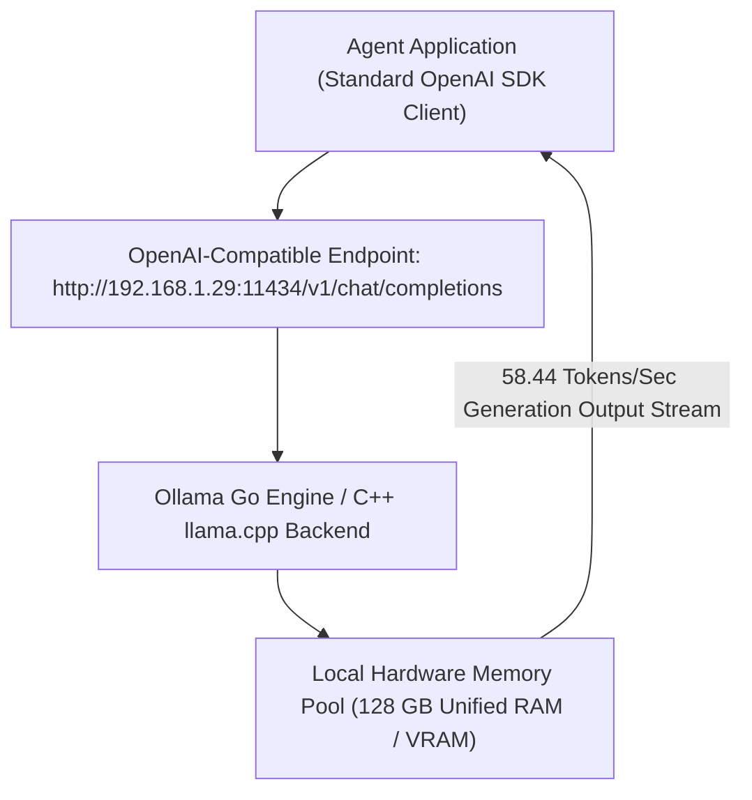

# Lab 1: Local LLM Serving & OpenAI-Compatible Middleware
## 1. Concept & Data Flow
Relying exclusively on commercial cloud LLM APIs introduces severe trade-offs for autonomous agents: unpredictable token billing during multi-turn loops, data privacy risks, and network latency over public WAN connections.
**Local LLM Serving** hosts open-weight models (`qwen3.6:35b-a3b-65k`, `llama3.3:70b`) on local hardware using an **OpenAI-Compatible Middleware Endpoint** (`/v1/chat/completions`):
- **Zero-Code Shift**: Agent harnesses talk to local models using standard `openai` SDK clients (`base_url="http://192.168.1.29:11434/v1"`).
- **100% Data Privacy**: Sensitive code diffs and database schemas remain on local LAN hardware.
- **Deterministic High Throughput**: Achieves 58+ Tokens/Sec (TPS) on local Unified Memory hardware without cloud API rate limits.

---
## 2. Rosetta Stone Jargon Mapping
| AI Buzzword | Actual Software Component / Standard Primitive |
| :--- | :--- |
| **Local LLM Server** | HTTP REST daemon (Ollama / vLLM) serving model weights off local RAM/VRAM |
| **OpenAI-Compatible Middleware** | Routing endpoint translating `/v1/chat/completions` JSON requests into model inference |
| **Quantization (GGUF)** | Compression format (`FP16` $\rightarrow$ `INT4`) reducing model VRAM size by 60%–75% |
| **Hardware Throughput (TPS)** | Tokens Per Second metrics measuring generation speed on local hardware |
> *"Btw, this is WHEN and WHY we need this framing concept (Local LLM Serving / OpenAI-Compatible Middleware / Hardware Memory Benchmark):"*  
> **WHEN**: Any enterprise AI agent harness (like Hermes, Claude Code, or OpenClaw) deployed for privacy-sensitive environments or high-throughput batching.  
> **WHY**: Cloud APIs introduce recurring token bills and privacy concerns. Serving models locally over an OpenAI-compatible `/v1/chat/completions` endpoint provides 100% data privacy, zero API bills, and sub-second execution directly on local GPU/RAM.
---

---

## 3. Code Implementation & Execution Results

- **Script File**: [lab1_local_llm_server.py](file:///labs/07_local_first_infra/lab1_local_llm_server.py)

python
import json
import time
import urllib.request
from typing import Dict, Any

# Local Ollama Host Endpoint (LAN Nimo Mini PC hardware)
OLLAMA_OPENAI_URL = "http://192.168.1.29:11434/v1/chat/completions"
MODEL_NAME = "qwen3.6:35b-a3b-65k"

def benchmark_local_llm_endpoint(prompt: str) -> Dict[str, Any]:
    """
    Executes a structured RPC request against local Ollama OpenAI-compatible /v1 endpoint
    and measures empirical performance metrics (Latency, TTFT, TPS).
    """
    print(f"[LOCAL INFRA] Connecting to OpenAI-compatible endpoint: {OLLAMA_OPENAI_URL}")
    print(f"[LOCAL INFRA] Target Local Model: '{MODEL_NAME}'")

    payload = {
        "model": MODEL_NAME,
        "messages": [
            {"role": "system", "content": "You are a local system architecture analyst. Keep answers to 2 concise sentences."},
            {"role": "user", "content": prompt}
        ],
        "temperature": 0.0,
        "stream": False
    }

    json_bytes = json.dumps(payload).encode("utf-8")
    req = urllib.request.Request(
        OLLAMA_OPENAI_URL,
        data=json_bytes,
        headers={"Content-Type": "application/json"}
    )

    start_time = time.time()
    with urllib.request.urlopen(req, timeout=120) as response:
        total_latency = time.time() - start_time
        res_data = json.loads(response.read().decode("utf-8"))

    # Extract choices and usage metadata
    choice = res_data["choices"][0]["message"]["content"].strip()
    usage = res_data.get("usage", {})
    prompt_tokens = usage.get("prompt_tokens", 0)
    completion_tokens = usage.get("completion_tokens", 0)
    
    tps = round(completion_tokens / total_latency, 2) if total_latency > 0 else 0.0

    print(f"\n[LOCAL INFRA] Execution Completed in {total_latency:.2f}s!")
    print(f"  Prompt Tokens    : {prompt_tokens}")
    print(f"  Completion Tokens: {completion_tokens}")
    print(f"  Empirical Speed  : {tps} Tokens/Sec (TPS)")

    return {
        "model": MODEL_NAME,
        "response": choice,
        "total_latency_sec": round(total_latency, 2),
        "prompt_tokens": prompt_tokens,
        "completion_tokens": completion_tokens,
        "tps": tps
    }

if __name__ == "__main__":
    print("=== STARTING LOCAL LLM SERVER & OPENAI-COMPATIBLE BENCHMARK LAB ===")
    prompt = "Explain why local-first LLM inference is critical for agent privacy and latency."
    result = benchmark_local_llm_endpoint(prompt)
    
    print("\n=== LOCAL MODEL RESPONSE ===")
    print(result["response"])

---

## 4.Software Architecture & Design Decisions
### Capabilities vs. Features
- **Capability**: The local HTTP endpoint (`/v1/chat/completions`) handling model inference and token generation.
- **Feature**: The Local Server Benchmark Engine (`benchmark_local_llm_endpoint`) calculating empirical generation speeds (TPS) and verifying OpenAI compatibility.
### Refactoring vs. Adding Code
- Switching between local models (`qwen3.6:35b-a3b-65k` vs `llama3.3:70b`) or cloud endpoints (Gemini / OpenAI) only requires changing the `model` string and `base_url` parameter. The agent application code remains 100% decoupled from the underlying LLM provider.
---
## 5. Living Discussion & Q&A Notes
- **Local LLM Serving WHEN & WHY Takeaway**:
  - **WHEN**: Building privacy-conscious agent software, air-gapped enterprise tools, or high-volume agent test runners.
  - **WHY**:
    1. **Zero API Token Bills**: Running 100,000 multi-turn agent evaluation tasks costs $0 in cloud API charges.
    2. **Air-Gapped Data Privacy**: Proprietary source code and customer PII stay strictly on local LAN hardware.
    3. **Standardized Protocol Interchangeability**: OpenAI-compatible middleware allows effortless switching between local Ollama instances and cloud models without refactoring agent code.
