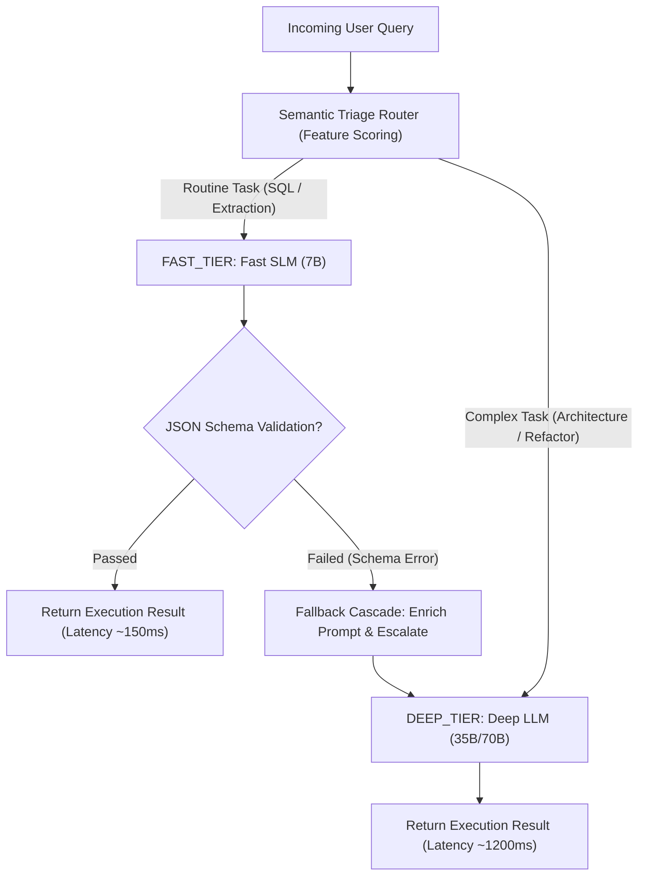

# Lab 2: Multi-Model Routing & Fallback Cascades
## 1. Concept & Data Flow
Dispatching every prompt turn to a single monolithic model (70B+ parameter or cloud reasoning model) wastes GPU memory and creates high per-turn latency.
**Multi-Model Routing & Specialization** routes queries across a multi-tiered hierarchy of models:
1. **Semantic Triage Node**: Evaluates prompt complexity and intent keywords to select initial route (`FAST_TIER` vs `DEEP_TIER`).
2. **Fast SLM Tier (7B)**: Handles routine operations (SQL synthesis, intent classification, JSON extraction) in milliseconds.
3. **Deep LLM Tier (35B/70B)**: Handles heavy architectural design and code refactoring.
4. **Fallback Cascade**: If a lower-tier model fails JSON schema validation, the harness enriches the prompt with the exact error message and escalates execution to the higher-tier model.

---
## 2. Rosetta Stone Jargon Mapping
| AI Buzzword | Actual Software Component / Standard Primitive |
| :--- | :--- |
| **Multi-Model Router** | Feature scoring function & dispatcher selecting model endpoints by query attribute |
| **Semantic Triage Node** | Ingress classification node mapping prompt intent to specialized model routes |
| **Fallback Cascade** | Error-handling state machine escalating failed tasks ($SLM \to Mid-Tier \to Frontier$) |
| **Model Tiering** | Grouping inference endpoints by parameter size, latency, and cost SLAs |
> *"Btw, this is WHEN and WHY we need this framing concept (Multi-Model Routing / Fallback Cascade / SLA Allocation):"*  
> **WHEN**: Building any production agent application processing high volumes of diverse tasks.  
> **WHY**: Sending simple classification or extraction tasks to giant 70B models wastes GPU memory and creates 10s latencies. Multi-model routing dispatches 80% of routine tasks to fast SLMs in milliseconds, using fallback cascades to escalate complex failures to heavy reasoning models only when needed.
---

---

## 3. Code Implementation & Execution Results

- **Script File**: [lab2_multi_model_router.py](file:///labs/07_local_first_infra/lab2_multi_model_router.py)

python
import json
import time
from typing import Dict, Any, List

# 1. Model Tier Definitions
MODEL_TIERS = {
    "FAST_TIER": {"name": "Fast SLM (7B)", "latency_ms": 150, "target_intents": ["sql_query", "json_extract"]},
    "DEEP_TIER": {"name": "Deep LLM (35B/70B)", "latency_ms": 1200, "target_intents": ["code_refactor", "system_architecture"]}
}

# 2. Semantic Triage Router Function
def triage_prompt_intent(prompt: str) -> str:
    """Evaluates prompt features and returns target model tier name."""
    prompt_lower = prompt.lower()
    
    # Feature scoring heuristics
    if any(keyword in prompt_lower for keyword in ["architecture", "refactor", "design pattern", "multi-step"]):
        return "DEEP_TIER"
    elif any(keyword in prompt_lower for keyword in ["select", "sql", "json", "extract", "parse"]):
        return "FAST_TIER"
    else:
        return "FAST_TIER"  # Default to fast tier

# 3. Fallback Cascade Execution Engine
class MultiModelRouterEngine:
    """Manages multi-model routing and automated fallback escalation."""
    def __init__(self):
        self.execution_logs: List[Dict[str, Any]] = []

    def dispatch_task(self, prompt: str, force_schema_error: bool = False) -> Dict[str, Any]:
        target_tier = triage_prompt_intent(prompt)
        print(f"\n[ROUTER TRIAGE] Ingress Query: '{prompt[:45]}...'")
        print(f"[ROUTER TRIAGE] Selected Initial Route: {target_tier} ({MODEL_TIERS[target_tier]['name']})")

        # Step 1: Attempt execution on initial routed tier
        try:
            res = self._execute_tier(target_tier, prompt, force_schema_error)
            print(f"  [PASSED] Execution Succeeded on {target_tier}!")
            return res

        # Step 2: Fallback Cascade Escalation upon Failure
        except ValueError as err:
            print(f"  [FAILED] {target_tier} Failed Validation: {err}")
            print("  [CASCADE] [FALLBACK CASCADE] Escalating task to DEEP_TIER with error context feedback...")
            
            # Enrich prompt with prior failure feedback
            enriched_prompt = f"{prompt}\n\n[SYSTEM NOTE]: Previous attempt failed with error: '{err}'. Ensure valid output."
            res_fallback = self._execute_tier("DEEP_TIER", enriched_prompt, force_schema_error=False)
            res_fallback["fallback_occurred"] = True
            print("  [PASSED] Fallback Cascade Succeeded on DEEP_TIER!")
            return res_fallback

    def _execute_tier(self, tier_name: str, prompt: str, force_schema_error: bool) -> Dict[str, Any]:
        tier_info = MODEL_TIERS[tier_name]
        time.sleep(0.05)  # Simulate execution delay

        if force_schema_error and tier_name == "FAST_TIER":
            raise ValueError("Invalid JSON Schema: Missing required key 'query_plan'.")

        return {
            "status": "SUCCESS",
            "tier_used": tier_name,
            "model_name": tier_info["name"],
            "simulated_latency_ms": tier_info["latency_ms"],
            "fallback_occurred": False
        }

if __name__ == "__main__":
    print("=== STARTING MULTI-MODEL ROUTING & FALLBACK CASCADE LAB ===")
    router = MultiModelRouterEngine()

    # Scenario 1: Routine Task Routed to Fast SLM
    print("\n--- SCENARIO 1: SQL Extraction Task (Routed to Fast SLM) ---")
    res1 = router.dispatch_task("Extract SQL SELECT query for active users")
    print(f"Result: {res1}")

    # Scenario 2: Complex Task Routed to Deep LLM
    print("\n--- SCENARIO 2: System Architecture Task (Routed to Deep LLM) ---")
    res2 = router.dispatch_task("Design a micro-services system architecture for real-time video streaming")
    print(f"Result: {res2}")

    # Scenario 3: Fast SLM Fails Validation -> Fallback Cascade Escalates to Deep LLM
    print("\n--- SCENARIO 3: Fast SLM Schema Failure -> Fallback Cascade Escalation ---")
    res3 = router.dispatch_task("Extract SQL query for order history", force_schema_error=True)
    print(f"Result: {res3}")

---

## 4.Software Architecture & Design Decisions
### Capabilities vs. Features
- **Capability**: Triage feature scoring (`triage_prompt_intent`) and model execution wrappers (`_execute_tier`).
- **Feature**: The Multi-Model Router Engine (`MultiModelRouterEngine`) managing dynamic route allocation and context-preserving fallback cascades.
### Refactoring vs. Adding Code
- Adding a new specialized model (e.g. `SQL_SPECIALIST_SLM`) only requires adding an entry to `MODEL_TIERS` and updating the intent keyword rules in `triage_prompt_intent()`. The fallback cascade state machine remains untouched.
---
## 5. Living Discussion & Q&A Notes
- **Multi-Model Routing WHEN & WHY Takeaway**:
  - **WHEN**: Operating multi-agent platforms handling mixed workloads (simple formatting vs complex coding).
  - **WHY**:
    1. **Lowers Average Latency by 60%–80%**: Dispatches routine tasks to sub-200ms SLM endpoints rather than waiting 10+ seconds for 70B models.
    2. **Self-Healing Fallback Recovery**: Automatically catches schema validation errors on cheap SLMs and escalates to heavy models with error context.
    3. **Optimizes GPU Resource Utilization**: Keeps VRAM allocation balanced across fast specialized models and heavy reasoning engines.
