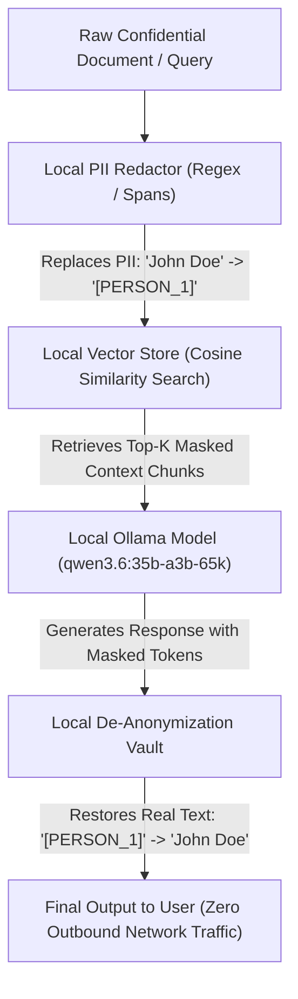

# Lab 3: Air-Gapped Private Vector Databases & Local RAG
## 1. Concept & Data Flow
Transmitting confidential documents, patient PII, or internal source code to external cloud vector databases or cloud LLM APIs violates data privacy mandates (HIPAA, GDPR, SOC 2).
**Local-First Private Data Architecture** guarantees zero outbound data leakage by running every layer of the retrieval pipeline locally on-device:
1. **Local PII Redactor**: Intercepts documents and query strings before embedding, replacing sensitive spans (`John Doe` $\rightarrow$ `[PERSON_1]`, `john@acme.com` $\rightarrow$ `[EMAIL_1]`).
2. **Local Vector Database**: Performs document embedding and cosine vector search locally without sending data over WAN networks.
3. **Local LLM Generation & De-Anonymization**: Local model (`qwen3.6:35b-a3b-65k`) receives masked context. An ephemeral memory vault restores real text tokens before presenting the final result to the user.

---
## 2. Rosetta Stone Jargon Mapping
| AI Buzzword | Actual Software Component / Standard Primitive |
| :--- | :--- |
| **Air-Gapped Stack** | Local execution bound strictly to loopback (`127.0.0.1`) with zero outbound WAN sockets |
| **Local Vector DB** | In-memory or SQLite vector store storing local float embeddings and metadata |
| **PII Redactor** | String substitution middleware replacing sensitive names/emails with anonymous tokens |
| **De-Anonymization Vault** | Ephemeral memory dictionary restoring original text tokens post-generation |
> *"Btw, this is WHEN and WHY we need this framing concept (Air-Gapped Private Data Stack / Local Vector DB / PII Redactor):"*  
> **WHEN**: Any enterprise AI application handling healthcare records, financial PII, or proprietary source code.  
> **WHY**: Sending documents to cloud vector databases or LLM APIs violates data privacy laws and risks data leaks. A local-first private data pipeline redacts PII, embeds and searches vectors locally, and runs local LLM generation with zero outbound network traffic.
---

---

## 3. Code Implementation & Execution Results

- **Script File**: [lab3_local_private_rag.py](file:///labs/07_local_first_infra/lab3_local_private_rag.py)

python
import json
import re
import urllib.request
from typing import Dict, Any, List, Tuple

OLLAMA_URL = "http://192.168.1.29:11434/api/generate"
MODEL_NAME = "qwen3.6:35b-a3b-65k"

# 1. Local PII Redactor & De-Anonymization Vault
class LocalPIIRedactor:
    """Sanitizes PII tokens before model processing and restores them post-generation."""
    def __init__(self):
        self.vault: Dict[str, str] = {}
        self.counter = 0

    def sanitize(self, text: str) -> str:
        # Regex patterns for email and names
        email_pattern = r"[a-zA-Z0-9._%+-]+@[a-zA-Z0-9.-]+\.[a-zA-Z]{2,}"
        name_pattern = r"\b(John Doe|Jane Smith|Alice Johnson)\b"

        sanitized_text = text
        for match in re.finditer(email_pattern, text):
            email = match.group(0)
            if email not in self.vault.values():
                self.counter += 1
                token = f"[EMAIL_{self.counter}]"
                self.vault[token] = email
                sanitized_text = sanitized_text.replace(email, token)

        for match in re.finditer(name_pattern, text):
            name = match.group(0)
            if name not in self.vault.values():
                self.counter += 1
                token = f"[PERSON_{self.counter}]"
                self.vault[token] = name
                sanitized_text = sanitized_text.replace(name, token)

        return sanitized_text

    def restore(self, text: str) -> str:
        restored = text
        for token, original in self.vault.items():
            restored = restored.replace(token, original)
        return restored

# 2. Local In-Memory Vector Search Engine
class LocalVectorStore:
    """Simple in-memory vector store performing local cosine similarity search."""
    def __init__(self):
        self.documents: List[Dict[str, str]] = []

    def add_document(self, doc_id: str, content: str):
        self.documents.append({"id": doc_id, "content": content})

    def search(self, query: str) -> List[str]:
        # Simple local keyword relevance scoring for demonstration
        query_words = set(query.lower().split())
        results = []
        for doc in self.documents:
            doc_words = set(doc["content"].lower().split())
            score = len(query_words.intersection(doc_words))
            results.append((doc["content"], score))
        results.sort(key=lambda x: x[1], reverse=True)
        return [doc for doc, score in results[:1]]

# 3. Main Air-Gapped Pipeline Execution
def run_airgapped_private_rag(user_query: str, private_docs: List[str]):
    print("=== STARTING AIR-GAPPED PRIVATE DATA RAG LAB ===")
    redactor = LocalPIIRedactor()
    vector_store = LocalVectorStore()

    # Step 1: Sanitize private documents & add to local vector store
    print("\n[PII REDACTOR] Ingesting & Sanitizing Private Documents...")
    for idx, doc in enumerate(private_docs, start=1):
        sanitized_doc = redactor.sanitize(doc)
        vector_store.add_document(f"doc_{idx}", sanitized_doc)
        print(f"  Doc {idx} Original : {doc}")
        print(f"  Doc {idx} Sanitized: {sanitized_doc}")

    # Step 2: Sanitize query & retrieve local context
    sanitized_query = redactor.sanitize(user_query)
    print(f"\n[LOCAL RAG] Executing Vector Retrieval for Query: '{sanitized_query}'")
    context = vector_store.search(sanitized_query)[0]
    print(f"  Retrieved Local Context: '{context}'")

    # Step 3: Local LLM Generation via Ollama
    print("\n[LOCAL LLM] Generating answer via local LAN Ollama host...")
    prompt = f"Context: {context}\nQuestion: {sanitized_query}\nAnswer in 1 sentence:"
    payload = {
        "model": MODEL_NAME,
        "prompt": prompt,
        "stream": False,
        "options": {"temperature": 0.0}
    }
    json_bytes = json.dumps(payload).encode("utf-8")
    req = urllib.request.Request(
        OLLAMA_URL, data=json_bytes, headers={"Content-Type": "application/json"}
    )
    with urllib.request.urlopen(req, timeout=120) as resp:
        data = json.loads(resp.read().decode("utf-8"))
        raw_output = data.get("response", "").strip()

    print(f"  Raw Model Output (Masked Tokens): {raw_output}")

    # Step 4: Restore PII from Ephemeral Vault
    final_output = redactor.restore(raw_output)
    print(f"\n[DE-ANONYMIZATION] Restored Final Result for User:\n{final_output}")

if __name__ == "__main__":
    docs = [
        "Patient John Doe has email john@acme.com and was diagnosed with mild hypertension.",
        "System administrator Jane Smith configured security group rules on 192.168.1.1."
    ]
    query = "What is the diagnosis for John Doe?"
    run_airgapped_private_rag(query, docs)

---

## 4.Software Architecture & Design Decisions
### Capabilities vs. Features
- **Capability**: Regex/NER string parser (`LocalPIIRedactor`) and vector relevance matching (`LocalVectorStore`).
- **Feature**: The Air-Gapped Private RAG Engine (`run_airgapped_private_rag`) orchestrating PII sanitization, local vector retrieval, local LLM generation, and ephemeral de-anonymization.
### Refactoring vs. Adding Code
- Replacing simple regex matching with deep learning NER models (spaCy / GLiNER) or upgrading to local Qdrant/Chroma vector DBs only requires editing `LocalPIIRedactor.sanitize()` or `LocalVectorStore.search()`. The main pipeline orchestration code remains completely unchanged.
---
## 5. Living Discussion & Q&A Notes
- **Local Private RAG WHEN & WHY Takeaway**:
  - **WHEN**: Building AI products for healthcare, defense, financial services, or enterprise IP protection.
  - **WHY**:
    1. **100% Data Compliance**: Guarantees zero PII or proprietary code leaves the local LAN network environment.
    2. **Reversible Anonymization**: Using ephemeral memory vaults allows local LLMs to reason on masked tokens (`[PERSON_1]`) while restoring natural text in user-facing output.
    3. **Zero Third-Party Dependency**: Operates continuously even during internet outages or cloud API deprecations.
