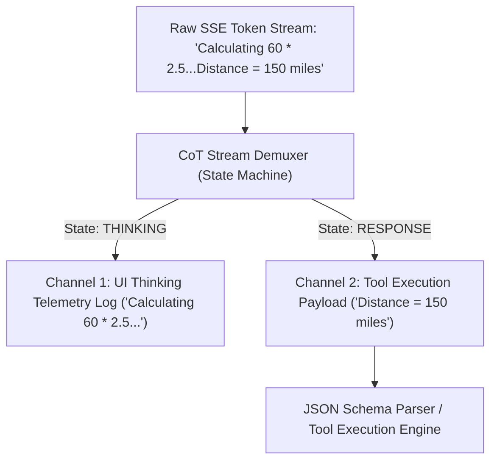

# Lab 1: Reasoning Models & Chain-of-Thought (CoT) Stream Demuxing
## 1. Concept & Data Flow
Reasoning models (such as DeepSeek-R1, QwQ, and Qwen3.6 thinking models) generate internal Chain-of-Thought (CoT) reasoning traces enclosed inside `<think> ... </think>` tags before emitting final answers or tool calls.
If a naive agent harness receives this token stream without demuxing:
1. The internal thinking tokens pollute tool execution context.
2. Unparsed `<think>` tags cause JSON schema parsers to fail.
A **CoT Stream Demuxer** maintains a state machine (`IDLE` $\rightarrow$ `THINKING` $\rightarrow$ `RESPONSE`) to demultiplex token streams across arbitrary SSE chunk boundaries:
- **Channel 1 (`[THINKING LOG]`)**: Extracted reasoning tokens routed to expandable UI telemetry accordions.
- **Channel 2 (`[RESPONSE PAYLOAD]`)**: Clean response content routed to JSON parsers and tool executors.

---
## 2. Rosetta Stone Jargon Mapping
| AI Buzzword | Actual Software Component / Standard Primitive |
| :--- | :--- |
| **Reasoning Model** | LLM fine-tuned (via GRPO/RL) to generate internal `<think>` reasoning traces |
| **CoT Stream Demuxer** | State machine & regex buffer demultiplexing tokens into thinking vs response streams |
| **Test-Time Compute** | Allocating extra inference tokens (`<think>`) at runtime to solve complex reasoning |
| **Thinking Budget** | Hyperparameter (`max_thinking_tokens`) capping maximum CoT generation tokens |
> *"Btw, this is WHEN and WHY we need this framing concept (Reasoning Model / Chain-of-Thought Stream Demuxer / Test-Time Compute):"*  
> **WHEN**: Working with reasoning models (DeepSeek-R1, QwQ, Qwen3.6) that generate internal `<think>` reasoning traces.  
> **WHY**: Naive stream parsers choke on `<think>` tags, breaking JSON tool calls and UI displays. A CoT demuxer separates thinking telemetry tokens from clean action payloads across arbitrary chunk boundaries.
---

---

## 3. Code Implementation & Execution Results

- **Script File**: [lab1_cot_demuxer.py](file:///labs/08_advanced_reasoning/lab1_cot_demuxer.py)

python
import json
import urllib.request
from typing import Tuple

OLLAMA_URL = "http://192.168.1.29:11434/api/generate"
MODEL_NAME = "qwen3.6:35b-a3b-65k"

# 1. State Machine CoT Stream Demuxer
class CoTStreamDemuxer:
    """State machine that demultiplexes <think> reasoning tokens from response payloads."""
    def __init__(self):
        self.state = "IDLE"  # IDLE, THINKING, RESPONSE
        self.buffer = ""

    def feed(self, chunk: str) -> Tuple[str, str]:
        """Processes a token chunk and returns (thinking_tokens, response_tokens)."""
        self.buffer += chunk
        thinking_out, response_out = "", ""

        while self.buffer:
            if self.state == "IDLE":
                if "<think>" in self.buffer:
                    pre, post = self.buffer.split("<think>", 1)
                    response_out += pre
                    self.buffer = post
                    self.state = "THINKING"
                else:
                    response_out += self.buffer
                    self.buffer = ""
            elif self.state == "THINKING":
                if "</think>" in self.buffer:
                    think_text, post = self.buffer.split("</think>", 1)
                    thinking_out += think_text
                    self.buffer = post
                    self.state = "RESPONSE"
                else:
                    thinking_out += self.buffer
                    self.buffer = ""
            elif self.state == "RESPONSE":
                response_out += self.buffer
                self.buffer = ""

        return thinking_out, response_out

# 2. Main Streaming Execution Loop
def run_demuxed_reasoning_stream(prompt: str):
    print("=== STARTING REASONING MODEL COT DEMUXER LAB ===")
    print(f"[REASONING ENGINE] Model: '{MODEL_NAME}' | Endpoint: LAN Ollama Host")
    
    demuxer = CoTStreamDemuxer()
    payload = {
        "model": MODEL_NAME,
        "prompt": prompt,
        "stream": True,
        "options": {"temperature": 0.0}
    }
    json_bytes = json.dumps(payload).encode("utf-8")
    req = urllib.request.Request(
        OLLAMA_URL, data=json_bytes, headers={"Content-Type": "application/json"}
    )

    full_thinking = []
    full_response = []

    print("\n=== DEMUXED STREAMING OUTPUT ===")
    with urllib.request.urlopen(req, timeout=120) as resp:
        for line in resp:
            if not line:
                continue
            data = json.loads(line.decode("utf-8"))
            chunk = data.get("response", "")
            
            thinking_token, response_token = demuxer.feed(chunk)
            
            if thinking_token:
                full_thinking.append(thinking_token)
                print(f"[THINKING LOG] {thinking_token}", end="", flush=True)
            if response_token:
                full_response.append(response_token)
                print(f"[RESPONSE PAYLOAD] {response_token}", end="", flush=True)

    print("\n\n=== FINAL DEMUXED SUMMARY ===")
    print(f"Total Thinking Characters : {len(''.join(full_thinking))}")
    print(f"Total Response Characters : {len(''.join(full_response))}")

if __name__ == "__main__":
    prompt = "Solve step-by-step: If a train travels at 60 mph for 2.5 hours, how far does it travel?"
    run_demuxed_reasoning_stream(prompt)

---

## 4.Software Architecture & Design Decisions
### Capabilities vs. Features
- **Capability**: State machine string buffer parsing (`CoTStreamDemuxer.feed`).
- **Feature**: Demuxed Reasoning Engine (`run_demuxed_reasoning_stream`) splitting streamed SSE tokens into separated UI logs and clean tool payloads.
### Refactoring vs. Adding Code
- Supporting custom XML reasoning tags (e.g. `<reasoning>`, `<scratchpad>`) only requires adding additional tag match strings inside `CoTStreamDemuxer.feed()`. The streaming event loop remains completely untouched.
---
## 5. Living Discussion & Q&A Notes
- **CoT Stream Demuxing WHEN & WHY Takeaway**:
  - **WHEN**: Building user interfaces or tool execution engines powered by reasoning LLMs.
  - **WHY**:
    1. **Protects JSON Tool Execution**: Prevents internal `<think>` text from breaking structured JSON parsers.
    2. **Improves UX Transparency**: Allows frontends to display reasoning steps in collapsible UI accordions while streaming final text directly into the main message body.
    3. **Handles Split Chunk Boundaries**: Correctly parses tags even when `<think>` or `</think>` tags are fragmented across multiple SSE chunks.
