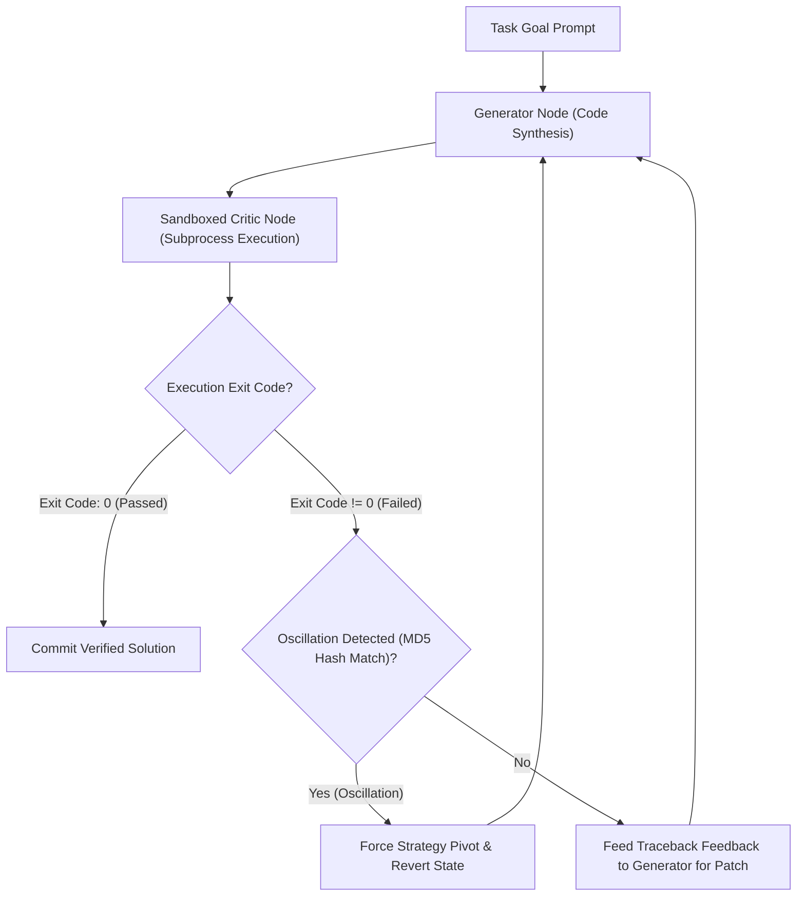

# Lab 3: Reflection & Self-Correction Loops (Reflexion Engine)
## 1. Concept & Data Flow
Single-pass generation in autonomous LLM systems is brittle. Complex coding tasks or multi-step reasoning frequently produce subtle syntax or logic errors when executed in a single forward pass.
**Reflection & Self-Correction Loops (Reflexion Engine)** decouple generation from quality verification using a 3-step state machine loop:
1. **Generator Node**: Generates candidate code or data artifacts via local LLM (`qwen3.6:35b-a3b-65k`).
2. **Sandboxed Critic Node**: Executes code in an isolated subprocess sandbox, capturing `stderr` tracebacks and calculating MD5 error signature hashes.
3. **Oscillation Detector & Reflexion Engine**: If defects are found, the engine feeds line-specific traceback feedback back into context. If an error oscillation is detected (MD5 hash match), it forces a strategy pivot or state rollback!

---
## 2. Rosetta Stone Jargon Mapping
| AI Buzzword | Actual Software Component / Standard Primitive |
| :--- | :--- |
| **Reflexion / Self-Correction** | Generator-Critic state machine loop with traceback context feedback |
| **Generator-Critic Pattern** | Decoupled graph nodes where Node A creates content and Node B audits output |
| **Error Oscillation** | Repeating failure pattern where fixing Error A re-introduces Error B across turns |
| **Traceback Ingestion** | Subprocess error capture passing `stderr` logs back into context for repair |
> *"Btw, this is WHEN and WHY we need this framing concept (Reflection Loop / Generator-Critic Pattern / Oscillation Detection):"*  
> **WHEN**: Any autonomous software engineering or complex reasoning agent where single-pass LLM generation can produce bugs.  
> **WHY**: Single-pass generation frequently produces edge-case bugs. A reflection loop runs code in a sandbox, catches tracebacks, and feeds error context back into the LLM, enabling autonomous self-healing while MD5 oscillation detection prevents infinite repair loops.
---

---

## 3. Code Implementation & Execution Results

- **Script File**: [lab3_reflexion_loop.py](file:///labs/08_advanced_reasoning/lab3_reflexion_loop.py)

python
import hashlib
import json
import os
import subprocess
import sys
import tempfile
import urllib.request
from typing import Dict, Any, List, Tuple

OLLAMA_URL = "http://192.168.1.29:11434/api/generate"
MODEL_NAME = "qwen3.6:35b-a3b-65k"

def llm_generate(prompt: str) -> str:
    payload = {
        "model": MODEL_NAME,
        "prompt": prompt,
        "stream": False,
        "options": {"temperature": 0.0}
    }
    json_bytes = json.dumps(payload).encode("utf-8")
    req = urllib.request.Request(
        OLLAMA_URL, data=json_bytes, headers={"Content-Type": "application/json"}
    )
    with urllib.request.urlopen(req, timeout=120) as resp:
        data = json.loads(resp.read().decode("utf-8"))
        res = data.get("response", "").strip()
        if res.startswith("```python"):
            res = res.replace("```python", "").replace("```", "").strip()
        return res

# 1. Sandboxed Critic Node (Execution Verification)
def run_sandboxed_critic(temp_dir: str) -> Tuple[int, str]:
    script_path = os.path.join(temp_dir, "solution.py")
    proc = subprocess.Popen(
        [sys.executable, script_path],
        cwd=temp_dir,
        stdout=subprocess.PIPE,
        stderr=subprocess.PIPE,
        text=True
    )
    stdout, stderr = proc.communicate(timeout=5)
    return proc.returncode, stderr.strip()

# 2. Reflexion & Self-Correction Engine
class ReflexionEngine:
    """Manages multi-turn reflection, traceback context feedback, and oscillation detection."""
    def __init__(self, max_turns: int = 3):
        self.max_turns = max_turns
        self.seen_signatures = set()

    def run_reflexion_loop(self, task_goal: str) -> Dict[str, Any]:
        print("=== STARTING REFLEXION & SELF-CORRECTION LOOP LAB ===")
        print(f"[TASK GOAL]: {task_goal}")

        with tempfile.TemporaryDirectory(prefix="reflexion_") as temp_dir:
            solution_path = os.path.join(temp_dir, "solution.py")
            current_prompt = f"Write a Python script for: {task_goal}. Provide ONLY runnable code."

            for turn in range(1, self.max_turns + 1):
                print(f"\n[TURN {turn}] Generator Node generating code...")
                code = llm_generate(current_prompt)
                
                # Write generated code to sandbox
                with open(solution_path, "w", encoding="utf-8") as f:
                    f.write(code)

                # Critic Node executes code
                exit_code, stderr = run_sandboxed_critic(temp_dir)

                if exit_code == 0:
                    print(f"  [PASSED] Execution Succeeded on Turn {turn}! (Exit Code: 0)")
                    return {"status": "SUCCESS", "turns": turn, "verified_code": code}

                print(f"  [FAILED] Execution Failed (Exit Code: {exit_code})")
                print(f"  [CRITIC TRACEBACK]:\n{stderr}")

                # Oscillation Detection via MD5 Hash
                sig_hash = hashlib.md5(stderr.encode("utf-8")).hexdigest()
                if sig_hash in self.seen_signatures:
                    print("  [CASCADE] [OSCILLATION ALERT] Repeated error signature detected!")
                    current_prompt = f"CRITICAL: Oscillation detected. Strategy Pivot Required!\nTask: {task_goal}\nPrior Error: {stderr}\nRewrite solution using a completely different strategy."
                else:
                    self.seen_signatures.add(sig_hash)
                    current_prompt = f"Fix defects in prior code.\nTask: {task_goal}\nTraceback Error:\n{stderr}\nCode:\n{code}"

            print("\n[REFLEXION ENGINE] Reached Max Turns without resolution.")
            return {"status": "FAILED_MAX_TURNS", "turns": self.max_turns}

if __name__ == "__main__":
    goal = "Create a function safe_divide(a, b) that divides a by b, handling ZeroDivisionError gracefully, and print safe_divide(10, 0)."
    engine = ReflexionEngine(max_turns=3)
    result = engine.run_reflexion_loop(goal)
    print(f"\nFinal Result: {result}")


---

## 4.Software Architecture & Design Decisions
### Capabilities vs. Features
- **Capability**: Subprocess sandbox execution (`run_sandboxed_critic`) and MD5 hash fingerprinting (`hashlib.md5`).
- **Feature**: The Reflexion Engine (`ReflexionEngine`) orchestrating multi-turn generation, error traceback ingestion, oscillation detection, and strategy pivoting.
### Refactoring vs. Adding Code
- Upgrading from simple script execution to running unit test suites (e.g. `pytest`) only requires modifying `run_sandboxed_critic()` to execute pytest commands. The main reflexion loop and oscillation detection logic remain completely unchanged.
---
## 5. Living Discussion & Q&A Notes
- **Reflexion Loops WHEN & WHY Takeaway**:
  - **WHEN**: Operating autonomous coding agents (like Claude Code, Hermes, or OpenClaw) handling multi-file edits or complex algorithm creation.
  - **WHY**:
    1. **Autonomous Self-Healing**: Automatically catches runtime exceptions and syntax errors, fixing defects without human intervention.
    2. **Prevents Infinite Repair Loops**: MD5 hash tracking detects repeating error signatures and forces a strategy pivot before token budgets are exhausted.
    3. **Empirical Verification**: Guarantees code validity by requiring clean subprocess execution (`Exit Code: 0`) before committing changes.
