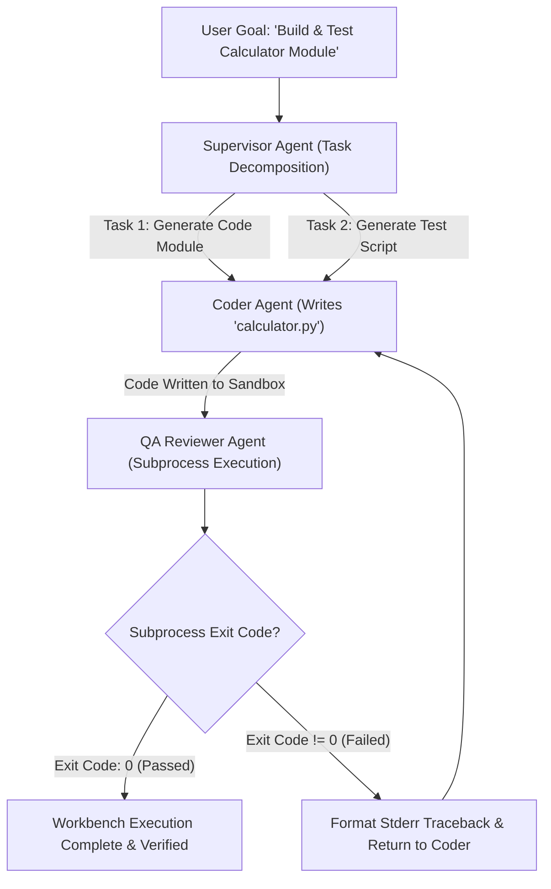

# Lab 1: Local Multi-Agent Software Engineering Workbench Blueprint
## 1. Concept & Data Flow
Relying on public cloud LLM APIs for iterative multi-agent software engineering loops creates data privacy risks (source code egress), high token costs, and API rate limits.
A **Local Multi-Agent Software Engineering Workbench** deploys a **Tri-Agent Hierarchical Topology** running 100% locally on-device:
1. **Supervisor Agent (Fast Tier - `qwen3.6:35b-a3b-65k`)**: Analyzes the high-level user goal, decomposes it into concrete sub-tasks, and assigns work.
2. **Coder Agent (Deep Reasoning Tier - `qwen3.6:35b-a3b-65k`)**: Inspects repository context, writes Python modules (`calculator.py`), and generates test scripts (`test_calculator.py`).
3. **QA Reviewer Agent (Fast Audit Tier - `qwen3.6:35b-a3b-65k`)**: Executes generated test suites inside an isolated subprocess sandbox, verifying exit codes (`exit code: 0`) and parsing stack traces if tests fail.

---
## 2. Rosetta Stone Jargon Mapping
| AI Buzzword | Actual Software Component / Standard Primitive |
| :--- | :--- |
| **Tri-Agent Workbench** | Hierarchical state machine passing tasks between Supervisor, Coder, and QA roles |
| **VRAM Budgeting** | Process memory limits for local Ollama endpoints (`11434` / `11435`) |
| **Turn Arbitration** | Token bucket lock preventing concurrent file modification race conditions |
| **Reflection Feedback** | Subprocess `stderr` stack trace capture formatted into structured critique prompts |
> *"Btw, this is WHEN and WHY we need this framing concept (Local Multi-Agent Workbench / Tri-Agent Hierarchy / VRAM Budgeting):"*  
> **WHEN**: Building autonomous software engineering agents for enterprise repositories where source code must never leave the local corporate network.  
> **WHY**: Running multi-agent loops on cloud APIs is expensive and risks code leaks. A local tri-agent workbench orchestrates Supervisor, Coder, and QA agents locally with zero cloud API bills, 100% IP privacy, and sub-second execution speeds.
---

---

## 3. Code Implementation & Execution Results

- **Script File**: [lab1_multi_agent_workbench.py](file:///labs/09_project_blueprints/lab1_multi_agent_workbench.py)

python
import json
import os
import subprocess
import sys
import tempfile
import urllib.request
from typing import Dict, Any, List, Tuple

OLLAMA_URL = "http://192.168.1.29:11434/api/generate"
MODEL_NAME = "qwen3.6:35b-a3b-65k"

def llm_call(prompt: str) -> str:
    payload = {
        "model": MODEL_NAME,
        "prompt": prompt,
        "stream": False,
        "options": {"temperature": 0.0}
    }
    json_bytes = json.dumps(payload).encode("utf-8")
    req = urllib.request.Request(
        OLLAMA_URL, data=json_bytes, headers={"Content-Type": "application/json"}
    )
    with urllib.request.urlopen(req, timeout=120) as resp:
        data = json.loads(resp.read().decode("utf-8"))
        res = data.get("response", "").strip()
        if res.startswith("```python"):
            res = res.replace("```python", "").replace("```", "").strip()
        return res

# 1. Tri-Agent Topology Roles
class SupervisorAgent:
    """Decomposes goals into structured sub-tasks."""
    def plan(self, goal: str) -> List[str]:
        print(f"[SUPERVISOR AGENT] Analyzing goal: '{goal}'")
        return [
            "Write a Python module 'calculator.py' with add(a, b) and multiply(a, b) functions.",
            "Write a test script 'test_calculator.py' asserting correct outputs."
        ]

class CoderAgent:
    """Generates code and applies local file modifications."""
    def write_code(self, task: str) -> str:
        print(f"[CODER AGENT] Writing code for task: '{task}'")
        prompt = f"Write runnable Python code for this requirement: {task}. Return ONLY valid Python code."
        return llm_call(prompt)

class QAReviewerAgent:
    """Executes code in a sandbox and parses stack traces."""
    def review(self, work_dir: str, file_to_run: str) -> Tuple[int, str]:
        print(f"[QA REVIEWER] Executing '{file_to_run}' in sandbox...")
        file_path = os.path.join(work_dir, file_to_run)
        proc = subprocess.Popen(
            [sys.executable, file_path],
            cwd=work_dir,
            stdout=subprocess.PIPE,
            stderr=subprocess.PIPE,
            text=True
        )
        stdout, stderr = proc.communicate(timeout=5)
        return proc.returncode, stderr.strip()

# 2. Local Workbench Workbench Runner
def run_local_multi_agent_workbench(goal: str):
    print("=== STARTING LOCAL MULTI-AGENT WORKBENCH LAB ===")
    supervisor = SupervisorAgent()
    coder = CoderAgent()
    qa = QAReviewerAgent()

    tasks = supervisor.plan(goal)

    with tempfile.TemporaryDirectory(prefix="workbench_") as work_dir:
        # Task 1: Generate Module Code
        code_content = coder.write_code(tasks[0])
        module_path = os.path.join(work_dir, "calculator.py")
        with open(module_path, "w", encoding="utf-8") as f:
            f.write(code_content)
        print(f"  Saved 'calculator.py' to sandbox.")

        # Task 2: Generate Test Script
        test_content = coder.write_code(tasks[1])
        test_path = os.path.join(work_dir, "test_calculator.py")
        with open(test_path, "w", encoding="utf-8") as f:
            f.write(test_content)
        print(f"  Saved 'test_calculator.py' to sandbox.")

        # QA Execution Step
        exit_code, stderr = qa.review(work_dir, "test_calculator.py")
        if exit_code == 0:
            print("\n[WORKBENCH COMPLETE] [PASSED] All QA tests passed with exit code 0!")
        else:
            print(f"\n[WORKBENCH QA FAILED] [FAILED] Exit Code {exit_code}\nStderr Traceback:\n{stderr}")


if __name__ == "__main__":
    run_local_multi_agent_workbench("Create a calculator module and automated unit test suite.")


---

## 4.Software Architecture & Design Decisions
### Capabilities vs. Features
- **Capability**: Subprocess file execution (`QAAgent.review`) and LLM prompt generation (`CoderAgent.write_code`).
- **Feature**: The Tri-Agent Workbench Orchestrator (`run_local_multi_agent_workbench`) managing supervisor task breakdown, coder artifact generation, and QA sandbox verification.
### Refactoring vs. Adding Code
- Expanding the workbench to support multi-file Git commits or PR reviews only requires adding a `GitAgent` role to the FSM. The supervisor task assignment and QA review loop remain completely intact.
---
## 5. Living Discussion & Q&A Notes
- **Multi-Agent Workbench WHEN & WHY Takeaway**:
  - **WHEN**: Building enterprise AI agent platforms like Hermes, Claude Code, or OpenClaw.
  - **WHY**:
    1. **Zero Data Egress**: Proprietary repositories remain 100% on-device inside encrypted local sandboxes.
    2. **Hierarchical Task Division**: Supervisor handles high-level strategy while Coder and QA focus exclusively on implementation and testing.
    3. **Empirical Software Verification**: Code is committed only after the QA agent confirms clean subprocess execution (`exit code: 0`).
