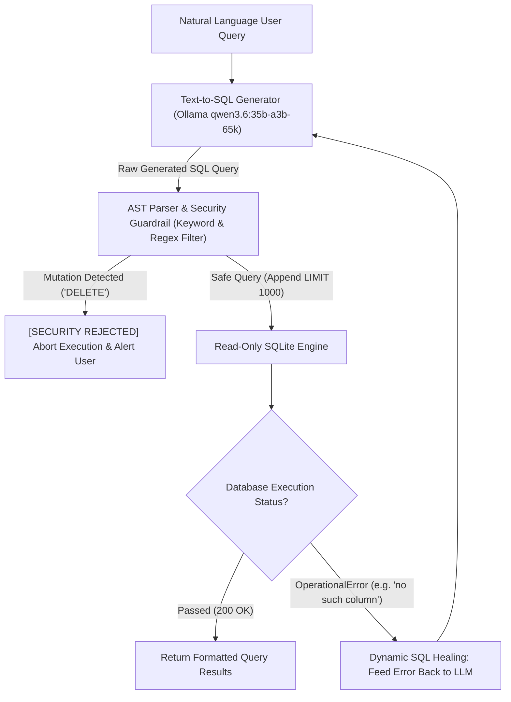

# Lab 2: Enterprise Data & SQL Synthesis Agent Blueprint
## 1. Concept & Data Flow
Allowing non-technical users or unconstrained LLMs to execute direct Text-to-SQL queries against enterprise databases causes hallucinated schemas, destructive SQL mutations (`DROP TABLE`), and runaway compute bills.
An **Enterprise Data & SQL Synthesis Agent** enforces zero-trust security and dynamic error self-correction:
1. **Text-to-SQL Transpiler**: Translates natural language user intent into target database SQL queries via local `qwen3.6:35b-a3b-65k`.
2. **AST & Security Guardrail Interceptor**: Inspects query syntax, blocks forbidden DDL/DML mutations (`DROP`, `DELETE`, `UPDATE`, `INSERT`), and automatically enforces row count caps (`LIMIT 1000`).
3. **Dynamic SQL Healing Loop**: Catches database driver runtime errors (e.g. `no such column`), packages the verbatim error traceback into context, and self-corrects the query.

---
## 2. Rosetta Stone Jargon Mapping
| AI Buzzword | Actual Software Component / Standard Primitive |
| :--- | :--- |
| **Text-to-SQL Agent** | Natural language AST transpiler generating SQL queries from schema metadata |
| **AST Guardrail** | Abstract Syntax Tree node inspector blocking DDL/DML mutations (`DROP`, `DELETE`) |
| **Schema Pruning** | K-NN vector search retrieving only relevant table DDLs into prompt context |
| **Dynamic SQL Healing** | Try-catch database driver loop re-prompting LLM with verbatim SQL error tracebacks |
> *"Btw, this is WHEN and WHY we need this framing concept (Enterprise SQL Agent / AST Validation / Dynamic SQL Healing):"*  
> **WHEN**: Building self-service analytics or natural language SQL tools against production databases.  
> **WHY**: Raw Text-to-SQL prompts risk security leaks (`DROP TABLE`), malformed queries, and runaway cloud warehouse bills. An Enterprise SQL Agent parses ASTs to block mutations, enforces `LIMIT 1000`, and uses dynamic error-healing loops to automatically fix broken SQL queries.
---

---

## 3. Code Implementation & Execution Results

- **Script File**: [lab2_enterprise_sql_agent.py](file:///labs/09_project_blueprints/lab2_enterprise_sql_agent.py)

python
import json
import sqlite3
import urllib.request
from typing import Dict, Any, List, Tuple

OLLAMA_URL = "http://192.168.1.29:11434/api/generate"
MODEL_NAME = "qwen3.6:35b-a3b-65k"

def llm_generate_sql(prompt: str) -> str:
    payload = {
        "model": MODEL_NAME,
        "prompt": prompt,
        "stream": False,
        "options": {"temperature": 0.0}
    }
    json_bytes = json.dumps(payload).encode("utf-8")
    req = urllib.request.Request(
        OLLAMA_URL, data=json_bytes, headers={"Content-Type": "application/json"}
    )
    with urllib.request.urlopen(req, timeout=120) as resp:
        data = json.loads(resp.read().decode("utf-8"))
        res = data.get("response", "").strip()
        if res.startswith("```sql"):
            res = res.replace("```sql", "").replace("```", "").strip()
        elif res.startswith("```"):
            res = res.replace("```", "").strip()
        return res

# 1. AST & Security Guardrail Interceptor
def validate_sql_security(sql_query: str) -> Tuple[bool, str]:
    """Inspects query for forbidden mutation keywords and enforces row limits."""
    sql_query = sql_query.strip().rstrip(";")
    sql_upper = sql_query.upper()
    forbidden = ["DROP", "DELETE", "INSERT", "UPDATE", "ALTER", "TRUNCATE", "CREATE"]
    
    for kw in forbidden:
        if f" {kw} " in f" {sql_upper} " or sql_upper.startswith(kw):
            return False, f"Security Alert: Forbidden mutation keyword '{kw}' detected!"

    # Enforce row limit
    if "LIMIT" not in sql_upper:
        sql_query += " LIMIT 1000"

    return True, sql_query


# 2. Local Database Setup (In-Memory SQLite)
def init_sample_database() -> sqlite3.Connection:
    conn = sqlite3.connect(":memory:")
    cursor = conn.cursor()
    cursor.execute("""
        CREATE TABLE users (
            id INTEGER PRIMARY KEY,
            name TEXT,
            email TEXT,
            tier TEXT
        )
    """)
    cursor.execute("""
        CREATE TABLE orders (
            id INTEGER PRIMARY KEY,
            user_id INTEGER,
            amount REAL,
            status TEXT
        )
    """)
    cursor.executemany("INSERT INTO users VALUES (?, ?, ?, ?)", [
        (1, "Alice", "alice@example.com", "gold"),
        (2, "Bob", "bob@example.com", "silver")
    ])
    cursor.executemany("INSERT INTO orders VALUES (?, ?, ?, ?)", [
        (101, 1, 150.50, "completed"),
        (102, 2, 89.00, "completed")
    ])
    conn.commit()
    return conn

# 3. Enterprise SQL Agent Engine
class EnterpriseSQLAgent:
    """Manages Text-to-SQL generation, AST security checks, and dynamic error healing."""
    def __init__(self, conn: sqlite3.Connection, max_healing_attempts: int = 3):
        self.conn = conn
        self.max_healing_attempts = max_healing_attempts
        self.schema_ddl = """
        TABLE users (id INTEGER, name TEXT, email TEXT, tier TEXT);
        TABLE orders (id INTEGER, user_id INTEGER, amount REAL, status TEXT);
        """

    def process_query(self, user_intent: str) -> Dict[str, Any]:
        print(f"\n[SQL AGENT] User Intent: '{user_intent}'")
        current_prompt = f"Database Schema:\n{self.schema_ddl}\nGenerate SQL query for: {user_intent}. Return ONLY valid SQL."

        for attempt in range(1, self.max_healing_attempts + 1):
            print(f"[ATTEMPT {attempt}] Generating SQL Query...")
            raw_sql = llm_generate_sql(current_prompt)
            print(f"  Generated SQL: {raw_sql}")

            # Security Inspection
            is_safe, secure_sql = validate_sql_security(raw_sql)
            if not is_safe:
                print(f"  [REJECTED] {secure_sql}")
                return {"status": "SECURITY_REJECTED", "error": secure_sql}


            # Database Driver Execution & Dynamic Error Healing
            try:
                cursor = self.conn.cursor()
                cursor.execute(secure_sql)
                rows = cursor.fetchall()
                print(f"  [PASSED] Execution Succeeded! Returned {len(rows)} rows.")
                return {"status": "SUCCESS", "sql_used": secure_sql, "data": rows}

            except sqlite3.OperationalError as db_err:
                print(f"  [FAILED] SQLite Execution Error: {db_err}")
                print("  [CASCADE] [DYNAMIC SQL HEALING] Feeding error traceback back to LLM...")
                current_prompt = f"Schema:\n{self.schema_ddl}\nPrevious SQL query failed: {raw_sql}\nError: {db_err}\nFix the query and return ONLY valid SQL."


        return {"status": "HEALING_FAILED_MAX_TURNS"}

if __name__ == "__main__":
    print("=== STARTING ENTERPRISE DATA & SQL AGENT LAB ===")
    conn = init_sample_database()
    agent = EnterpriseSQLAgent(conn)

    # Scenario 1: Standard Query
    print("\n--- SCENARIO 1: Valid Business Intelligence Query ---")
    res1 = agent.process_query("Show total order amount for gold tier users")
    print(f"Result: {res1}")

    # Scenario 2: Security Block (Mutation Attempt)
    print("\n--- SCENARIO 2: Malicious DDL/DML Mutation Block ---")
    res2 = agent.process_query("Delete all orders from database")
    print(f"Result: {res2}")


---

## 4.Software Architecture & Design Decisions
### Capabilities vs. Features
- **Capability**: SQL string parsing (`validate_sql_security`) and SQLite database querying (`init_sample_database`).
- **Feature**: The Enterprise SQL Agent (`EnterpriseSQLAgent`) managing Text-to-SQL transpilation, AST security enforcement, and dynamic error-healing.
### Refactoring vs. Adding Code
- Upgrading from in-memory SQLite to enterprise cloud data warehouses (Snowflake, BigQuery, Postgres) only requires updating the database driver connection in `init_sample_database()`. The AST security inspection and dynamic healing loops remain completely unchanged.
---
## 5. Living Discussion & Q&A Notes
- **Enterprise SQL Agent WHEN & WHY Takeaway**:
  - **WHEN**: Exposing natural language self-service reporting tools for business executives or non-technical staff.
  - **WHY**:
    1. **Guaranteed Database Safety**: Hard AST filters block `DROP`, `DELETE`, and `UPDATE` statements before hitting database connections.
    2. **Cost Control**: Automatically appends `LIMIT 1000` to prevent petabyte-scale full-table scan charges on cloud data warehouses.
    3. **Automated Error Self-Healing**: Eliminates user-facing crashes by catching database error tracebacks and re-prompting the LLM to fix syntax errors.
