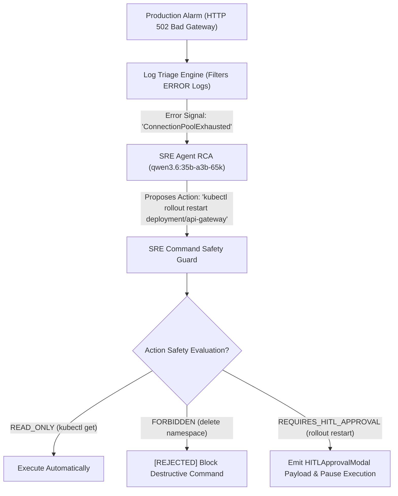

# Lab 3: Autonomous DevOps & SRE Incident Remediation Agent Blueprint
## 1. Concept & Data Flow
Managing high-availability cloud infrastructure (Kubernetes, microservices) during production outages presents severe operational bottlenecks: log storms overwhelm human engineers, and unconstrained AI agents with write access risk catastrophic accidental pod/namespace deletions.
An **Autonomous DevOps & SRE Agent** automates incident triage and remediation within a strict safety framework:
1. **Log Triage Engine**: Ingests stdout/stderr streams, filtering `ERROR`/`CRITICAL` log signatures (`ConnectionPoolExhausted`) to reduce token context overhead.
2. **Root Cause Analysis (RCA)**: Synthesizes root-cause hypotheses via local `qwen3.6:35b-a3b-65k`.
3. **SRE Command Safety Guard & HITL Gate**:
   - `READ_ONLY` commands (`kubectl get pods`) run automatically.
   - `REQUIRES_HITL_APPROVAL` mutative commands (`kubectl rollout restart`) emit SDUI approval modals, pausing execution.
   - `FORBIDDEN` destructive commands (`kubectl delete namespace`) are blocked immediately.

---
## 2. Rosetta Stone Jargon Mapping
| AI Buzzword | Actual Software Component / Standard Primitive |
| :--- | :--- |
| **Autonomous SRE Agent** | Incident response state machine inspecting log traces and executing diagnostic commands |
| **Log Triage Engine** | Sliding window log stream filter extracting `ERROR`/`FATAL` signatures |
| **HITL Remediation Gate** | Webhook / UI approval checkpoint pausing mutative commands (`kubectl restart`) |
| **RCA Synthesizer** | Structured Markdown report generator compiling incident timelines and root causes |
> *"Btw, this is WHEN and WHY we need this framing concept (Autonomous SRE Agent / Log Triage Engine / HITL Remediation Gate):"*  
> **WHEN**: Operating high-availability cloud infrastructure (Kubernetes, AWS, microservices) where production outages require fast incident response.  
> **WHY**: Log storms overwhelm human engineers during outages. An Autonomous SRE Agent filters log signals, diagnoses root causes, runs diagnostic tools automatically, and uses HITL approval gates before applying mutative fixes to prevent accidental cluster damage.
---

---

## 3. Code Implementation & Execution Results

- **Script File**: [lab3_autonomous_sre_agent.py](file:///labs/09_project_blueprints/lab3_autonomous_sre_agent.py)

python
import json
import re
import urllib.request
from typing import Dict, Any, List, Tuple

OLLAMA_URL = "http://192.168.1.29:11434/api/generate"
MODEL_NAME = "qwen3.6:35b-a3b-65k"

def llm_call(prompt: str) -> str:
    payload = {
        "model": MODEL_NAME,
        "prompt": prompt,
        "stream": False,
        "options": {"temperature": 0.0}
    }
    json_bytes = json.dumps(payload).encode("utf-8")
    req = urllib.request.Request(
        OLLAMA_URL, data=json_bytes, headers={"Content-Type": "application/json"}
    )
    with urllib.request.urlopen(req, timeout=120) as resp:
        data = json.loads(resp.read().decode("utf-8"))
        return data.get("response", "").strip()

# 1. Log Triage Engine (Filter & Compression)
class LogTriageEngine:
    """Filters log streams for ERROR/CRITICAL signatures to reduce context bloat."""
    def extract_error_signatures(self, log_stream: List[str]) -> List[str]:
        error_logs = []
        for line in log_stream:
            if any(level in line for level in ["ERROR", "CRITICAL", "FATAL"]):
                error_logs.append(line)
        return error_logs

# 2. SRE Command Safety Guard & HITL Gate
class SRECommandSafetyGuard:
    """Evaluates proposed commands against safety policies."""
    MUTATIVE_WHITELIST = [
        r"^kubectl rollout restart deployment/[a-z0-9-]+ -n [a-z0-9-]+$",
        r"^kubectl scale deployment/[a-z0-9-]+ --replicas=\d+ -n [a-z0-9-]+$"
    ]
    FORBIDDEN_PATTERNS = [r"delete namespace", r"rm -rf", r"drop database"]

    def evaluate_command(self, command: str) -> Tuple[str, str]:
        cmd_clean = command.strip().lower()
        if any(re.search(pat, cmd_clean) for pat in self.FORBIDDEN_PATTERNS):
            return "FORBIDDEN", "Destructive command strictly prohibited by security policy."

        if any(re.match(pat, cmd_clean) for pat in self.MUTATIVE_WHITELIST):
            return "REQUIRES_HITL_APPROVAL", "Mutative infrastructure command requires human SRE token clearance."

        return "READ_ONLY", "Diagnostic command approved for automatic execution."

# 3. Autonomous SRE Remediation Agent
class AutonomousSREAgent:
    """Manages incident triage, root cause analysis, and HITL remediation gates."""
    def __init__(self):
        self.triage = LogTriageEngine()
        self.guard = SRECommandSafetyGuard()

    def investigate_and_remediate(self, raw_logs: List[str]) -> Dict[str, Any]:
        print("=== STARTING AUTONOMOUS DEVOPS & SRE AGENT LAB ===")
        print(f"[SRE AGENT] Ingesting {len(raw_logs)} raw log lines...")

        # Step 1: Log Triage & Filtering
        filtered_logs = self.triage.extract_error_signatures(raw_logs)
        print(f"  Extracted {len(filtered_logs)} ERROR log signatures.")

        # Step 2: Root Cause Analysis (RCA) via Ollama
        prompt = f"System Log Errors:\n" + "\n".join(filtered_logs) + "\n\nProvide 1-sentence Root Cause Analysis:"
        rca = llm_call(prompt)
        print(f"\n[ROOT CAUSE ANALYSIS]: {rca}")

        # Step 3: Propose Remediation Commands
        proposed_cmd1 = "kubectl get pods -n production"
        proposed_cmd2 = "kubectl rollout restart deployment/api-gateway -n production"
        proposed_cmd3 = "kubectl delete namespace production"

        print("\n[SAFETY GUARD EVALUATION]:")
        for cmd in [proposed_cmd1, proposed_cmd2, proposed_cmd3]:
            status, reason = self.guard.evaluate_command(cmd)
            print(f"  Command: '{cmd}'")
            print(f"  Status : [{status}] -> {reason}\n")

        return {
            "status": "SUCCESS",
            "rca": rca,
            "remediation_status": "PAUSED_FOR_HITL_APPROVAL",
            "approval_modal": {
                "type": "HITLApprovalModal",
                "proposed_command": proposed_cmd2,
                "risk_level": "MEDIUM"
            }
        }

if __name__ == "__main__":
    sample_logs = [
        "2026-08-09T00:43:00Z INFO [api-gateway] Processing GET /api/v1/checkout",
        "2026-08-09T00:43:01Z ERROR [api-gateway] ConnectionPoolExhausted: DB pool maxed at 100/100",
        "2026-08-09T00:43:02Z CRITICAL [api-gateway] HTTP 502 Bad Gateway emitted to client",
        "2026-08-09T00:43:03Z INFO [frontend] Retrying connection to api-gateway"
    ]
    agent = AutonomousSREAgent()
    res = agent.investigate_and_remediate(sample_logs)
    print(f"Result Payload: {json.dumps(res, indent=2)}")

---

## 4.Software Architecture & Design Decisions
### Capabilities vs. Features
- **Capability**: Regex log filtering (`LogTriageEngine`) and regex command whitelist parsing (`SRECommandSafetyGuard`).
- **Feature**: The Autonomous SRE Incident Remediation Engine (`AutonomousSREAgent`) orchestrating telemetry compression, LLM root-cause analysis, and HITL authorization checkpoints.
### Refactoring vs. Adding Code
- Integrating real Kubernetes Python API client libraries (`kubernetes-client`) or AWS SDKs (`boto3`) only requires replacing simulated command strings in `investigate_and_remediate()`. The log triage engine and safety guard policy evaluation remain completely unchanged.
---
## 5. Living Discussion & Q&A Notes
- **Autonomous SRE Agent WHEN & WHY Takeaway**:
  - **WHEN**: Operating mission-critical Kubernetes / cloud microservice clusters.
  - **WHY**:
    1. **Reduces Mean-Time-To-Detect (MTTD)**: Filters million-line log streams down to key error signatures in seconds.
    2. **Zero Risk of Accidental Destruction**: Hard regex safety guards block destructive commands (`delete namespace`, `rm -rf`).
    3. **Human-in-the-Loop Control**: Pauses before applying mutative changes, emitting SDUI component frames (`HITLApprovalModal`) for operator clearance.
