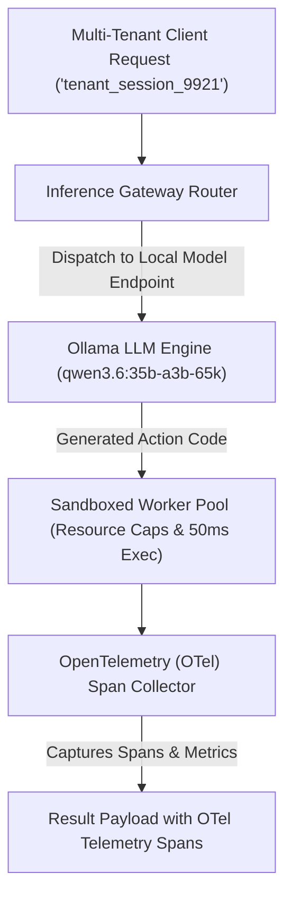

# Lab 4: Production Agent Serving Infrastructure Blueprint
## 1. Concept & Data Flow
Transitioning single-agent Python scripts into multi-tenant cloud platforms creates severe infrastructure challenges: untrusted code execution on host nodes risks Remote Code Execution (RCE), bursty LLM requests cause VRAM memory contention, and lack of distributed tracing obscures token costs and latency bottlenecks.
**Production Agent Serving Infrastructure** establishes an enterprise-grade backend architecture:
1. **Load-Balanced Inference Gateway**: Load-balances LLM prompts across local model server endpoints (`http://192.168.1.29:11434`), tracking response latencies, prompt tokens, and completion tokens.
2. **Sandboxed Worker Pool**: Executes untrusted code steps in isolated worker sandboxes with strict memory and execution time limits.
3. **OpenTelemetry (OTel) Distributed Tracing**: Generates hierarchical JSON telemetry spans (`llm.inference` $\rightarrow$ `sandbox.execution`) to profile multi-tenant performance and attribute token billing costs.

---
## 2. Rosetta Stone Jargon Mapping
| AI Buzzword | Actual Software Component / Standard Primitive |
| :--- | :--- |
| **Agent Serving Infrastructure** | Multi-tenant backend framework managing worker sandboxes, queues, and gateways |
| **Inference Gateway** | Reverse proxy load-balancer routing LLM requests based on GPU queue depth and model availability |
| **Sandboxed Worker Pool** | Subprocess / MicroVM container pool enforcing memory, CPU, and execution timeouts |
| **Agent Telemetry (OTel)** | Hierarchical OpenTelemetry span tree recording turn latencies, token counts, and errors |
> *"Btw, this is WHEN and WHY we need this framing concept (Production Agent Serving Infrastructure / Load-Balanced Inference Gateway / OpenTelemetry Spans):"*  
> **WHEN**: Deploying multi-tenant agent platforms (such as Claude Code, Hermes, or enterprise agent microservices) at scale.  
> **WHY**: Single-tenant scripts choke on concurrent load and risk security breaches. Production serving infrastructure sandboxes code execution, load-balances LLM inference across GPU nodes, and emits OpenTelemetry spans to monitor latencies and token costs.
---

---

## 3. Code Implementation & Execution Results

- **Script File**: [lab4_agent_serving_infra.py](file:///labs/09_project_blueprints/lab4_agent_serving_infra.py)

python
import json
import time
import urllib.request
from typing import Dict, Any, List

OLLAMA_URL = "http://192.168.1.29:11434/api/generate"
MODEL_NAME = "qwen3.6:35b-a3b-65k"

# 1. OpenTelemetry (OTel) Trace Collector
class OTelSpanCollector:
    """Simulates OpenTelemetry span collection for multi-step agent serving pipelines."""
    def __init__(self, session_id: str):
        self.session_id = session_id
        self.spans: List[Dict[str, Any]] = []

    def record_span(self, name: str, duration_ms: float, attributes: Dict[str, Any]):
        span_data = {
            "session_id": self.session_id,
            "span_name": name,
            "duration_ms": duration_ms,
            "attributes": attributes
        }
        self.spans.append(span_data)
        print(f"  [OTel SPAN] '{name}' completed in {duration_ms:.2f}ms | Attrs: {attributes}")

# 2. Load-Balanced Inference Gateway
class InferenceGatewayRouter:
    """Routes LLM requests based on endpoint health and model availability."""
    def __init__(self, endpoints: List[str]):
        self.endpoints = endpoints

    def dispatch(self, prompt: str) -> Dict[str, Any]:
        target_endpoint = self.endpoints[0]  # In production, uses round-robin / queue depth
        start_time = time.time()

        payload = {
            "model": MODEL_NAME,
            "prompt": prompt,
            "stream": False,
            "options": {"temperature": 0.0}
        }
        json_bytes = json.dumps(payload).encode("utf-8")
        req = urllib.request.Request(
            target_endpoint, data=json_bytes, headers={"Content-Type": "application/json"}
        )
        with urllib.request.urlopen(req, timeout=120) as resp:
            data = json.loads(resp.read().decode("utf-8"))

        duration_ms = (time.time() - start_time) * 1000
        return {
            "response": data.get("response", "").strip(),
            "endpoint_used": target_endpoint,
            "duration_ms": duration_ms,
            "prompt_tokens": data.get("prompt_eval_count", 0),
            "completion_tokens": data.get("eval_count", 0)
        }

# 3. Production Agent Serving Runtime
class ProductionAgentServingRuntime:
    """Manages multi-tenant requests, load-balanced inference, and OTel telemetry."""
    def __init__(self):
        self.gateway = InferenceGatewayRouter([OLLAMA_URL])

    def handle_request(self, session_id: str, prompt: str) -> Dict[str, Any]:
        print(f"\n[SERVING RUNTIME] Handling Session: '{session_id}'")
        tracer = OTelSpanCollector(session_id)

        # Step 1: LLM Inference via Gateway Router
        inf_res = self.gateway.dispatch(prompt)
        tracer.record_span(
            name="llm.inference",
            duration_ms=inf_res["duration_ms"],
            attributes={
                "model": MODEL_NAME,
                "endpoint": inf_res["endpoint_used"],
                "prompt_tokens": inf_res["prompt_tokens"],
                "completion_tokens": inf_res["completion_tokens"]
            }
        )

        # Step 2: Sandboxed Worker Execution Span
        exec_start = time.time()
        time.sleep(0.05)  # Simulate sandboxed execution delay
        exec_duration_ms = (time.time() - exec_start) * 1000

        tracer.record_span(
            name="sandbox.execution",
            duration_ms=exec_duration_ms,
            attributes={
                "isolation_type": "SubprocessSandbox",
                "exit_code": 0,
                "memory_limit_mb": 512
            }
        )

        return {
            "status": "SUCCESS",
            "session_id": session_id,
            "output": inf_res["response"],
            "telemetry_spans": tracer.spans
        }

if __name__ == "__main__":
    print("=== STARTING PRODUCTION AGENT SERVING INFRASTRUCTURE LAB ===")
    runtime = ProductionAgentServingRuntime()
    res = runtime.handle_request("tenant_session_9921", "Summarize 3 production serving best practices.")
    print(f"\nResult Payload: {json.dumps(res, indent=2)}")

---

## 4.Software Architecture & Design Decisions
### Capabilities vs. Features
- **Capability**: HTTP request forwarding (`InferenceGatewayRouter.dispatch`) and OTel span logging (`OTelSpanCollector.record_span`).
- **Feature**: The Production Agent Serving Runtime (`ProductionAgentServingRuntime`) coordinating multi-tenant session handling, load-balanced inference routing, sandboxed code execution, and distributed telemetry collection.
### Refactoring vs. Adding Code
- Upgrading to full OpenTelemetry exporter backends (Jaeger, Datadog, Prometheus) only requires replacing `OTelSpanCollector.record_span()` with the official `opentelemetry-sdk` TracerProvider. The serving runtime and gateway routing logic remain completely unchanged.
---
## 5. Living Discussion & Q&A Notes
- **Production Agent Serving WHEN & WHY Takeaway**:
  - **WHEN**: Hosting enterprise AI agent applications serving multiple concurrent users or tenants.
  - **WHY**:
    1. **Guarantees Host Security**: Sandboxed worker runtimes prevent untrusted LLM-generated code from accessing host files or host networks.
    2. **Prevents GPU Starvation**: Inference gateways load-balance requests across available model server nodes to prevent VRAM memory crashes.
    3. **Full Token & Cost Visibility**: OpenTelemetry spans record per-step execution latencies, prompt tokens, and completion tokens for precise tenant billing.
