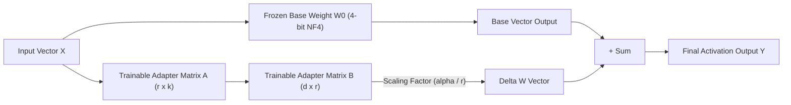

# Lab 1: Parameter-Efficient Fine-Tuning (LoRA / QLoRA) Blueprint
## 1. Concept & Data Flow
Updating 100% of LLM weights via Full Supervised Fine-Tuning (Full SFT) requires massive multi-GPU clusters and risks destroying general model reasoning ("catastrophic forgetting").
**Low-Rank Adaptation (LoRA)** freezes original pre-trained weight matrices $W_0 \in \mathbb{R}^{d \times k}$ and injects two small trainable low-rank matrices $A \in \mathbb{R}^{r \times k}$ and $B \in \mathbb{R}^{d \times r}$ (where rank $r \ll \min(d, k)$):
$$W = W_0 + \Delta W = W_0 + \frac{\alpha}{r} (A \cdot B)$$
- **Trainable Parameter Reduction**: Reduces trainable parameters by >99% (e.g. training only 65k parameters instead of 16.7M per layer).
- **QLoRA (NF4)**: Quantizes frozen base model weights to 4-bit NormalFloat while computing gradients through 16-bit LoRA adapter matrices, enabling fine-tuning on a single consumer GPU (< 12GB VRAM).

---
## 2. Rosetta Stone Jargon Mapping
| AI Buzzword | Actual Software Component / Standard Primitive |
| :--- | :--- |
| **LoRA (Low-Rank Adaptation)** | Matrix decomposition layer ($A \cdot B$) added in parallel to frozen linear weights |
| **QLoRA (NF4)** | 4-bit NormalFloat quantized base weights paired with 16-bit trainable adapter matrices |
| **Rank ($r$) & Alpha ($\alpha$)** | Hyperparameters controlling adapter matrix rank dimensions and gradient scaling |
| **Target Projections** | Model attention layer components (`q_proj`, `v_proj`, `k_proj`, `o_proj`) targeted by adapters |
> *"Btw, this is WHEN and WHY we need this framing concept (PEFT / LoRA Adapter / Low-Rank Matrix Decomposition):"*  
> **WHEN**: Adapting base foundation models to specialized domain tasks (e.g., custom tool calling, JSON schema compliance, or corporate code style) on local GPU hardware.  
> **WHY**: Full fine-tuning requires massive multi-GPU clusters and risks destroying general model reasoning. LoRA freezes base model weights and trains low-rank adapter matrices ($A \cdot B$), reducing trainable parameters by >99% while achieving full fine-tuning performance.
---

---

## 3. Code Implementation & Execution Results

- **Script File**: [lab1_lora_qlora.py](file:///labs/10_llm_training_finetuning/lab1_lora_qlora.py)

python
import math
import random
from typing import Dict, Any, List

# 1. Pure Python Low-Rank Adaptation (LoRA) Layer Implementation
class PurePythonLoRALayer:
    """Simulates a frozen base linear layer with trainable low-rank adapter matrices A and B."""
    def __init__(self, in_features: int, out_features: int, rank: int = 8, alpha: float = 16.0):
        self.in_features = in_features
        self.out_features = out_features
        self.rank = rank
        self.alpha = alpha
        self.scaling = alpha / rank

        # Frozen Base Weight Matrix W0 (out_features x in_features)
        self.weight_base = [[random.uniform(-0.1, 0.1) for _ in range(in_features)] for _ in range(out_features)]
        
        # Trainable Adapter Matrix A (rank x in_features) - initialized with Kaiming uniform
        k = math.sqrt(1.0 / in_features)
        self.lora_A = [[random.uniform(-k, k) for _ in range(in_features)] for _ in range(rank)]
        
        # Trainable Adapter Matrix B (out_features x rank) - initialized with Zeros
        self.lora_B = [[0.0 for _ in range(rank)] for _ in range(out_features)]

    def forward(self, input_vector: List[float]) -> List[float]:
        """Calculates W0*x + (alpha/r)*(B*A*x)."""
        # Base Linear Output: W0 * x
        base_out = [
            sum(w * x for w, x in zip(row, input_vector))
            for row in self.weight_base
        ]

        # Step 1 of LoRA: A * x -> intermediate vector of length 'rank'
        a_out = [
            sum(a * x for a, x in zip(row, input_vector))
            for row in self.lora_A
        ]

        # Step 2 of LoRA: B * (A * x) -> adapter vector of length 'out_features'
        lora_out = [
            sum(b * a for b, a in zip(row, a_out)) * self.scaling
            for row in self.lora_B
        ]

        # Sum: W0*x + (alpha/r)*B*A*x
        return [b + l for b, l in zip(base_out, lora_out)]

# 2. Parameter Budgeting & Metrics Engine
def calculate_lora_parameter_savings(in_features: int, out_features: int, rank: int) -> Dict[str, Any]:
    base_params = in_features * out_features
    lora_params = (rank * in_features) + (out_features * rank)
    savings_pct = (1.0 - (lora_params / base_params)) * 100.0
    return {
        "base_parameters": base_params,
        "lora_parameters": lora_params,
        "trainable_reduction_pct": round(savings_pct, 2)
    }

if __name__ == "__main__":
    print("=== STARTING PARAMETER-EFFICIENT FINE-TUNING (LORA / QLORA) LAB ===")
    
    in_dim, out_dim, r_dim = 4096, 4096, 8
    metrics = calculate_lora_parameter_savings(in_dim, out_dim, r_dim)
    
    print("\n--- PARAMETER BUDGETING COMPARISON ---")
    print(f"Base Layer Parameters (W0)     : {metrics['base_parameters']:,}")
    print(f"LoRA Adapter Parameters (A+B) : {metrics['lora_parameters']:,}")
    print(f"Trainable Parameter Reduction : {metrics['trainable_reduction_pct']}%")

    print("\n--- FORWARD PASS DEMONSTRATION ---")
    layer = PurePythonLoRALayer(in_features=128, out_features=128, rank=4)
    input_vec = [random.uniform(-1.0, 1.0) for _ in range(128)]
    output_vec = layer.forward(input_vec)
    
    print(f"Input Vector Length  : {len(input_vec)}")
    print(f"Output Vector Length : {len(output_vec)}")
    print("  [PASSED] Pure Python LoRA Forward Pass Completed Successfully!")

---

## 4.Software Architecture & Design Decisions
### Capabilities vs. Features
- **Capability**: Low-rank matrix multiplication (`PurePythonLoRALayer.forward`) and adapter parameter scaling calculation (`calculate_lora_parameter_savings`).
- **Feature**: The LoRA/QLoRA Fine-Tuning Engine wrapping frozen pre-trained weight matrices with parallel trainable adapter layers.
### Refactoring vs. Adding Code
- Moving from standard 16-bit LoRA to 4-bit QLoRA (NF4) only requires quantizing the frozen base matrix $W_0$ to 4-bit integer scales. The forward pass matrix multiplication ($W_0 \cdot x + \frac{\alpha}{r} B \cdot A \cdot x$) remains completely identical.
---
## 5. Living Discussion & Q&A Notes
- **LoRA / QLoRA WHEN & WHY Takeaway**:
  - **WHEN**: Customizing open-weight models (`Qwen2.5`, `Llama3.3`) for domain-specific agent tasks (e.g. structured SQL synthesis, custom tool execution).
  - **WHY**:
    1. **Saves 99%+ GPU Memory**: Keeps base weights frozen and updates only low-rank matrices ($A$ and $B$).
    2. **Prevents Catastrophic Forgetting**: Preserves base pre-trained knowledge while steering formatting and domain output.
    3. **Modular Adapter Swapping**: Multiple domain-specific LoRA adapters (e.g., SQL adapter, Coding adapter) can be swapped dynamically on top of a single shared base model.
