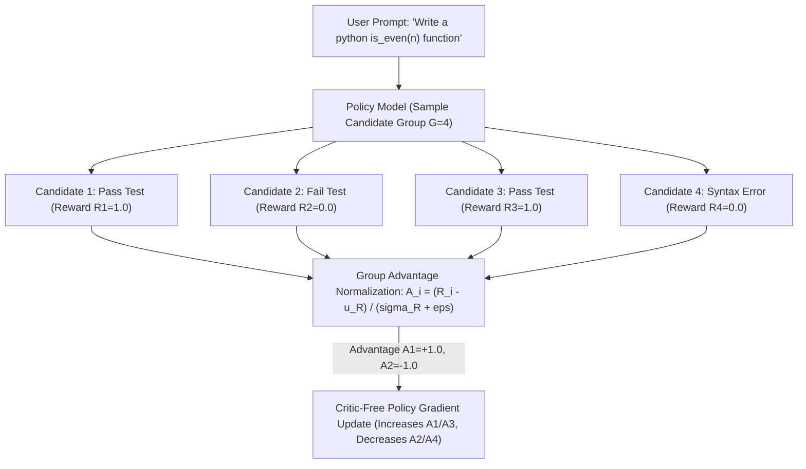

# Lab 3: Preference Optimization & GRPO Alignment Blueprint
## 1. Concept & Data Flow
Traditional RLHF (such as Proximal Policy Optimization / PPO) requires maintaining a Critic / Value model of equal parameter size alongside the Policy model, doubling VRAM requirements.
**Group Relative Policy Optimization (GRPO - DeepSeek-R1 Pattern)** eliminates the Critic model by sampling a candidate group of $G$ outputs per prompt and normalizing relative advantages within the group:
1. **Candidate Group Sampling**: The policy model samples $G=4$ outputs for a user prompt.
2. **Reinforcement Learning from Verifiable Rewards (RLVR)**: Deterministic program verifiers (subprocesses, unit tests, regex formatters) score each output ($R_i \in \{0, 1\}$).
3. **Group Advantage Normalization**: Calculates normalized advantages $A_i = \frac{R_i - \mu_R}{\sigma_R + \epsilon}$, where $\mu_R$ and $\sigma_R$ are the mean and standard deviation of rewards within the sampled group.
4. **Critic-Free Policy Update**: Direct policy gradient updates increase weights for above-average outputs ($A_i > 0$) and decrease weights for below-average outputs ($A_i < 0$) with zero Critic memory overhead.

---
## 2. Rosetta Stone Jargon Mapping
| AI Buzzword | Actual Software Component / Standard Primitive |
| :--- | :--- |
| **GRPO (Group Relative Policy)** | Critic-free policy gradient algorithm using intra-group reward normalization |
| **RLVR (Verifiable Rewards)** | Unit test suite / regex validator returning binary or scalar rewards ($R \in \{0, 1\}$) |
| **Group Advantage ($A_i$)** | Z-score normalization of rewards ($\frac{R_i - \mu}{\sigma}$) within a candidate output batch |
| **KL Divergence Penalty** | Loss constraint preventing model policy drift from base reference weights |
> *"Btw, this is WHEN and WHY we need this framing concept (GRPO / Verifiable Rewards / Group Advantage Normalization):"*  
> **WHEN**: Aligning reasoning or coding models on verifiable tasks (unit tests, mathematical proofs, JSON formatting) without cloud human feedback.  
> **WHY**: PPO requires a massive Critic model that doubles VRAM consumption. GRPO samples a group of candidate outputs, computes rule-based verifiable rewards, and normalizes relative advantages across the group to update policy weights with zero Critic memory overhead.
---

---

## 3. Code Implementation & Execution Results

- **Script File**: [lab3_grpo_preference_alignment.py](file:///labs/10_llm_training_finetuning/lab3_grpo_preference_alignment.py)

python
import json
import math
import random
import subprocess
import sys
import tempfile
from typing import Dict, Any, List, Tuple

# 1. Deterministic Program Verifier (RLVR Engine)
def verify_python_code(code: str, expected_output: str) -> float:
    """Executes code in a sandbox and returns 1.0 (Pass) or 0.0 (Fail)."""
    with tempfile.TemporaryDirectory(prefix="grpo_") as temp_dir:
        file_path = f"{temp_dir}/script.py"
        with open(file_path, "w", encoding="utf-8") as f:
            f.write(code)
        
        try:
            proc = subprocess.Popen(
                [sys.executable, file_path],
                cwd=temp_dir,
                stdout=subprocess.PIPE,
                stderr=subprocess.PIPE,
                text=True
            )
            stdout, stderr = proc.communicate(timeout=3)
            if proc.returncode == 0 and expected_output in stdout.strip():
                return 1.0
            return 0.0
        except Exception:
            return 0.0

# 2. GRPO Group Advantage Normalizer
def calculate_grpo_group_advantages(rewards: List[float]) -> List[float]:
    """Calculates A_i = (R_i - mean(R)) / (std(R) + eps) across a candidate group."""
    n = len(rewards)
    mean_r = sum(rewards) / n
    variance = sum((r - mean_r) ** 2 for r in rewards) / n
    std_r = math.sqrt(variance)
    eps = 1e-8

    if std_r == 0:
        return [0.0 for _ in rewards]

    return [round((r - mean_r) / (std_r + eps), 4) for r in rewards]

# 3. GRPO Alignment Engine Simulation
class GRPOAlignmentEngine:
    """Orchestrates candidate group sampling, RLVR verification, and advantage computation."""
    def run_alignment_step(self, prompt: str, candidate_outputs: List[str], expected_output: str) -> Dict[str, Any]:
        print("=== STARTING GRPO PREFERENCE ALIGNMENT LAB ===")
        print(f"[PROMPT]: '{prompt}'")
        print(f"[GROUP SIZE]: G = {len(candidate_outputs)}")

        rewards = []
        print("\n--- STEP 1: VERIFIABLE REWARD EVALUATION (RLVR) ---")
        for idx, code in enumerate(candidate_outputs, start=1):
            r = verify_python_code(code, expected_output)
            rewards.append(r)
            status = "PASSED" if r == 1.0 else "FAILED"
            print(f"  Candidate {idx}: [{status}] -> Reward R_{idx} = {r}")

        print("\n--- STEP 2: GROUP RELATIVE ADVANTAGE NORMALIZATION ---")
        advantages = calculate_grpo_group_advantages(rewards)
        for idx, (r, a) in enumerate(zip(rewards, advantages), start=1):
            direction = "POLICY INCREASE (+)" if a > 0 else ("POLICY DECREASE (-)" if a < 0 else "NEUTRAL (0)")
            print(f"  Candidate {idx}: Reward = {r:.1f} | Advantage A_{idx} = {a:+.4f} | Action: {direction}")

        return {
            "status": "SUCCESS",
            "group_rewards": rewards,
            "group_advantages": advantages
        }

if __name__ == "__main__":
    candidates = [
        "def is_even(n):\n    return n % 2 == 0\nprint(is_even(4))",          # Pass -> True
        "def is_even(n):\n    return n % 2 != 0\nprint(is_even(4))",          # Fail -> False
        "def is_even(n):\n    return True if n == 4 else False\nprint(is_even(4))", # Pass -> True
        "syntax error line 1"                                                # Fail -> Crash
    ]
    prompt = "Write a python function is_even(n) returning True for even numbers."
    
    engine = GRPOAlignmentEngine()
    res = engine.run_alignment_step(prompt, candidates, expected_output="True")
    print(f"\nFinal GRPO Result Payload:\n{json.dumps(res, indent=2)}")

---

## 4.Software Architecture & Design Decisions
### Capabilities vs. Features
- **Capability**: Subprocess program verification (`verify_python_code`) and Z-score variance math (`calculate_grpo_group_advantages`).
- **Feature**: The GRPO Alignment Engine (`GRPOAlignmentEngine`) managing candidate sampling, verifiable reward evaluation, and group-relative advantage normalization.
### Refactoring vs. Adding Code
- Replacing simple binary unit testing ($R \in \{0, 1\}$) with complex continuous rubrics (e.g. combining execution time, memory usage, and formatting compliance) only requires updating `verify_python_code()`. The group advantage normalization and policy update engine remain completely unchanged.
---
## 5. Living Discussion & Q&A Notes
- **GRPO Preference Alignment WHEN & WHY Takeaway**:
  - **WHEN**: Training custom reasoning or coding LLMs (DeepSeek-R1 style) using automated verification suites.
  - **WHY**:
    1. **Eliminates Critic Model VRAM Overhead**: Saves 50% GPU memory compared to PPO by calculating advantages relative to candidate group baseline rewards.
    2. **Automated Verifiable Rewards**: Replaces expensive human annotators with deterministic software verifiers (`pytest`, compiler output, math solvers).
    3. **Prevents Mode Collapse**: Normalizing advantages within each candidate group ensures gradient updates remain stable across varying task difficulties.
