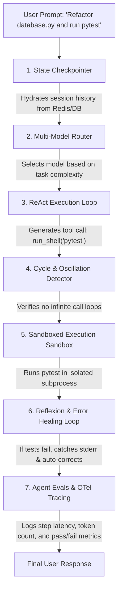

# Module 11 - Living Q&A: Combining Primitives into a Single Feature Solution

## 1. User Question

> **Question**: "At some point, do a lot of these get put together in one single feature type solution? Like for instance do you ever end up having to implement let's say a state_checkpointer, agent_evals, and react loops all in one single script for a single thing? I still haven't actually built anything with any of these so I'm wondering if they are all used individually or eventually do people have use cases where they end up getting mashed together so to say."

---

## 2. Technical Answer & Architecture

**Yes, absolutely.** In real-world software engineering, the isolated primitives from our individual labs are **never** deployed as standalone single-feature scripts.

Instead, all these primitives get combined into a single unified backend system called a **Production Agent Harness** (the architecture powering applications like Claude Code, Kiro, OpenClaw, or Hermes).

During **Track 1 (Labs 00 - 10)**, we intentionally separated them into isolated 30–50 line scripts so you could see the exact data contracts, state transitions, and raw RPC calls **under the hood** without framework abstractions hiding how they work.

In **Track 2 (Module 11 - Harness Architecture)**, these exact primitives get imported as modular building blocks into a single runtime loop.

---

## 3. How Primitives Mash Together in a Single Agent Turn

Here is how 6 lab primitives execute inside one single agent request loop:

---

## 4. Concrete Execution Step-by-Step

Imagine a user types: *"Fix the bug in `calculator.py` and run tests."* Here is how those lab components interact in a single script:

1. **State Checkpointer (Lab 2.2)**: Loads past conversation history and state variables from a persistent database using `session_id`.
2. **ReAct Loop (Lab 1.1)**: Prompts the LLM to generate thoughts and select a tool action (`edit_file`).
3. **Cycle Detector (Lab 1.2)**: Verifies the agent isn't stuck repeating the exact same `edit_file` command for the 4th time in a row.
4. **Sandboxed Worker Sandbox (Lab 4.1)**: Executes `pytest` inside an isolated subprocess with strict memory and execution timeout caps.
5. **Reflexion Engine (Lab 8.3)**: If `pytest` returns an error (`AssertionError`), it captures `stderr`, computes an MD5 error signature, and feeds the traceback back to the LLM to fix the code.
6. **Agent Evals & OTel Collector (Lab 4.2)**: Records turn latency, total prompt/completion tokens, and whether the code passed tests.

---

## 5. Architectural Framing Takeaway

> *"Btw, this is WHEN and WHY we need this framing concept (Production Agent Harness Architecture):"*  
> **WHEN**: Building a real-world AI agent application (like a coding assistant, data SQL agent, or automated SRE bot).  
> **WHY**: Single primitives only handle one responsibility (e.g., checkpointer only handles state; cycle detector only handles loop prevention). A Production Agent Harness combines them into a single decoupled architecture (`core/`, `api/`, `tools/`, `evals/`) to give your application state persistence, crash recovery, security isolation, self-healing, and observability all at once.
