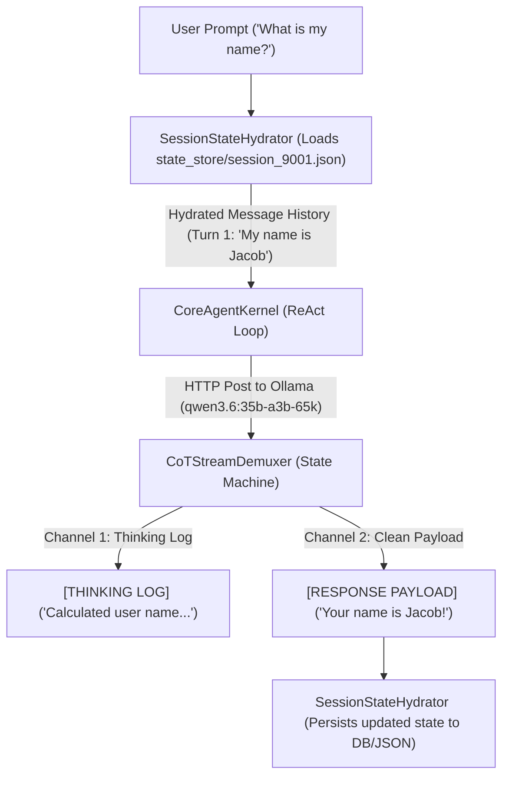

# Lab 1: Core Harness Execution Loop & Session State Hydrator

## 1. Concept & Data Flow

Deploying a ReAct execution loop as an isolated single-turn script creates severe operational limitations: when the script terminates, all conversation context, user variables, and execution state are lost. Furthermore, reasoning models (such as DeepSeek-R1 or Qwen3.6) emit internal `<think>` reasoning traces that pollute conversational context if left unparsed.

A **Core Agent Kernel** integrates three decoupled primitives into a single stateful backend component:
1. **Session State Hydrator**: Restores past turn history and state variables from persistent storage (`state_store/session_9001.json`) before model inference and saves updated state post-turn.
2. **CoT Stream Demuxer**: Demultiplexes internal `<think>` reasoning tokens from clean user-facing response payloads.
3. **Core Agent Kernel Loop**: Manages multi-turn ReAct decision cycles across user turns.

---

## 2. Rosetta Stone Jargon Mapping

| AI Buzzword | Actual Software Component / Standard Primitive |
| :--- | :--- |
| **Agent Kernel** | Core execution loop orchestrating model calls, state hydration, and tool execution |
| **Session State Hydrator** | Data access layer reading/writing conversation graph state from Redis/PostgreSQL/JSON |
| **CoT Stream Demuxer** | State machine demultiplexing `<think>` reasoning tokens from response payloads |
| **Multi-Turn Continuity** | Persisting conversation turn history to maintain context memory across requests |

> *"Btw, this is WHEN and WHY we need this framing concept (Core Agent Kernel / Session State Hydration / CoT Demuxing):"*  
> **WHEN**: Building the foundation of a multi-turn agent backend (like Claude Code or Hermes) where users interact over multiple turns and reasoning models generate internal `<think>` traces.  
> **WHY**: Running a ReAct loop in a stateless script loses conversation memory when the script terminates. Session state hydration preserves context across turns, while CoT demuxing prevents raw `<think>` tags from cluttering user outputs or breaking downstream parsers.

---

---

---

## 3. Code Implementation & Execution Results

- **Script File**: [lab1_core_harness_kernel.py](file:///education/labs/11_harness_architecture/lab1_core_harness_kernel.py)

python
import json
import os
import urllib.request
from typing import Dict, Any, List, Tuple

OLLAMA_URL = "http://192.168.1.29:11434/api/generate"
MODEL_NAME = "qwen3.6:35b-a3b-65k"

# 1. Session State Hydrator (State Checkpointer Primitive)
class SessionStateHydrator:
    """Hydrates and persists agent conversation state from/to a JSON store."""
    def __init__(self, storage_dir: str = None):
        if storage_dir is None:
            storage_dir = os.path.join(os.path.dirname(__file__), "state_store")
        self.storage_dir = storage_dir
        os.makedirs(storage_dir, exist_ok=True)

    def _get_path(self, session_id: str) -> str:
        return os.path.join(self.storage_dir, f"{session_id}.json")

    def load_state(self, session_id: str) -> Dict[str, Any]:
        path = self._get_path(session_id)
        if os.path.exists(path):
            with open(path, "r", encoding="utf-8") as f:
                return json.load(f)
        return {"session_id": session_id, "messages": [], "turn_count": 0}

    def save_state(self, session_id: str, state: Dict[str, Any]):
        path = self._get_path(session_id)
        with open(path, "w", encoding="utf-8") as f:
            json.dump(state, f, indent=2)

# 2. CoT Stream Demuxer (Reasoning Demuxer Primitive)
class CoTStreamDemuxer:
    """Demultiplexes <think> reasoning tokens from final response payloads."""
    def __init__(self):
        self.state = "IDLE"  # IDLE, THINKING, RESPONSE
        self.buffer = ""

    def feed(self, chunk: str) -> Tuple[str, str]:
        self.buffer += chunk
        thinking_out, response_out = "", ""

        while self.buffer:
            if self.state == "IDLE":
                if "<think>" in self.buffer:
                    pre, post = self.buffer.split("<think>", 1)
                    response_out += pre
                    self.buffer = post
                    self.state = "THINKING"
                else:
                    response_out += self.buffer
                    self.buffer = ""
            elif self.state == "THINKING":
                if "</think>" in self.buffer:
                    pre, post = self.buffer.split("</think>", 1)
                    thinking_out += pre
                    self.buffer = post
                    self.state = "RESPONSE"
                else:
                    thinking_out += self.buffer
                    self.buffer = ""
            elif self.state == "RESPONSE":
                response_out += self.buffer
                self.buffer = ""

        return thinking_out, response_out

# 3. Core Agent Kernel (ReAct Loop Primitive)
class CoreAgentKernel:
    """Unified Kernel combining ReAct loop, state hydration, and stream demuxing."""
    def __init__(self):
        self.checkpointer = SessionStateHydrator()

    def run_turn(self, session_id: str, user_prompt: str) -> Dict[str, Any]:
        print(f"\n[KERNEL] Starting Turn for Session: '{session_id}'")
        state = self.checkpointer.load_state(session_id)
        
        # Hydrate state history
        state["messages"].append({"role": "user", "content": user_prompt})
        state["turn_count"] += 1

        full_prompt = "\n".join([f"{m['role'].upper()}: {m['content']}" for m in state["messages"]]) + "\nASSISTANT:"
        
        payload = {
            "model": MODEL_NAME,
            "prompt": full_prompt,
            "stream": False,
            "options": {"temperature": 0.2}
        }
        json_bytes = json.dumps(payload).encode("utf-8")
        req = urllib.request.Request(OLLAMA_URL, data=json_bytes, headers={"Content-Type": "application/json"})

        with urllib.request.urlopen(req, timeout=120) as resp:
            data = json.loads(resp.read().decode("utf-8"))
            raw_response = data.get("response", "")

        # Demux response text
        demuxer = CoTStreamDemuxer()
        thinking_text, response_text = demuxer.feed(raw_response)

        print(f"  [THINKING LOG]: {thinking_text.strip()[:80]}...")
        print(f"  [RESPONSE PAYLOAD]: {response_text.strip()[:80]}...")

        # Update state and persist
        state["messages"].append({"role": "assistant", "content": response_text.strip()})
        self.checkpointer.save_state(session_id, state)

        return {
            "session_id": session_id,
            "turn_count": state["turn_count"],
            "thinking": thinking_text.strip(),
            "response": response_text.strip()
        }

if __name__ == "__main__":
    print("=== STARTING MODULE 11 - LAB 1: CORE HARNESS KERNEL ===")
    kernel = CoreAgentKernel()
    res1 = kernel.run_turn("session_9001", "Hello! My name is Jacob.")
    res2 = kernel.run_turn("session_9001", "What is my name?")
    print(f"\nFinal State Checkpoint Verified: {json.dumps(res2, indent=2)}")

---

## 4.Software Architecture & Design Decisions

### Capabilities vs. Features
- **Capability**: JSON state persistence (`SessionStateHydrator.save_state`) and buffer demultiplexing (`CoTStreamDemuxer.feed`).
- **Feature**: The Core Agent Kernel (`CoreAgentKernel`) orchestrating state hydration, prompt formatting, local LLM execution, and post-turn state checkpointing.

### Refactoring vs. Adding Code
- Replacing local file JSON state storage with enterprise Redis or PostgreSQL backends only requires modifying `SessionStateHydrator.load_state()` and `SessionStateHydrator.save_state()`. The agent kernel execution loop remains completely untouched.

---

## 5. Living Discussion & Q&A Notes

- **Core Agent Kernel WHEN & WHY Takeaway**:
  - **WHEN**: Building the foundation layer of a multi-turn agent backend.
  - **WHY**:
    1. **Multi-Turn Memory Persistence**: Session state hydration ensures context is preserved across web page reloads, API calls, and server restarts.
    2. **Clean UI & Tool Parsing**: Stream demuxing isolates reasoning logs from response text, keeping user interfaces clean and preventing JSON parsing failures.
