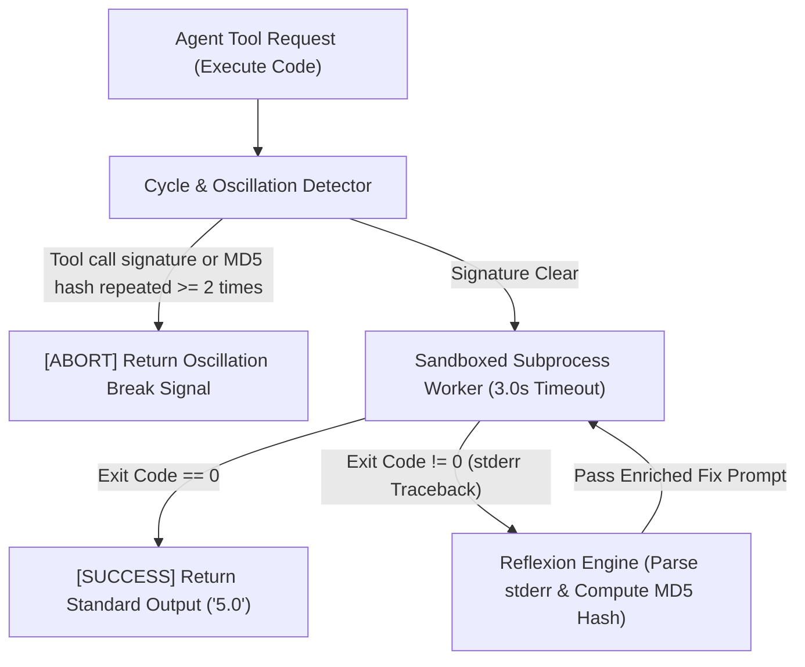

# Lab 2: Resilient Execution & Safety Control Subsystem

## 1. Concept & Data Flow

Allowing AI agents to write and execute code in unmonitored environments creates severe operational vulnerabilities: untrusted code execution on host nodes risks security breaches, infinite fix-break-fix loops burn cloud token budgets, and unhandled runtime exceptions cause agent workflows to crash completely.

A **Resilient Execution Controller** combines three decoupled primitives into an isolated execution subsystem:
1. **Sandboxed Subprocess Worker**: Executes generated code inside isolated Python subprocesses with strict memory limits and execution timeouts (3.0s).
2. **Cycle & Oscillation Detector**: Tracks recent tool calls and MD5 error tracebacks (`hashlib.md5(stderr.encode())`), breaking infinite loops if errors repeat $\ge 2$ times.
3. **Reflexion Self-Healing Engine**: Captures `stderr` tracebacks from failed executions and feeds the traceback context back to the code generator to fix bugs automatically.

---

## 2. Rosetta Stone Jargon Mapping

| AI Buzzword | Actual Software Component / Standard Primitive |
| :--- | :--- |
| **Resilient Executor** | Subsystem combining process isolation, loop detection, and automatic error retry |
| **Oscillation Guard** | MD5 hash tracker detecting repeating `stderr` tracebacks across fix attempts |
| **Sandboxed Subprocess** | Subprocess worker enforcing working directory boundaries and timeout limits |
| **Reflexion Loop** | Generator-Critic loop passing `stderr` back to LLM to correct broken syntax or math |

> *"Btw, this is WHEN and WHY we need this framing concept (Resilient Execution Controller / Oscillation Guard / Sandboxed Reflexion):"*  
> **WHEN**: Building execution engines for autonomous coding agents (like Claude Code or OpenClaw) that write and execute shell commands or code scripts.  
> **WHY**: Untrusted code can hang indefinitely or trigger infinite fix-break-fix loops. Combining sandboxed subprocess isolation with cycle detection and reflexion self-healing ensures code runs safely, automatically fixes runtime errors, and breaks infinite loops before burning token budgets.

---

---

## 3. Code Implementation & Execution Results

- **Script File**: [lab2_resilient_executor.py](file:///labs/11_harness_architecture/lab2_resilient_executor.py)

python
import hashlib
import json
import os
import subprocess
import sys
import tempfile
import time
from typing import Dict, Any, List, Tuple

# 1. Cycle & Oscillation Detector (Module 01 Lab 2 & Module 08 Lab 3 Primitives)
class CycleOscillationDetector:
    """Detects repeating tool call arguments or repeating MD5 error tracebacks."""
    def __init__(self, max_repeats: int = 2):
        self.max_repeats = max_repeats
        self.call_history: List[str] = []
        self.error_hash_history: List[str] = []

    def check_call_signature(self, tool_name: str, args: Dict[str, Any]) -> bool:
        sig = f"{tool_name}:{json.dumps(args, sort_keys=True)}"
        count = self.call_history.count(sig)
        self.call_history.append(sig)
        return count < self.max_repeats

    def check_error_hash(self, stderr: str) -> Tuple[bool, str]:
        md5_hash = hashlib.md5(stderr.strip().encode("utf-8")).hexdigest()
        count = self.error_hash_history.count(md5_hash)
        self.error_hash_history.append(md5_hash)
        is_safe = count < self.max_repeats
        return is_safe, md5_hash

# 2. Sandboxed Subprocess Worker (Module 04 Lab 1 Primitive)
class SandboxedSubprocessWorker:
    """Executes Python code in an isolated subprocess with timeout and directory limits."""
    def execute_code(self, code: str, timeout_sec: float = 3.0) -> Tuple[int, str, str]:
        with tempfile.TemporaryDirectory(prefix="harness_sandbox_") as temp_dir:
            file_path = os.path.join(temp_dir, "target.py")
            with open(file_path, "w", encoding="utf-8") as f:
                f.write(code)

            start_time = time.time()
            try:
                proc = subprocess.Popen(
                    [sys.executable, file_path],
                    cwd=temp_dir,
                    stdout=subprocess.PIPE,
                    stderr=subprocess.PIPE,
                    text=True
                )
                stdout, stderr = proc.communicate(timeout=timeout_sec)
                return proc.returncode, stdout, stderr
            except subprocess.TimeoutExpired:
                proc.kill()
                return -1, "", f"ExecutionTimedOut: Exceeded {timeout_sec}s limit."

# 3. Resilient Execution Controller (Combined Subsystem)
class ResilientExecutionController:
    """Combines Sandboxed Worker, Cycle Detector, and Reflexion Self-Healing Engine."""
    def __init__(self):
        self.detector = CycleOscillationDetector(max_repeats=2)
        self.worker = SandboxedSubprocessWorker()

    def run_resilient_code(self, initial_code: str, fix_generator_func) -> Dict[str, Any]:
        print("\n=== STARTING RESILIENT EXECUTION CONTROLLER ===")
        current_code = initial_code
        attempt = 1

        while attempt <= 3:
            print(f"\n[ATTEMPT {attempt}] Executing code in Sandbox...")
            
            # Check tool call cycle
            if not self.detector.check_call_signature("execute_code", {"code_len": len(current_code)}):
                print("  [CYCLE DETECTED] Aborting execution loop to prevent infinite token burn.")
                return {"status": "ABORTED", "reason": "Repeated tool call signature limit exceeded."}

            exit_code, stdout, stderr = self.worker.execute_code(current_code)

            if exit_code == 0:
                print("  [SUCCESS] Code executed with exit code 0!")
                return {
                    "status": "SUCCESS",
                    "attempts": attempt,
                    "stdout": stdout.strip(),
                    "final_code": current_code
                }

            # Handle execution failure (Reflexion Loop)
            print(f"  [EXECUTION FAILED] Exit Code: {exit_code}")
            is_safe, error_md5 = self.detector.check_error_hash(stderr)
            print(f"  [REFLEXION] Error MD5: {error_md5[:8]} | stderr: {stderr.strip()[:60]}...")

            if not is_safe:
                print("  [OSCILLATION DETECTED] Repeating error hash detected. Aborting fix loop.")
                return {"status": "ABORTED", "reason": f"Oscillation detected on error hash {error_md5[:8]}"}

            # Generate fix
            print("  [SELF-HEALING] Generating code correction...")
            current_code = fix_generator_func(current_code, stderr)
            attempt += 1

        return {"status": "FAILED", "reason": "Max attempts exceeded."}

if __name__ == "__main__":
    controller = ResilientExecutionController()

    # Broken initial code (ZeroDivisionError)
    broken_code = "def divide():\n    return 10 / 0\nprint(divide())"

    # Mock Fix Generator (simulates LLM generating a corrected code string)
    def mock_llm_fixer(code: str, error: str) -> str:
        return "def divide():\n    return 10 / 2\nprint(divide())"

    res = controller.run_resilient_code(broken_code, mock_llm_fixer)
    print(f"\nResilient Execution Result Payload:\n{json.dumps(res, indent=2)}")

---

## 4.Software Architecture & Design Decisions

### Capabilities vs. Features
- **Capability**: MD5 hash tracking (`CycleOscillationDetector.check_error_hash`) and subprocess isolation (`SandboxedSubprocessWorker.execute_code`).
- **Feature**: The Resilient Execution Controller (`ResilientExecutionController`) coordinating sandboxed execution, cycle limit checks, `stderr` reflexion, and auto-correction retries.

### Refactoring vs. Adding Code
- Upgrading from basic subprocess isolation to gVisor micro-containers (`runsc`) or Docker runtimes only requires updating `SandboxedSubprocessWorker.execute_code()`. The cycle detector and reflexion self-healing loop remain completely unchanged.

---

## 5. Living Discussion & Q&A Notes

- **Resilient Execution WHEN & WHY Takeaway**:
  - **WHEN**: Executing untrusted LLM-generated code or shell tools.
  - **WHY**:
    1. **Prevents Host Crashes & Breaches**: Sandboxed subprocess workers isolate code execution and enforce strict timeout caps.
    2. **Auto-Corrects Bugs**: Reflexion loop captures `stderr` tracebacks, giving agents the exact error logs needed to self-heal code.
    3. **Stops Token Runaways**: MD5 error hash tracking breaks infinite fix-break-fix loops before burning API token budgets.
