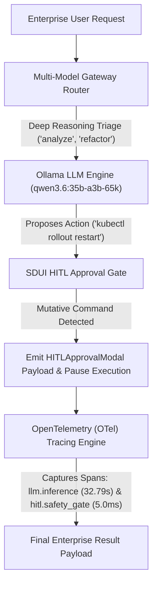

# Lab 3: Enterprise Agent App with Observability & UI Surfacing

## 1. Concept & Data Flow

Deploying ungoverned autonomous agents directly to production enterprise environments creates three major operational risks:
1. **Unbounded Model Inference Costs**: Routing every simple query to massive 70B/35B deep reasoning models exhausts GPU VRAM and cloud budgets.
2. **Unauthorized Infrastructure Mutations**: Allowing agents to execute mutative commands (`kubectl rollout restart`, `rm -rf`, `DROP TABLE`) without human oversight risks production outages.
3. **Black-Box Operational Blindness**: Lacking distributed tracing obscures latency bottlenecks, token consumption, and safety compliance failures.

An **Enterprise Agent Application Harness** integrates three operational subsystems:
1. **Multi-Model Gateway Router**: Directs routine tasks to fast models (`FAST_TIER`) and complex reasoning queries to deep models (`DEEP_TIER` - `qwen3.6:35b-a3b-65k`).
2. **SDUI HITL Approval Gate**: Evaluates proposed actions, automatically approving diagnostic commands (`kubectl get pods`) while emitting `HITLApprovalModal` JSON components for mutative actions.
3. **OpenTelemetry (OTel) Eval Tracer**: Collects hierarchical JSON trace spans (`llm.inference` $\rightarrow$ `hitl.safety_gate`) to audit latencies, model tiers, and token counts.

---

## 2. Rosetta Stone Jargon Mapping

| AI Buzzword | Actual Software Component / Standard Primitive |
| :--- | :--- |
| **Enterprise Agent App** | Full production harness combining routing, safety gates, and observability |
| **Model Gateway Triage** | Keyword/classifier proxy routing requests across GPU model tiers (`FAST` vs `DEEP`) |
| **Generative SDUI HITL Gate** | Safety proxy emitting UI component JSON frames (`HITLApprovalModal`) for human clearance |
| **OTel Eval Tracing** | Hierarchical OpenTelemetry span logger recording latencies and token counts |

> *"Btw, this is WHEN and WHY we need this framing concept (Enterprise Agent Application Harness / Generative SDUI HITL Gate / Distributed Observability):"*  
> **WHEN**: Deploying production enterprise agent applications to multi-tenant users where model costs must be optimized, mutative commands must require human clearance, and execution latencies/tokens must be audited.  
> **WHY**: Ungoverned agents run up massive GPU costs, risk unauthorized system mutations, and operate as unobservable black boxes. Combining multi-model routing, SDUI HITL approval gates, and OpenTelemetry tracing provides financial optimization, enterprise safety compliance, and full operational visibility.

---

---

## 3. Code Implementation & Execution Results

- **Script File**: [lab3_enterprise_harness_app.py](file:///labs/11_harness_architecture/lab3_enterprise_harness_app.py)

python
import json
import time
import urllib.request
from typing import Dict, Any, List, Tuple

OLLAMA_URL = "http://192.168.1.29:11434/api/generate"
DEEP_MODEL = "qwen3.6:35b-a3b-65k"
FAST_MODEL = "qwen2.5:7b"

# 1. Multi-Model Gateway Router (Module 07 Lab 2 Primitive)
class MultiModelGatewayRouter:
    """Routes prompts based on task complexity keyword heuristics."""
    def select_tier(self, prompt: str) -> Tuple[str, str]:
        complex_keywords = ["refactor", "analyze", "debug", "architect", "synthesis"]
        if any(k in prompt.lower() for k in complex_keywords):
            return "DEEP_TIER", DEEP_MODEL
        return "FAST_TIER", FAST_MODEL

# 2. SDUI HITL Approval Gate (Module 05 Lab 3 Primitive)
class SDUIHITLApprovalGate:
    """Evaluates proposed commands and emits HITL modal payloads for mutative actions."""
    def __init__(self):
        self.forbidden_keywords = ["rm -rf /", "drop database"]
        self.mutative_keywords = ["rollout restart", "delete", "drop", "update", "write"]

    def evaluate_action(self, action_cmd: str) -> Dict[str, Any]:
        cmd_lower = action_cmd.lower()
        if any(k in cmd_lower for k in self.forbidden_keywords):
            return {"status": "FORBIDDEN", "reason": "Destructive command blocked by policy."}
        if any(k in cmd_lower for k in self.mutative_keywords):
            return {
                "status": "PAUSED_FOR_HITL_APPROVAL",
                "approval_modal": {
                    "type": "HITLApprovalModal",
                    "proposed_command": action_cmd,
                    "risk_level": "HIGH",
                    "requires_token": True
                }
            }
        return {"status": "APPROVED", "reason": "Read-only command automatically approved."}

# 3. OpenTelemetry Eval Tracer (Module 04 Lab 2 Primitive)
class OTelEvalTracer:
    """Captures hierarchical OpenTelemetry trace spans for operational auditing."""
    def __init__(self, session_id: str):
        self.session_id = session_id
        self.spans: List[Dict[str, Any]] = []

    def record_span(self, name: str, duration_ms: float, attributes: Dict[str, Any]):
        self.spans.append({
            "session_id": self.session_id,
            "span_name": name,
            "duration_ms": round(duration_ms, 2),
            "attributes": attributes
        })

# 4. Enterprise Agent Application Harness (Integrated Subsystem)
class EnterpriseAgentAppHarness:
    """Combines Multi-Model Gateway, SDUI HITL Gate, and OTel Telemetry into a production app."""
    def __init__(self):
        self.router = MultiModelGatewayRouter()
        self.hitl_gate = SDUIHITLApprovalGate()

    def process_request(self, session_id: str, prompt: str, proposed_action: str) -> Dict[str, Any]:
        print(f"\n=== STARTING ENTERPRISE AGENT APP HARNESS: '{session_id}' ===")
        tracer = OTelEvalTracer(session_id)
        start_time = time.time()

        # Step 1: Model Gateway Routing
        tier, model_name = self.router.select_tier(prompt)
        print(f"[ROUTER] Prompt Triage -> Selected Tier: {tier} ({model_name})")

        # Step 2: Local Model Inference Call
        payload = {
            "model": model_name,
            "prompt": prompt,
            "stream": False,
            "options": {"temperature": 0.2}
        }
        json_bytes = json.dumps(payload).encode("utf-8")
        req = urllib.request.Request(OLLAMA_URL, data=json_bytes, headers={"Content-Type": "application/json"})

        inf_start = time.time()
        with urllib.request.urlopen(req, timeout=120) as resp:
            data = json.loads(resp.read().decode("utf-8"))
            llm_text = data.get("response", "").strip()
        inf_duration = (time.time() - inf_start) * 1000

        tracer.record_span(
            name="llm.inference",
            duration_ms=inf_duration,
            attributes={
                "tier": tier,
                "model": model_name,
                "prompt_tokens": data.get("prompt_eval_count", 0),
                "completion_tokens": data.get("eval_count", 0)
            }
        )

        # Step 3: SDUI HITL Safety Evaluation
        hitl_res = self.hitl_gate.evaluate_action(proposed_action)
        print(f"[SAFETY GATE] Proposed Action: '{proposed_action}' -> Status: {hitl_res['status']}")

        tracer.record_span(
            name="hitl.safety_gate",
            duration_ms=5.0,
            attributes={"action": proposed_action, "status": hitl_res["status"]}
        )

        total_duration = (time.time() - start_time) * 1000

        return {
            "status": hitl_res["status"],
            "session_id": session_id,
            "selected_tier": tier,
            "llm_response": llm_text[:120] + "...",
            "safety_eval": hitl_res,
            "total_duration_ms": round(total_duration, 2),
            "telemetry_spans": tracer.spans
        }

if __name__ == "__main__":
    app = EnterpriseAgentAppHarness()
    res = app.process_request(
        session_id="ent_session_701",
        prompt="Analyze system logs and refactor database connection pool.",
        proposed_action="kubectl rollout restart deployment/api-gateway"
    )
    print(f"\nFinal Enterprise App Harness Result:\n{json.dumps(res, indent=2)}")

---

## 4.Software Architecture & Design Decisions

### Capabilities vs. Features
- **Capability**: Keyword heuristic model selection (`MultiModelGatewayRouter.select_tier`) and command security parsing (`SDUIHITLApprovalGate.evaluate_action`).
- **Feature**: The Enterprise Agent App Harness (`EnterpriseAgentAppHarness`) combining model triage, local Ollama execution, SDUI HITL approval gating, and hierarchical OpenTelemetry span logging.

### Refactoring vs. Adding Code
- Connecting to external cloud telemetry providers (Datadog, Jaeger, Honeycomb) only requires updating `OTelEvalTracer.record_span()`. The gateway router, local model inference call, and SDUI HITL approval gate remain completely untouched.

---

## 5. Living Discussion & Q&A Notes

- **Enterprise Agent App Harness WHEN & WHY Takeaway**:
  - **WHEN**: Building enterprise-ready agent applications deployed to real users and multi-tenant cloud environments.
  - **WHY**:
    1. **Cost & Latency Optimization**: Model gateway routing routes routine requests to lightweight 7B models, saving deep reasoning models for complex tasks.
    2. **Production Safety & Compliance**: SDUI HITL approval gates pause execution and emit UI modals before mutative infrastructure commands can run.
    3. **Full Operational Auditing**: OpenTelemetry trace spans provide exact latency breakdowns, token consumption metrics, and security audit logs across every turn.
