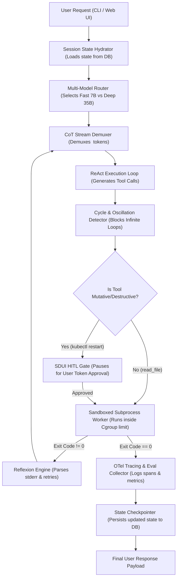

# Module 11 Overview: Production Agent Harness Architecture & End-to-End System Synthesis

## 1. Macro Concept & Industry Need

**Production Agent Harness Architecture** represents the ultimate synthesis phase of AI agent engineering. In Modules 00 through 10, we mastered individual primitives (token streaming, ReAct execution loops, cycle detection, state checkpointers, sandboxed workers, CoT stream demuxers, logit steering, reflexion loops, and fine-tuned models) as low-abstraction, 30–50 line standalone scripts.

In production software development (building tools like Claude Code, Kiro, Hermes, or enterprise agent microservices), these primitives are **never deployed in isolation**. They are integrated into a single unified software architecture called a **Production Agent Harness**.

Without an integrated agent harness, deploying individual primitives leads to severe system failures:
1. **Uncoordinated Component State**: Running a ReAct loop without a state checkpointer loses conversational context across crashes or page reloads.
2. **Runaway Failure Loops**: Running tool execution without cycle detection and reflexion engines causes infinite loop token burns during errors.
3. **Black-Box Operational Blindness**: Executing multi-turn agent turns without OpenTelemetry tracing and evaluation pipelines obscures per-step latencies, token costs, and safety violations.

An Agent Harness acts as the central control plane, orchestrating state hydration, model routing, sandboxed tool execution, self-healing, human-in-the-loop gates, and telemetry into a single resilient event loop.

---

## 2. Architectural Component Mapping

The following table maps individual lab primitives into standard production software architecture layers inside an agent harness:

| Lab Primitive | Harness Architecture Layer | System Function / Role |
| :--- | :--- | :--- |
| **State Checkpointer (Module 02 Lab 2)** | Session State Hydrator (`core/state.py`) | Restores and persists agent execution graph, conversation context, and state variables to Redis/PostgreSQL. |
| **CoT Stream Demuxer (Module 08 Lab 1)** | Telemetry Stream Demuxer (`ui/demux.py`) | Separates internal `<think>` reasoning traces from clean user-facing tool payloads across SSE stream chunks. |
| **ReAct Loop (Module 01 Lab 1)** | Core Reasoning & Action Engine (`core/agent.py`) | Executes autoregressive decision cycles, prompt construction, and tool selection. |
| **Cycle & Oscillation Detector (Module 01 Lab 2)** | Execution Safety Interceptor (`core/guard.py`) | Detects repeating tool arguments or MD5 traceback signatures, breaking infinite execution loops. |
| **Sandboxed Worker Sandbox (Module 04 Lab 1)** | Isolated Compute Execution Runtime (`tools/sandbox.py`) | Runs LLM-generated code inside isolated sub-processes with cgroup memory and CPU limits. |
| **Reflexion Loop (Module 08 Lab 3)** | Self-Healing Failure Controller (`core/reflexion.py`) | Parses `stderr` tracebacks on tool failures and triggers self-correcting fix attempts. |
| **Multi-Model Router (Module 07 Lab 2)** | Model Gateway & Cascade Manager (`api/router.py`) | Directs routine queries to fast 7B models and escalates complex reasoning to deep 35B/70B models. |
| **Generative SDUI HITL Gate (Module 05 Lab 3)** | Human-in-the-Loop Approval Gate (`ui/hitl.py`) | Emits UI modal payloads (`HITLApprovalModal`), pausing execution before running mutative shell commands. |
| **Agent Evals & OTel Tracing (Module 04 Lab 2)** | Distributed Observability Pipeline (`evals/tracer.py`) | Captures hierarchical OpenTelemetry spans (`agent.step`, `llm.inference`, `tool.exec`) for latency and cost tracking. |

---

## 3. The Unified Agent Harness Event Loop

The diagram below illustrates how all 9 mastered primitives interlock inside a single production agent turn:

---

## 4. Natural Lab Progression Roadmap for Module 11

To bridge the gap between individual primitives and production application architecture, Module 11 provides a 3-lab step-by-step synthesis curriculum:

### Lab 1: Core Execution Engine & Session State Hydrator
- **Goal**: Combine **ReAct Execution Loop** + **State Checkpointer** + **CoT Stream Demuxer** into a single stateful agent kernel.
- **Script**: `labs/11_harness_architecture/lab1_core_harness_kernel.py`
- **Doc**: `labs/11_harness_architecture/lab1_core_harness_kernel.md`

### Lab 2: Resilient Execution & Safety Control Subsystem
- **Goal**: Combine **Cycle & Oscillation Detector** + **Sandboxed Worker** + **Reflexion Self-Healing Engine** into an isolated execution controller.
- **Script**: `labs/11_harness_architecture/lab2_resilient_executor.py`
- **Doc**: `labs/11_harness_architecture/lab2_resilient_executor.md`

### Lab 3: End-to-End Enterprise Agent App with Observability & UI Surfacing
- **Goal**: Integrate **Multi-Model Router** + **Generative SDUI HITL Approval Gate** + **OpenTelemetry Evals Engine** into a complete production agent application harness.
- **Script**: `labs/11_harness_architecture/lab3_enterprise_harness_app.py`
- **Doc**: `labs/11_harness_architecture/lab3_enterprise_harness_app.md`
