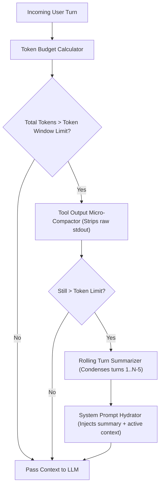

# Module 12 Overview: Context Engine & Token Budget Compaction

## 1. Macro Concept & System Need

In long-running agent interactions, conversation histories expand with every turn. Large Language Models (LLMs) have fixed **Context Windows** (e.g., 8,192, 32,768, or 131,072 tokens). 

Without an active **Context Engine**, agent execution fails due to three failure modes:
1. **Context Limit Crashes**: Exceeding the maximum token limit triggers HTTP 400 API errors (`context_length_exceeded`).
2. **Context Degradation ("Lost in the Middle")**: As context length grows, LLM attention quality degrades, causing forgotten system instructions or ignored tool schema rules.
3. **Exploding Token Costs & Latency**: Sending 50,000 tokens of raw historical stdout logs on every turn increases cost and latency exponentially.

A **Context Engine** dynamically manages token budgets by trimming historical stdout logs, sliding token windows, summarizing older turns, and hydrating system prompts within strict boundaries.

---

## 2. Low-Level Capabilities vs. High-Level User Features

| System Layer | Low-Level Capability (Under the Hood Primitive) | High-Level User Feature |
| :--- | :--- | :--- |
| **Summarization Engine** | `RollingTurnSummarizer` | Infinite conversation persistence |
| **Log Pruner** | `ToolOutputMicroCompactor` | Clean, low-latency agent chat UI |
| **Prompt Assembler** | `SystemPromptHydrator` | Dynamic system state injection |

---

## 3. Architecture & Data Control Flow

> *Btw, this is WHEN and WHY we need this framing concept:*
> **WHEN**: Executing agent loops that run over 10+ turns or process large tool outputs.
> **WHY**: Hardcoding context limits leads to brittle code. A dedicated context engine decouples token tracking from the core reasoning loop.



---

## 4. Code Architecture & Component Spec

```python
# Context Engine Interface Contract
from typing import List, Dict, Any

class BaseContextEngine:
    def __init__(self, max_token_budget: int = 8000):
        self.max_token_budget = max_token_budget

    def estimate_tokens(self, text: str) -> int:
        """Rough estimation: ~4 characters per token."""
        return len(text) // 4

    def prune_tool_outputs(self, messages: List[Dict[str, Any]]) -> List[Dict[str, Any]]:
        """Strips verbose stdout logs from past tool responses, keeping final status."""
        pruned = []
        for msg in messages:
            if msg.get("role") == "tool" and len(msg.get("content", "")) > 500:
                truncated_content = msg["content"][:200] + "\n... [TRUNCATED LOGS] ...\n" + msg["content"][-100:]
                pruned.append({**msg, "content": truncated_content})
            else:
                pruned.append(msg)
        return pruned
```

---

## 5. Lab Progression Roadmap

1. **Lab 1 (`lab1_context_summarizer.py`)**: Implement rolling window summarization for long conversation histories.
2. **Lab 2 (`lab2_transcript_pruner.py`)**: Build a micro-compactor that strips verbose terminal output logs from past turns.
3. **Lab 3 (`lab3_prompt_hydrator.py`)**: Assemble dynamic system prompts with runtime state variables within fixed token constraints.
