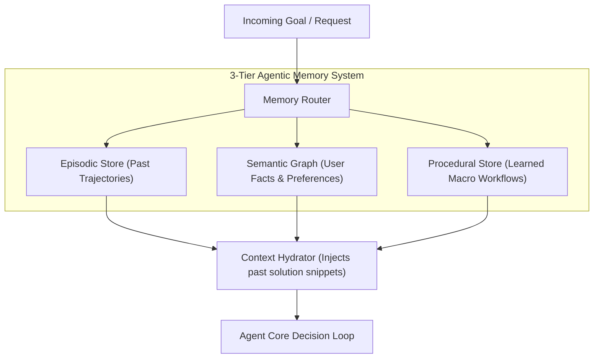

# Module 14 Overview: Agentic Memory Systems (Episodic, Semantic & Procedural)

## 1. Macro Concept & System Need

Standard Retrieval-Augmented Generation (RAG) simply performs vector similarity search across unstructured documents. True **Agentic Memory Systems** require structured multi-tiered memory architectures to persist context, learn user habits, and optimize execution paths over time.

Without a 3-tier memory system:
1. **Stateless Repetition**: The agent repeats the exact same trial-and-error debug steps every time it encounters a recurring bug.
2. **Ignored User Preferences**: The agent forgets key constraints (e.g., "always use standard Python, avoid third-party libraries").
3. **Redundant Tool Calls**: Multi-step workflows (e.g., search repo -> find file -> run test) are executed slowly step-by-step rather than recalled as a single macro-action.

---

## 2. Low-Level Capabilities vs. High-Level User Features

| Memory Tier | Low-Level Capability (Under the Hood Primitive) | High-Level User Feature |
| :--- | :--- | :--- |
| **Episodic Memory** | `TrajectoryStoreIndexer` | Recalls past task trajectories & bug fixes |
| **Semantic Memory** | `FactGraphStore` | Remembers user constraints & preferences |
| **Procedural Memory** | `MacroWorkflowStore` | Executes learned multi-step tool routines |

---

## 3. Architecture & Data Control Flow

> *Btw, this is WHEN and WHY we need this framing concept:*
> **WHEN**: Developing agents that operate continuously over long time horizons or across multiple independent user sessions.
> **WHY**: Unstructured vector databases do not distinguish between past actions taken by the agent (episodic) and domain facts about the user (semantic). Categorizing memory into 3 distinct tiers prevents cross-contamination.



---

## 4. Code Architecture & Component Spec

```python
# 3-Tier Agent Memory Interface
from typing import Dict, Any, List

class AgenticMemoryStore:
    def __init__(self):
        self.episodic_history: List[Dict[str, Any]] = []
        self.semantic_facts: Dict[str, str] = {}
        self.procedural_macros: Dict[str, List[str]] = {}

    def add_episodic_turn(self, goal: str, action: str, outcome: str):
        self.episodic_history.append({"goal": goal, "action": action, "outcome": outcome})

    def set_semantic_fact(self, key: str, value: str):
        self.semantic_facts[key] = value

    def register_procedural_macro(self, macro_name: str, tool_sequence: List[str]):
        self.procedural_macros[macro_name] = tool_sequence
```

---

## 5. Lab Progression Roadmap

1. **Lab 1 (`lab1_episodic_memory.py`)**: Build an execution history indexer that records past tool calls and outcomes for similarity lookup during errors.
2. **Lab 2 (`lab2_semantic_fact_graph.py`)**: Implement a key-value fact extractor that parses conversation turns for user preferences and persists them.
3. **Lab 3 (`lab3_procedural_workflow_store.py`)**: Create a macro-action recorder that saves successful multi-step tool call sequences as reusable single actions.
