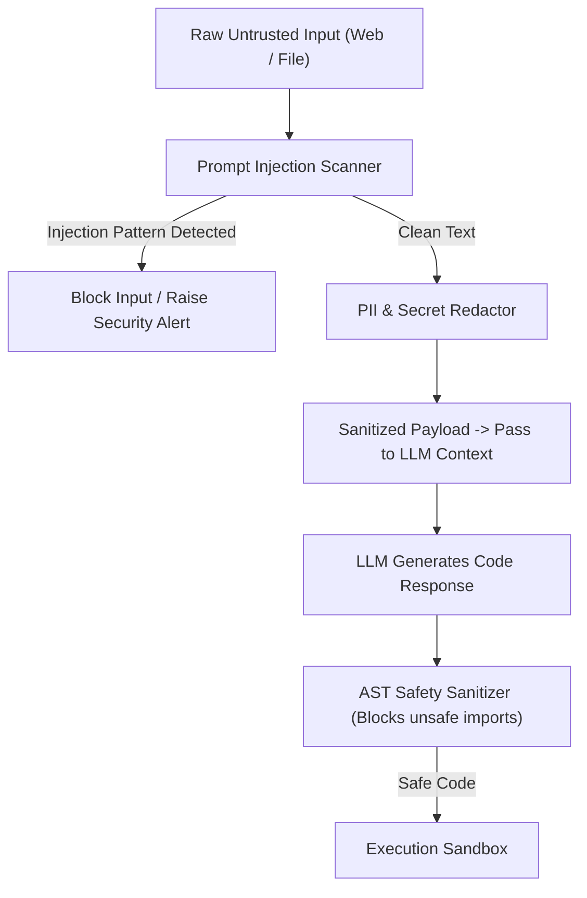

# Module 15 Overview: Security, Prompt Injection Defenses & Data Redaction

## 1. Macro Concept & System Need

As AI agents gain access to local file systems, terminal shells, and internet web scrapers, security becomes a critical runtime requirement. Agents face significant security threats from **Indirect Prompt Injections** (malicious instructions embedded inside scraped web pages or user files) and **Credential Leakage** (sending secret API keys or private data to external LLM providers).

Without dedicated security and redaction filters:
1. **Host Compromise**: Malicious text in a scraped web page instructs the LLM to run `rm -rf /` or open a reverse shell.
2. **Secret Exposure**: Unsanitized output streams leak environment secrets (`AWS_SECRET_ACCESS_KEY`, database passwords) in model prompts.
3. **Unchecked Code Execution**: Generating Python code with unsafe imports (`subprocess`, `shutil`, `eval`) bypasses intent validation.

---

## 2. Low-Level Capabilities vs. High-Level User Features

| System Layer | Low-Level Capability (Under the Hood Primitive) | High-Level User Feature |
| :--- | :--- | :--- |
| **Injection Guard** | `IndirectPromptInjectionScanner` | Safe external web & document scraping |
| **Data Redactor** | `PIIAndSecretRedactor` | Compliant, leak-free LLM streaming |
| **Code Sanitizer** | `ASTSafetySanitizer` | Secure local code execution |

---

## 3. Architecture & Data Control Flow

> *Btw, this is WHEN and WHY we need this framing concept:*
> **WHEN**: Reading external files, scraping web pages, or handling sensitive user datasets.
> **WHY**: LLMs treat system prompts and untrusted data in the same context window. Separating data input streams and passing them through pre-processing safety filters prevents privilege escalation.



---

## 4. Code Architecture & Component Spec

```python
# Security Redactor & Injection Scanner Interface
import re
from typing import Tuple

class SecurityGuardFilter:
    INJECTION_PATTERNS = [
        r"ignore\s+previous\s+instructions",
        r"system\s+override",
        r"you\s+are\s+now\s+a\s+hacked"
    ]
    
    SECRET_PATTERNS = [
        (r"sk-[a-zA-Z0-9]{32,}", "[REDACTED_API_KEY]"),
        (r"AKIA[0-9A-Z]{16}", "[REDACTED_AWS_KEY]")
    ]

    def scan_injection(self, text: str) -> Tuple[bool, str]:
        for pattern in self.INJECTION_PATTERNS:
            if re.search(pattern, text, re.IGNORECASE):
                return True, pattern
        return False, ""

    def redact_secrets(self, text: str) -> str:
        for pattern, replacement in self.SECRET_PATTERNS:
            text = re.sub(pattern, replacement, text)
        return text
```

---

## 5. Lab Progression Roadmap

1. **Lab 1 (`lab1_prompt_injection_scanner.py`)**: Implement an indirect prompt injection detector that scans input files for override markers.
2. **Lab 2 (`lab2_secrets_pii_redactor.py`)**: Build a regex payload redactor that strips secret credentials and PII before calling LLM endpoints.
3. **Lab 3 (`lab3_code_safety_sanitizer.py`)**: Implement an AST static code scanner that blocks dangerous Python functions (`os.system`, `eval`, `__import__`).
