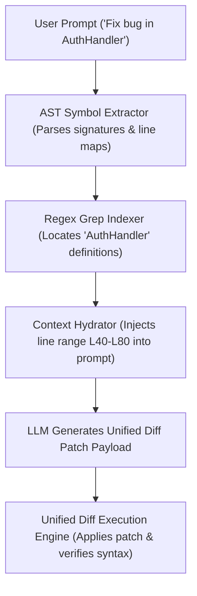

# Module 16 Overview: Codebase Indexing & AST Parsing Engine

## 1. Macro Concept & System Need

Developer agent applications (such as Claude Code, Cursor, or Antigravity) must understand and edit multi-file software repositories. Sending entire source code files into context causes extreme token waste and slow latency. 

A **Codebase Indexing & AST Engine** enables high-precision codebase navigation:
1. **AST Symbol Extraction**: Parses source code files into Abstract Syntax Trees to map classes, functions, docstrings, and imports without reading full file bodies.
2. **Lexical Regex Search**: Fast string matching (`grep`) to locate symbol references across directories.
3. **Unified Diff Patching**: Generating and applying standard `git diff` unified patch blocks to modify code files surgically without overwriting entire files.

---

## 2. Low-Level Capabilities vs. High-Level User Features

| System Layer | Low-Level Capability (Under the Hood Primitive) | High-Level User Feature |
| :--- | :--- | :--- |
| **AST Parser** | `ASTSymbolGraphExtractor` | Precise code symbol search & map |
| **Lexical Indexer** | `RegexFileGrepIndexer` | Fast multi-file search (`grep`) |
| **Patch Engine** | `UnifiedDiffExecutionEngine` | Reliable surgical code editing |

---

## 3. Architecture & Data Control Flow

> *Btw, this is WHEN and WHY we need this framing concept:*
> **WHEN**: Building coding assistants that read, analyze, and edit multi-file codebases.
> **WHY**: Requesting full file rewrites from an LLM often truncates code or drops existing comments. AST symbol indexing isolates target line ranges, and unified diff patching updates only modified lines.



---

## 4. Code Architecture & Component Spec

```python
# AST Symbol Extraction Interface
import ast
from typing import Dict, List, Any

class ASTSymbolVisitor(ast.NodeVisitor):
    def __init__(self):
        self.symbols: List[Dict[str, Any]] = []

    def visit_FunctionDef(self, node: ast.FunctionDef):
        self.symbols.append({
            "type": "function",
            "name": node.name,
            "line_start": node.lineno,
            "line_end": node.end_lineno
        })
        self.generic_visit(node)

    def visit_ClassDef(self, node: ast.ClassDef):
        self.symbols.append({
            "type": "class",
            "name": node.name,
            "line_start": node.lineno,
            "line_end": node.end_lineno
        })
        self.generic_visit(node)
```

---

## 5. Lab Progression Roadmap

1. **Lab 1 (`lab1_ast_symbol_extractor.py`)**: Implement an AST visitor that extracts functions, classes, line numbers, and dependencies from Python source files.
2. **Lab 2 (`lab2_lexical_grep_indexer.py`)**: Build a lexical file searching engine that scans directory trees and returns line-numbered matching snippets.
3. **Lab 3 (`lab3_unified_diff_patcher.py`)**: Implement a unified diff patch parser that modifies target files in place while preserving untouched lines.
