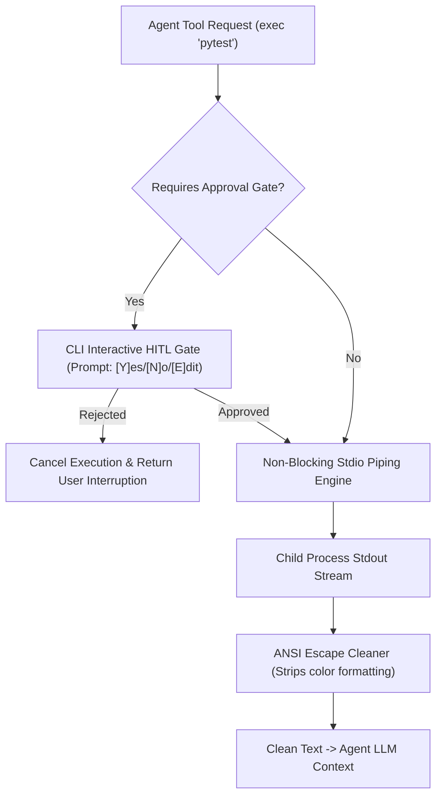

# Module 17 Overview: CLI Terminal Harness & Interactive HITL

## 1. Macro Concept & System Need

Terminal-native AI agent applications (such as Claude Code, OpenClaw, or custom CLI tools) run directly within command-line environments. Interacting with local terminals requires non-blocking stream handling, stripping complex ANSI formatting escape sequences, and providing interactive Human-in-the-Loop (HITL) prompt gates.

Without a dedicated CLI Terminal Harness:
1. **Blocked Process IO**: Reading from process stdout using synchronous calls (`subprocess.run`) blocks the agent loop during long-running builds or tests.
2. **Context Pollution from ANSI Escape Sequences**: Raw terminal output contains ANSI color codes (`\x1b[31mError\x1b[0m`), which pollute model tokens and degrade LLM reasoning performance.
3. **Unsafe Command Execution**: Executing dangerous shell actions without interactive user confirmation gates can result in unintended file deletion or host configuration changes.

---

## 2. Low-Level Capabilities vs. High-Level User Features

| System Layer | Low-Level Capability (Under the Hood Primitive) | High-Level User Feature |
| :--- | :--- | :--- |
| **Stream Piping** | `NonBlockingStdioPipingEngine` | Real-time terminal output streaming |
| **Log Sanitizer** | `ANSIEscapeSequenceCleaner` | Clean, token-efficient terminal logs |
| **HITL Interceptor** | `CLIInteractiveApprovalGate` | Command execution approval modal |

---

## 3. Architecture & Data Control Flow

> *Btw, this is WHEN and WHY we need this framing concept:*
> **WHEN**: Building CLI tools that execute local terminal commands and interact directly with terminal users.
> **WHY**: Operating system terminal pipes stream raw binary data containing escape codes. Decoupling stream capture, ANSI cleaning, and user confirmation creates a clean CLI event harness.



---

## 4. Code Architecture & Component Spec

```python
# Non-Blocking Stdio & ANSI Cleaner Interface
import re
import sys
from typing import str

class CLITerminalHarness:
    ANSI_REGEX = re.compile(r'\x1B(?:[@-Z\\-_]|\[[0-?]*[ -/]*[@-~])')

    @classmethod
    def clean_ansi_codes(cls, raw_text: str) -> str:
        """Strips ANSI terminal escape sequences for clean LLM log processing."""
        return cls.ANSI_REGEX.sub('', raw_text)

    @staticmethod
    def prompt_user_approval(command: str) -> bool:
        """CLI Human-in-the-Loop Interceptor."""
        sys.stdout.write(f"\n[HITL Gate] Allow execution of command: '{command}'? [y/N]: ")
        sys.stdout.flush()
        response = sys.stdin.readline().strip().lower()
        return response == 'y'
```

---

## 5. Lab Progression Roadmap

1. **Lab 1 (`lab1_stdio_terminal_pipe.py`)**: Implement an asynchronous, non-blocking stdio process reader using `asyncio.create_subprocess_exec`.
2. **Lab 2 (`lab2_ansi_format_cleaner.py`)**: Build an ANSI regex stripper that cleans terminal streams before context injection.
3. **Lab 3 (`lab3_cli_interactive_hitl.py`)**: Implement a terminal HITL prompt gate supporting `[Y]es / [N]o / [E]dit / [A]lways allow` decisions.
