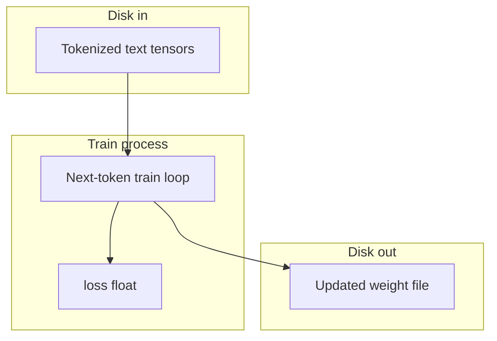

# OT: Pretrain a tiny LLM

This folder is optional. It is not on the 00–15 path. After this page you can name the three objects in a pretrain step: the tokenized tensors, the train loop, and the weight file it writes. That is not an agent chapter. Finishing this page does not unlock chapter 15.

## Data
Three objects exist, and they are not the same as chapter 00.

A **corpus** is text you tokenize into tensors (arrays of token IDs). Those IDs are the data. There is no HTTP POST. There is no `OLLAMA_HOST`.

A **train loop** is a Python process that reads a batch of those IDs, predicts the next ID, compares the prediction to the real next ID, and computes a **loss** (one float). It then updates the weight numbers so the next prediction is closer.

A **weight file** is the same kind of file chapter 00 named (`.safetensors` or `.gguf`). After a train step the numbers inside it have changed. Chapter 00 never writes that file. This page does.

There is no `lab0_pretrain_tiny.py` in this folder. The old notes lived under `modules/10/00`. The runnable labs that did move here are LoRA, GGUF, and GRPO.

## Information
The only path on this page is:

tokenized tensors → train loop → loss (float) → optimizer step → updated weights on disk

Chapter 00 is a different path:

script → HTTP POST (JSON) → provider at `192.168.1.29:11434` → JSON `response` → script

If you are calling Ollama with `OLLAMA_HOST` (`http://192.168.1.29:11434`) and `OLLAMA_MODEL` (`qwen3.6:35b-a3b-65k`), you are not pretraining. You are using a provider that already loaded someone else's weights.

## Knowledge
1. Confirm you actually want to train. The 00–15 line never requires this folder.
2. Tokenize a small text file into token IDs. A first pretrain uses a small file, not a large crawl.
3. Run a loop: take a window of IDs, predict the next ID, compute `loss` as a float, step the optimizer, write weights.
4. Read `loss` after each step. If it is not a number, the loop is not training.
5. Stop when `loss` has gone down on that small file. Do not start LoRA, GGUF, or GRPO on this page.

## Wisdom
Skip this folder unless you care about training. It is optional. Finishing it does not unlock chapter 15. If you only need a model to answer, go back to [00_script_provider_weights.md](../00_atoms/00_script_provider_weights.md) and POST to `http://192.168.1.29:11434`.

## The When and Why
- **When:** you want to train weights from text you own, not call a server.
- **Why:** calling a server is chapter 00. Pretrain is the step that creates the weight file that chapter 00 later loads.

## How it works



Walkthrough of one train step:

1. The process reads a batch of token IDs from the tensors on disk.
2. It asks the current weights to predict the next token ID.
3. It compares that prediction to the real next ID and writes one float named `loss`.
4. It updates the weight numbers so `loss` is smaller on the next batch.
5. It writes the new numbers to a weight file.

Nothing in that walkthrough opens a port. Nothing sends `model`, `prompt`, or `stream`. Those keys belong to chapter 00.

## Data contract
A train step produces one number. There is no request JSON and no HTTP route.

**Output of one step**

```json
{
  "loss": 0.0
}
```

`loss` is a float. If a later lab adds a script, that script should print this field.

## Lab
There is no `lab0_pretrain_tiny.py` in this folder. Do not invent a train script here. The LoRA lab is [lab1_lora_qlora.md](./lab1_lora_qlora.md).

- Module: [this file](./00_pretrain_tiny.md)
- Next module: [01_lora_qlora.md](./01_lora_qlora.md)

## Related
- **Chapter 00:** you usually just call. Script, provider, weights. POST to `/api/generate`.
- **01_lora_qlora:** adapter matrices over frozen weights. That is finetune, not pretrain.
- **02_gguf:** fewer bits per weight so llama.cpp or Ollama can load the file.
- **03_grpo:** group-relative preference update after a model already exists.

## Notes
- This page was moved from `modules/10/00`. The LoRA, GGUF, and GRPO labs were moved from `modules/10` and `labs/10` into this folder.
- There is no paired `.py` for this module. The intended contract is `loss` as a number. Nothing to drift against.
