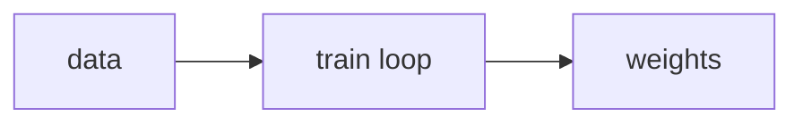

# OT: Pretrain a tiny LLM

Side folder. Not on PATH. After this page you know pretrain is next-token on your tensors.

## Data
- Moved from modules/10/00

## Information
Weights update. Not an agent chapter.

## Knowledge
Follow the old module + lab if present.

## Wisdom
Skip unless you care about training.

## The When and Why
- **When:** you want to train, not call.
- **Why:** calling a server is chapter 00.

## How it works

## Data contract
loss: number

## Lab
Module + labs in this folder.

## Related
- **Chapter 00:** you usually just call.

## Notes
LoRA/GGUF/GRPO labs moved here.
