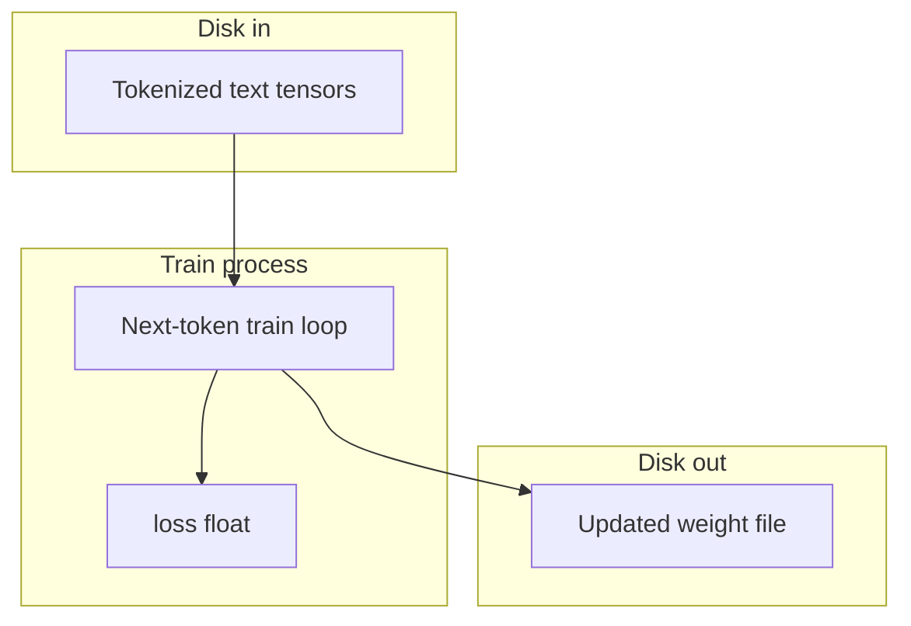

# Optional Training: Pretraining a Tiny Language Model from Scratch

By the end of this module, you will understand the three core components of foundational language model pretraining: tokenized text tensors, the next-token training loop, and serializing learned weight parameters to disk.

While application developers typically interact with pre-existing models over HTTP, understanding how base weights are initialized and trained demystifies the entire AI stack.

## Data
Foundational pretraining involves three primary objects:
1. **Tokenized Corpus**: Raw text converted into numerical token ID arrays (tensors). In our pure-Python demonstration, we tokenize character sequences across a small vocabulary.
2. **Next-Token Training Loop**: A loop that consumes token sequences, calculates predicted probability distributions over vocabulary items via `softmax`, and evaluates prediction errors using Cross-Entropy Loss (`-log(p[target])`).
3. **Weight Checkpoint (`weights.json`)**: Serialized parameter matrices storing learned transition logits and vocabulary mappings (`stoi`, `W`).

## Information
Pretraining operates directly on mathematical arrays:
- **Foundational Learning**: Pretraining is the process of teaching a model language patterns from raw text before any instruction tuning or RLHF occurs.
- **Loss Convergence**: As optimization steps proceed, the loss metric decreases, demonstrating that the probability assigned to true next tokens is increasing.
- **Independence from Inference APIs**: Pretraining creates the weight files that inference runtimes (like Ollama or vLLM) load later.

## Knowledge
Here is the step-by-step procedure:
1. Build a character vocabulary mapping strings to discrete integer IDs (`build_vocab`).
2. Generate input-target training pairs representing sequential token transitions (`make_pairs`).
3. Run the optimization loop: compute logits, evaluate softmax probabilities, and calculate Cross-Entropy loss.
4. Perform gradient descent updates to adjust weight matrix values.
5. Save learned parameters to a JSON weight file (`weights.json`).

## Wisdom
Pretraining is computationally intensive. For standard agent development, invoking existing pre-trained foundational models is vastly more practical. However, understanding the training loop builds deep intuition for model behavior.

## The When and Why
- **When**: Exploring the fundamental mathematics of machine learning or pretraining specialized domain models.
- **Why**: Understanding how weights learn token distributions demystifies model limitations, context windows, and hallucination mechanics.

## How it works



Walkthrough of one train step:

1. The process reads a batch of token IDs from the tensors on disk.
2. It asks the current weights to predict the next token ID.
3. It compares that prediction to the real next ID and writes one float named `loss`.
4. It updates the weight numbers so `loss` is smaller on the next batch.
5. It writes the new numbers to a weight file.

Walkthrough of lab 0:

1. `build_vocab` maps `a` / `b` / `c` to 0 / 1 / 2.
2. `make_pairs` builds next-char pairs from `aba`, `abc`, `cab`.
3. `train_step` does softmax plus `-log(p[next])` and a gradient step on `W`.
4. After 40 steps, `last_loss` is smaller than `first_loss` (about `math.log(3)` on a zero matrix).
5. `weights.json` holds `stoi` and `W`. No POST. No GPU.

Nothing in that walkthrough opens a port. Nothing sends `model`, `prompt`, or `stream`. Those keys belong to chapter 00.

## Data contract
A train step produces one number. There is no request JSON and no HTTP route.

**Output of one step**

```json
{
  "loss": 0.0
}
```

**Lab 0 train return**

```json
{
  "first_loss": 1.098612,
  "last_loss": 0.4
}
```

`loss` is a float. Lab 0 prints `first_loss` and `last_loss` and writes `weights.json`.

## Lab
Done when `last_loss` is a smaller float than `first_loss` and `weights.json` exists.

- Module: [this file](./00_pretrain_tiny.md)
- Lab 0: [lab0_pretrain_tiny.md](./lab0_pretrain_tiny.md) - write `lab0_pretrain_tiny.py`. Next-token table on three strings. Done when `last_loss < first_loss`.
- Next module: [01_lora_qlora.md](./01_lora_qlora.md) / [lab1_lora_qlora.md](./lab1_lora_qlora.md) - adapter math, not pretrain.

## Related
- **Chapter 00:** you usually just call. Script, provider, weights. POST to `/api/generate`.
- **01_lora_qlora:** adapter matrices over frozen weights. That is finetune, not pretrain.
- **02_gguf:** fewer bits per weight so llama.cpp or Ollama can load the file.
- **03_grpo:** group-relative preference update after a model already exists.

## Notes
- This page was moved from `modules/10/00`. The LoRA, GGUF, and GRPO labs were moved from `modules/10` and `labs/10` into this folder.
- Lab 0 has no reference `.py` yet. The intended contract is `loss` as a number. CPU lists (or numpy) only. Do not edit the `.py` files in the repo.
