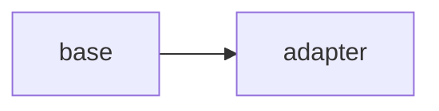

# OT: LoRA / QLoRA

Side folder. Adapter matrices over frozen weights.

## Data
- Lab: `lab1_lora_qlora`

## Information
Do not treat this as required path.

## Knowledge
Run the reference if you have a GPU.

## Wisdom
Skip on CPU-only.

## The When and Why
- **When:** you need a small domain adapter.
- **Why:** full finetune is larger.

## How it works

## Data contract
adapter files

## Lab
- [lab1_lora_qlora.py](./lab1_lora_qlora.py) / [lab1_lora_qlora.md](./lab1_lora_qlora.md)

## Related
- **QLoRA:** 4-bit base + LoRA.

## Notes
Moved from modules/10 and labs/10.
