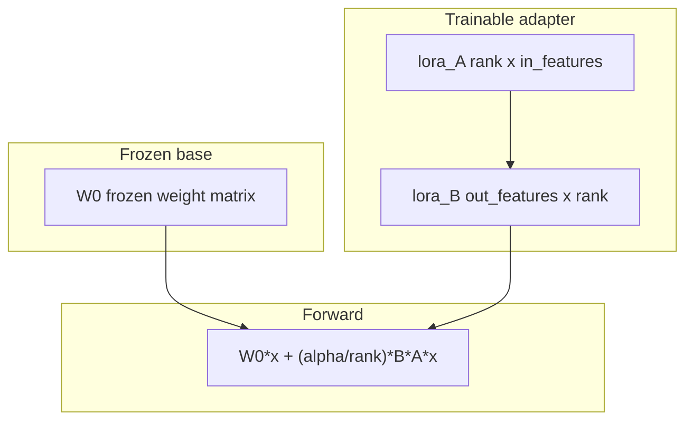

# Optional Training: Low-Rank Adaptation (LoRA) and QLoRA

By the end of this module, you will understand how Low-Rank Adaptation (LoRA) and Quantized LoRA (QLoRA) enable parameter-efficient fine-tuning of large models by freezing base weights and training small low-rank matrix pairs.

Full fine-tuning of multi-billion parameter models requires immense GPU memory. LoRA dramatically reduces computational overhead by freezing existing weights and learning low-rank delta matrices.

## Data
A **LoRA Layer** decomposes weight updates inside linear transformations:
- **Frozen Base Weight (`W0`)**: The pre-existing large weight matrix (e.g. $4096 \times 4096$).
- **Low-Rank Decomposition Matrices (`A` and `B`)**:
  - `A`: Matrix of shape $\text{rank} \times \text{in\_features}$.
  - `B`: Matrix of shape $\text{out\_features} \times \text{rank}$.
  - `rank` ($r$): Low-rank dimension (typically $4$ to $64$).
  - `alpha` ($\alpha$): Scaling factor.
- **Forward Pass Computation**: $y = W_0 x + \frac{\alpha}{r} (B \cdot A \cdot x)$.
- **QLoRA (Quantized LoRA)**: Quantizes the frozen base weight $W_0$ into 4-bit NormalFloat precision while training $A$ and $B$ in 16-bit precision.

## Information
LoRA provides massive parameter and memory efficiency:
- **Parameter Savings**: In a $4096 \times 4096$ matrix, full tuning updates $16,777,216$ parameters; rank-8 LoRA updates only $65,536$ parameters ($>99.6\%$ parameter reduction).
- **Modularity**: Small adapter checkpoints ($<100\text{ MB}$) can be hot-swapped onto a single shared base model to serve diverse domain tasks.

## Knowledge
Here is the step-by-step procedure:
1. Freeze base weight parameters $W_0$.
2. Initialize matrix $A$ with Gaussian distribution and matrix $B$ with zeros.
3. Compute forward activations through both the base path and the low-rank adapter path.
4. Scale adapter output by $\frac{\alpha}{r}$ and sum with base activations.
5. Save only the trained $A$ and $B$ adapter weights upon training completion.

## Wisdom
LoRA allows you to customize large models for specific tasks without the cost of full fine-tuning.

## The When and Why
- **When**: Fine-tuning foundational models on specialized domain datasets, custom tool-calling schemas, or unique corporate writing styles.
- **Why**: LoRA reduces GPU VRAM requirements by over 75% and produces lightweight, portable adapter checkpoints.

## How it works



Walkthrough of one forward pass:

1. `PurePythonLoRALayer` holds `weight_base` (`W0`), `lora_A`, and `lora_B`.
2. It multiplies `W0` by the input vector `x`. That path does not train.
3. It multiplies `A` by `x`, then `B` by that result, then scales by `alpha / rank`.
4. It adds the two vectors. That sum is the layer output.
5. A real train would write `A` and `B` to adapter files. The reference script does not write those files. It prints the parameter counts and checks that input length equals output length.

## Data contract
Intended output of a real LoRA train: adapter files on disk (`adapter_config.json` plus the `A`/`B` tensors).

What [lab1_lora_qlora.py](./lab1_lora_qlora.py) actually returns from `calculate_lora_parameter_savings`:

```json
{
  "base_parameters": 16777216,
  "lora_parameters": 65536,
  "trainable_reduction_pct": 99.61
}
```

Those numbers are for `in_features=4096`, `out_features=4096`, `rank=8`. There is no HTTP request and no `OLLAMA_HOST`.

## Lab
Done when you can name `W0`, `A`, `B`, and the three keys above.

- Module: [this file](./01_lora_qlora.md)
- Lab 1: [lab1_lora_qlora.py](./lab1_lora_qlora.py) / [lab1_lora_qlora.md](./lab1_lora_qlora.md) — print the parameter budget and run one forward pass.

## Related
- **QLoRA:** 4-bit base + LoRA. Same adapter. Smaller `W0` in VRAM.
- **00_pretrain_tiny:** next-token on your tensors. That writes a full weight file, not an adapter.
- **02_gguf:** fewer bits per weight so llama.cpp or Ollama can load the file.
- **Chapter 00:** you usually just call. POST to `/api/generate`.

## Notes
- Moved from `modules/10` and `labs/10`.
- Drift vs [lab1_lora_qlora.py](./lab1_lora_qlora.py): the intended contract is adapter files on disk. The script never writes those files, never loads a Hugging Face model, and never needs a GPU. It prints `base_parameters`, `lora_parameters`, and `trainable_reduction_pct`, then runs `PurePythonLoRALayer.forward` on a 128-wide vector. QLoRA (4-bit base) is named on this page and is not implemented in the script.
