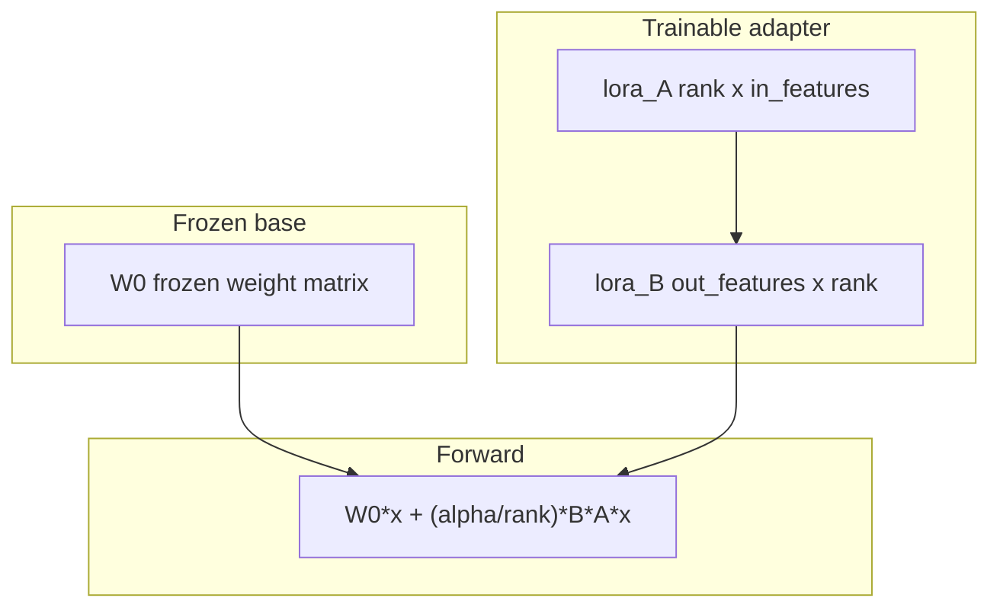

# OT: LoRA / QLoRA

This folder is optional. It is not on the 00–15 path. After this page you can name what a LoRA adapter is: two small matrices sitting on a frozen base weight matrix. Finishing this page does not unlock chapter 15.

## Data
Three matrices exist inside one linear layer.

A **base weight** `W0` is the large matrix that already came from pretrain or from a downloaded model. During LoRA it stays frozen. The numbers do not change.

An **adapter** is two smaller matrices, `A` and `B`, plus a scale `alpha / rank`. `A` is `rank` by `in_features`. `B` is `out_features` by `rank`. Only `A` and `B` are trained.

A **forward pass** adds the two paths: `W0 * x + (alpha / rank) * (B * (A * x))`. That is the function `PurePythonLoRALayer.forward` in [lab1_lora_qlora.py](./lab1_lora_qlora.py).

QLoRA is the same adapter on a 4-bit copy of `W0`. The base uses fewer bits so it fits in less VRAM. The adapter is still trained in higher precision.

## Information
The only path on this page is:

frozen `W0` + trainable `A`, `B` → forward → adapter files (or, in this repo, printed counts)

That is not a call to Ollama. There is no POST to `http://192.168.1.29:11434`. There is no `prompt` key. If you only need a model to answer, stay on chapter 00.

A full finetune updates every number in `W0`. LoRA updates only `A` and `B`. For a 4096 by 4096 layer at rank 8, `calculate_lora_parameter_savings` in the lab prints that cut: 16,777,216 base parameters versus 65,536 adapter parameters.

## Knowledge
1. Confirm you want an adapter, not a new pretrain. Pretrain is [00_pretrain_tiny.md](./00_pretrain_tiny.md).
2. Keep `W0` frozen. Train only `lora_A` and `lora_B`.
3. Pick a rank (the lab uses 8 for the budget print, 4 for the tiny forward demo).
4. Run [lab1_lora_qlora.py](./lab1_lora_qlora.py) if you want to see the math on CPU. A real GPU train is a different program and is not required for 00–15.
5. Stop when you can name `W0`, `A`, `B`, `rank`, and `alpha`. Do not export GGUF on this page.

## Wisdom
Skip this folder unless you need a small domain adapter. It is optional. Finishing it does not unlock chapter 15. Skip a real GPU train if you are on CPU only. The reference script in this repo is pure Python and does run on CPU. If you only need to call a model, POST to `http://192.168.1.29:11434` with `OLLAMA_MODEL=qwen3.6:35b-a3b-65k`.

## The When and Why
- **When:** you need a small domain adapter on top of a frozen base.
- **Why:** a full finetune updates every weight and is larger. Calling a local server does not need an adapter.

## How it works



Walkthrough of one forward pass:

1. `PurePythonLoRALayer` holds `weight_base` (`W0`), `lora_A`, and `lora_B`.
2. It multiplies `W0` by the input vector `x`. That path does not train.
3. It multiplies `A` by `x`, then `B` by that result, then scales by `alpha / rank`.
4. It adds the two vectors. That sum is the layer output.
5. A real train would write `A` and `B` to adapter files. The reference script does not write those files. It prints the parameter counts and checks that input length equals output length.

## Data contract
Intended output of a real LoRA train: adapter files on disk (`adapter_config.json` plus the `A`/`B` tensors).

What [lab1_lora_qlora.py](./lab1_lora_qlora.py) actually returns from `calculate_lora_parameter_savings`:

```json
{
  "base_parameters": 16777216,
  "lora_parameters": 65536,
  "trainable_reduction_pct": 99.61
}
```

Those numbers are for `in_features=4096`, `out_features=4096`, `rank=8`. There is no HTTP request and no `OLLAMA_HOST`.

## Lab
Done when you can name `W0`, `A`, `B`, and the three keys above.

- Module: [this file](./01_lora_qlora.md)
- Lab 1: [lab1_lora_qlora.py](./lab1_lora_qlora.py) / [lab1_lora_qlora.md](./lab1_lora_qlora.md) — print the parameter budget and run one forward pass.

## Related
- **QLoRA:** 4-bit base + LoRA. Same adapter. Smaller `W0` in VRAM.
- **00_pretrain_tiny:** next-token on your tensors. That writes a full weight file, not an adapter.
- **02_gguf:** fewer bits per weight so llama.cpp or Ollama can load the file.
- **Chapter 00:** you usually just call. POST to `/api/generate`.

## Notes
- Moved from `modules/10` and `labs/10`.
- Drift vs [lab1_lora_qlora.py](./lab1_lora_qlora.py): the intended contract is adapter files on disk. The script never writes those files, never loads a Hugging Face model, and never needs a GPU. It prints `base_parameters`, `lora_parameters`, and `trainable_reduction_pct`, then runs `PurePythonLoRALayer.forward` on a 128-wide vector. QLoRA (4-bit base) is named on this page and is not implemented in the script.
