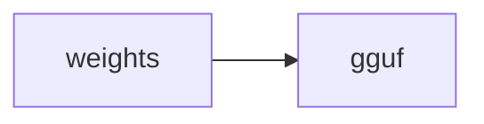

# OT: GGUF quant

Side folder. Export smaller weights for llama.cpp / Ollama.

## Data
- Lab: `lab2_gguf_quantization`

## Information
File of numbers, fewer bits.

## Knowledge
Run the reference.

## Wisdom
Skip if you only pull Ollama tags.

## The When and Why
- **When:** you need a smaller file.
- **Why:** FP16 may not fit.

## How it works

## Data contract
`.gguf` path

## Lab
- [lab2_gguf_quantization.py](./lab2_gguf_quantization.py) / [lab2_gguf_quantization.md](./lab2_gguf_quantization.md)

## Related
- **Chapter 00 weight file.**

## Notes
Moved from labs/10 lab2.
