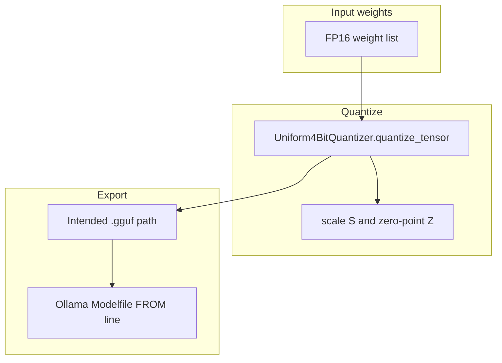

# OT: GGUF quant

This folder is optional. It is not on the 00–15 path. After this page you can name what quantization does: store the same weight numbers in fewer bits, then point llama.cpp or Ollama at a `.gguf` path. Finishing this page does not unlock chapter 15.

## Data
Three objects exist.

A **weight list** is the original numbers, usually 16-bit floats (FP16). Chapter 00 called this the weight file. Here you look at the bits per number.

A **quantized copy** stores each number as a small integer plus a **scale** `S` and a **zero-point** `Z`. The lab uses 4 bits, so each integer is 0 to 15. The function is `Uniform4BitQuantizer.quantize_tensor` in [lab2_gguf_quantization.py](./lab2_gguf_quantization.py).

A **`.gguf` file** is the on-disk format llama.cpp and Ollama load. A **Modelfile** is a short text file that tells Ollama `FROM` that path. The function `generate_ollama_modelfile` builds that text. It does not write the `.gguf` bytes.

## Information
The only path on this page is:

FP16 weights → 4-bit integers + `S` + `Z` → (intended) `.gguf` path → Ollama or llama.cpp loads it

That is not a train loop. LoRA changes `A` and `B`. This page does not train. It compresses numbers that already exist.

If you only `ollama pull` a tag, you already have a quantized file. Skip this page. The provider at `http://192.168.1.29:11434` with `OLLAMA_MODEL=qwen3.6:35b-a3b-65k` is enough for 00–15.

## Knowledge
1. Confirm you need a smaller file. FP16 may not fit in VRAM. A pulled Ollama tag may already be quantized.
2. Map each float `w` to an integer `q` with `q = round(w / S) + Z`, then clamp to 0..15.
3. Reconstruct with `w_hat = (q - Z) * S`. The lab prints `mse` and `mae` from `evaluate_quantization_loss` so you can see the error.
4. For a real export, write a `.gguf` and a Modelfile whose `FROM` line is that path. Then `ollama create` and POST to `/api/generate` as in chapter 00.
5. Stop when you can name `S`, `Z`, bits per weight, and the `.gguf` path. Do not start GRPO on this page.

## Wisdom
Skip this folder if you only pull Ollama tags. It is optional. Finishing it does not unlock chapter 15. If you only need a model to answer, stay on chapter 00 and POST to `http://192.168.1.29:11434`.

## The When and Why
- **When:** you need a smaller weight file than FP16.
- **Why:** FP16 may not fit. A GGUF with fewer bits per number is what llama.cpp and Ollama load.

## How it works



Walkthrough of one quantize step:

1. `Uniform4BitQuantizer` reads a list of floats.
2. It computes `S = (max - min) / 15` and `Z = round(-min / S)`, then clamps `Z` to 0..15.
3. Each float becomes an integer 0..15.
4. `dequantize_tensor` rebuilds floats so `evaluate_quantization_loss` can print `mse` and `mae`.
5. `generate_ollama_modelfile` prints a Modelfile with `FROM ./models/custom_agent_q4_k_m.gguf`, `PARAMETER temperature 0.2`, `PARAMETER top_p 0.9`, and a `SYSTEM` line. The script does not write that `.gguf` file.

## Data contract
Intended output of a real export: a `.gguf` path on disk.

What [lab2_gguf_quantization.py](./lab2_gguf_quantization.py) actually prints from `evaluate_quantization_loss` and `generate_ollama_modelfile`:

```json
{
  "mse": 0.0,
  "mae": 0.0,
  "scale": 0.0,
  "zero_point": 0,
  "gguf_path": "./models/custom_agent_q4_k_m.gguf"
}
```

`mse` and `mae` are floats. `scale` is a float. `zero_point` is an int. `gguf_path` is a string in the printed Modelfile. The file at that path is not created. There is no HTTP request.

## Lab
Done when you can name bits per weight, `S`, `Z`, and the `.gguf` path a Modelfile would load.

- Module: [this file](./02_gguf.md)
- Lab 2: [lab2_gguf_quantization.py](./lab2_gguf_quantization.py) / [lab2_gguf_quantization.md](./lab2_gguf_quantization.md) — quantize a list, print loss, print a Modelfile.

## Related
- **Chapter 00 weight file:** the provider loads `.gguf` or `.safetensors`. This page is how a smaller `.gguf` is made.
- **01_lora_qlora:** adapter on a frozen base. Quantize after you have weights, not instead of an adapter.
- **03_grpo:** preference update. That is training, not export.

## Notes
- Moved from `labs/10` lab2.
- Drift vs [lab2_gguf_quantization.py](./lab2_gguf_quantization.py): the intended contract is a real `.gguf` path on disk. The script never writes `.gguf` bytes. It quantizes 10,000 random floats (`random.seed(42)`), prints 16-bit vs 4-bit size, `scale`, `zero_point`, `mse`, and `mae`, then prints a Modelfile string whose `FROM` line names `./models/custom_agent_q4_k_m.gguf`.
