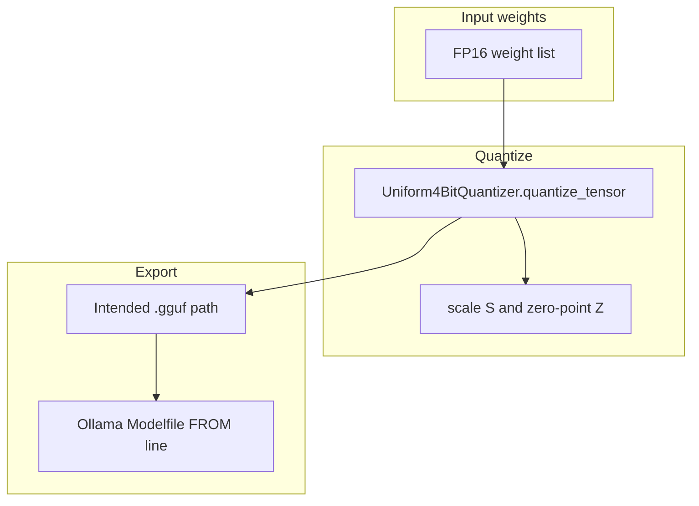

# Optional Training: GGUF Format and Uniform 4-Bit Quantization

By the end of this module, you will understand how model quantization compresses 16-bit floating point weights (FP16) into compact integer representations (such as 4-bit integers with scale $S$ and zero-point $Z$) and packages them into the standard GGUF format for local execution via Ollama and llama.cpp.

Full-precision model weights require massive VRAM. Quantization compresses weights by up to 75% with minimal degradation in output quality.

## Data
**Weight Quantization** compresses numerical precision:
- **FP16 Base Tensor**: High-precision 16-bit floating point weights ($2\text{ bytes per parameter}$).
- **Uniform 4-Bit Quantizer**:
  - `Scale (S)`: Step size calculated via $(W_{\max} - W_{\min}) / (2^b - 1)$.
  - `Zero-Point (Z)`: Offset calculated via $\text{round}(-W_{\min} / S)$ clamped to range.
  - `Quantized Value (q)`: $\text{round}(w / S) + Z$ stored in 4 bits ($0.5\text{ bytes per parameter}$).
- **Dequantization**: Reconstructs approximate weights via $\hat{w} = (q - Z) \cdot S$.
- **GGUF & Modelfile**: The industry standard single-file binary container used by llama.cpp and Ollama.

## Information
Quantization trade-offs are straightforward:
- **VRAM Compression**: Compresses model size from 16 GB down to ~4.5 GB, allowing 7B+ parameter models to run smoothly on consumer laptops.
- **Quantization Error**: Reconstructing floating-point values from 4-bit bins introduces minor rounding errors (measured via Mean Squared Error / MSE and Mean Absolute Error / MAE).

## Knowledge
Here is the step-by-step procedure:
1. Determine the tensor dynamic range ($W_{\min}$ and $W_{\max}$).
2. Calculate the scaling factor $S$ and zero-point offset $Z$.
3. Quantize float arrays into discrete 4-bit integer values (`quantize_tensor`).
4. Evaluate reconstruction loss via `evaluate_quantization_loss(original, dequantized)`.
5. Generate an Ollama `Modelfile` linking the quantized `.gguf` weight container.

## Wisdom
Quantization is the primary technology enabling local on-device AI. Choose 4-bit or 8-bit quantized GGUF weights to maximize token generation speed on CPU and edge hardware.

## The When and Why
- **When**: Packaging fine-tuned models for distribution, running models locally on CPU/Apple Silicon, or optimizing server density.
- **Why**: 4-bit quantization reduces memory bandwidth bottlenecks by 4x while preserving over 99% of model benchmark performance.

## How it works



Walkthrough of one quantize step:

1. `Uniform4BitQuantizer` reads a list of floats.
2. It computes `S = (max - min) / 15` and `Z = round(-min / S)`, then clamps `Z` to 0..15.
3. Each float becomes an integer 0..15.
4. `dequantize_tensor` rebuilds floats so `evaluate_quantization_loss` can print `mse` and `mae`.
5. `generate_ollama_modelfile` prints a Modelfile with `FROM ./models/custom_agent_q4_k_m.gguf`, `PARAMETER temperature 0.2`, `PARAMETER top_p 0.9`, and a `SYSTEM` line. The script does not write that `.gguf` file.

## Data contract
Intended output of a real export: a `.gguf` path on disk.

What [lab2_gguf_quantization.py](./lab2_gguf_quantization.py) actually prints from `evaluate_quantization_loss` and `generate_ollama_modelfile`:

```json
{
  "mse": 0.0,
  "mae": 0.0,
  "scale": 0.0,
  "zero_point": 0,
  "gguf_path": "./models/custom_agent_q4_k_m.gguf"
}
```

`mse` and `mae` are floats. `scale` is a float. `zero_point` is an int. `gguf_path` is a string in the printed Modelfile. The file at that path is not created. There is no HTTP request.

## Lab
Done when you can name bits per weight, `S`, `Z`, and the `.gguf` path a Modelfile would load.

- Module: [this file](./02_gguf.md)
- Lab 2: [lab2_gguf_quantization.py](./lab2_gguf_quantization.py) / [lab2_gguf_quantization.md](./lab2_gguf_quantization.md) — quantize a list, print loss, print a Modelfile.

## Related
- **Chapter 00 weight file:** the provider loads `.gguf` or `.safetensors`. This page is how a smaller `.gguf` is made.
- **01_lora_qlora:** adapter on a frozen base. Quantize after you have weights, not instead of an adapter.
- **03_grpo:** preference update. That is training, not export.

## Notes
- Moved from `labs/10` lab2.
- Drift vs [lab2_gguf_quantization.py](./lab2_gguf_quantization.py): the intended contract is a real `.gguf` path on disk. The script never writes `.gguf` bytes. It quantizes 10,000 random floats (`random.seed(42)`), prints 16-bit vs 4-bit size, `scale`, `zero_point`, `mse`, and `mae`, then prints a Modelfile string whose `FROM` line names `./models/custom_agent_q4_k_m.gguf`.
