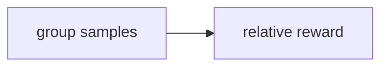

# OT: GRPO

Side folder. Group-relative preference update.

## Data
- Lab: `lab3_grpo_preference_alignment`

## Information
Not on the agent path.

## Knowledge
Run only if you are studying post-training.

## Wisdom
Skip for the 00–15 line.

## The When and Why
- **When:** you are aligning a small model.
- **Why:** calling a local server does not need this.

## How it works

## Data contract
reward: number

## Lab
- [lab3_grpo_preference_alignment.py](./lab3_grpo_preference_alignment.py) / [lab3_grpo_preference_alignment.md](./lab3_grpo_preference_alignment.md)

## Related
- **Chapter 12 evals:** the checker can be a reward.

## Notes
Moved from labs/10 lab3.
