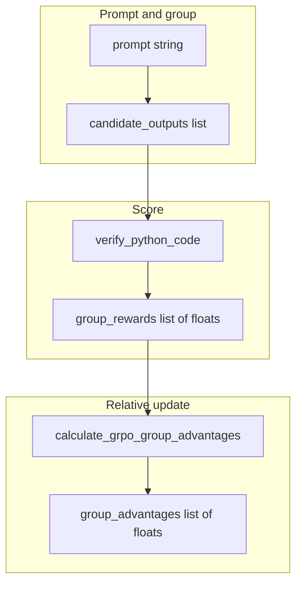

# OT: GRPO

This folder is optional. It is not on the 00–15 path. After this page you can name a group-relative preference update: sample several answers, score each one, then push the policy toward the ones that scored above the group mean. Finishing this page does not unlock chapter 15.

## Data
Three objects exist.

A **group** is several candidate answers for the same prompt. The lab uses four Python snippets for `is_even(n)`. They are hardcoded in [lab3_grpo_preference_alignment.py](./lab3_grpo_preference_alignment.py). A real GRPO run would sample them from a model.

A **reward** is one number per candidate. The lab uses `verify_python_code`: run the snippet, look for `expected_output` in stdout, return `1.0` or `0.0`. That is a checker, the same idea as chapter 12 evals.

An **advantage** is that reward minus the group mean, divided by the group standard deviation. The function is `calculate_grpo_group_advantages`. A positive advantage means "increase the chance of this answer." A negative advantage means "decrease it."

## Information
The only path on this page is:

prompt → group of candidates → reward per candidate → advantage per candidate → (intended) policy update

That is post-training. It is not an agent loop. It is not a POST to `http://192.168.1.29:11434`. Calling Ollama with `OLLAMA_MODEL=qwen3.6:35b-a3b-65k` does not need GRPO.

Chapter 12 can use a checker as an eval. This page uses a checker as a reward. Same number, different job.

## Knowledge
1. Confirm you are studying post-training. The 00–15 line never requires this folder.
2. Collect a group of answers for one prompt. The lab group size is 4.
3. Score each answer. `verify_python_code` returns `1.0` or `0.0`.
4. Call `calculate_grpo_group_advantages(rewards)` to get `A_i = (R_i - mean(R)) / (std(R) + 1e-8)`.
5. Stop when you can name `group_rewards` and `group_advantages`. Do not wire this into chapter 04 or chapter 15.

## Wisdom
Skip this folder unless you are aligning a small model. It is optional. Finishing it does not unlock chapter 15. Skip it for the 00–15 line. If you only need a model to answer, POST to `http://192.168.1.29:11434`.

## The When and Why
- **When:** you are aligning a small model with a group of scored answers.
- **Why:** calling a local server does not need this. Chapter 00 is a POST. This page is a train step.

## How it works



Walkthrough of one alignment step:

1. `GRPOAlignmentEngine.run_alignment_step` receives a `prompt`, a `candidate_outputs` list, and an `expected_output` string.
2. For each candidate it calls `verify_python_code(code, expected_output)` and stores a `1.0` or `0.0`.
3. It calls `calculate_grpo_group_advantages` on that list.
4. It prints each reward, each advantage, and whether the policy would increase, decrease, or stay.
5. It returns `status`, `group_rewards`, and `group_advantages`. The script does not update any model weights.

## Data contract
Intended output of a real GRPO step: a reward number per candidate, then a weight update.

What `GRPOAlignmentEngine.run_alignment_step` actually returns:

```json
{
  "status": "SUCCESS",
  "group_rewards": [1.0, 0.0, 1.0, 0.0],
  "group_advantages": [1.0, -1.0, 1.0, -1.0]
}
```

`group_rewards` is a list of floats (`1.0` or `0.0` in this lab). `group_advantages` is a list of floats of the same length. The hardcoded `is_even` group in `__main__` produces rewards `[1.0, 0.0, 1.0, 0.0]`. There is no HTTP request and no `OLLAMA_HOST`.

## Lab
Done when you can name `group_rewards` and `group_advantages` and say what a positive advantage means.

- Module: [this file](./03_grpo.md)
- Lab 3: [lab3_grpo_preference_alignment.py](./lab3_grpo_preference_alignment.py) / [lab3_grpo_preference_alignment.md](./lab3_grpo_preference_alignment.md) - score four snippets, print advantages.

## Related
- **Chapter 12 evals:** the checker can be a reward. Same float, used to score a run, not to train.
- **00_pretrain_tiny:** next-token loss. GRPO is a later preference step.
- **01_lora_qlora:** adapter train. GRPO can sit on top of an adapter. It is not required.
- **Chapter 00:** you usually just call.

## Notes
- Moved from `labs/10` lab3.
- Drift vs [lab3_grpo_preference_alignment.py](./lab3_grpo_preference_alignment.py): the intended contract is a reward number plus a policy update. The script never loads a model, never POSTs to Ollama, and never writes weights. Candidates are four hardcoded strings. `verify_python_code` runs each string with `subprocess.Popen` in a temp dir (`timeout=3`) and returns `1.0` or `0.0`. The return payload is `status`, `group_rewards`, and `group_advantages`.
