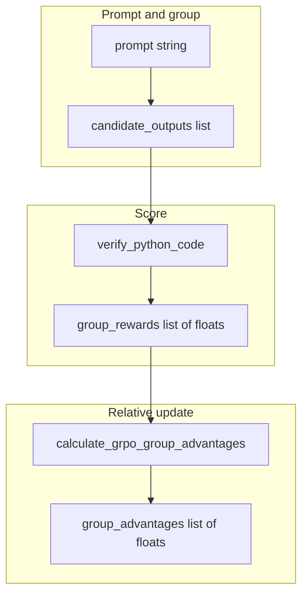

# Optional Training: Group Relative Policy Optimization (GRPO)

By the end of this module, you will understand how Group Relative Policy Optimization (GRPO) aligns language models by sampling a group of candidate completions, evaluating programmatic or reward-model scores, and optimizing policy updates relative to group baseline performance.

Traditional Reinforcement Learning from Human Feedback (RLHF) often requires training a separate critic/value model. GRPO eliminates the critic network by computing advantages directly relative to the sampled group mean.

## Data
**GRPO Alignment** operates on candidate completion batches:
- **Group Candidates ($G$)**: Multiple candidate completions generated for the same input prompt ($G \ge 2$).
- **Candidate Rewards ($R_i$)**: Scalar scores assigned to each completion (e.g. unit test verification returning $1.0$ or $0.0$).
- **Group Relative Advantage ($A_i$)**: Normalized scalar score calculated via:
  $$A_i = \frac{R_i - \text{mean}(R)}{\text{std}(R) + \epsilon}$$
  - $A_i > 0$: Increases the generation probability of candidate $i$.
  - $A_i < 0$: Decreases the generation probability of candidate $i$.

## Information
GRPO brings key advantages to reasoning and coding alignment:
- **No Critic Network**: Computing baseline statistics across the sampled group eliminates the memory and compute overhead of maintaining an auxiliary value model.
- **Outcome Supervision**: Automated test execution suites serve as deterministic, objective reward functions for coding and reasoning tasks.

## Knowledge
Here is the step-by-step procedure:
1. Sample a group of candidate completions for a prompt.
2. Evaluate each candidate using a reward verification function (`verify_python_code`).
3. Calculate group reward statistics (mean and standard deviation).
4. Compute group relative advantages ($A_i$) for each candidate.
5. Apply policy gradient updates to encourage positive-advantage completions.

## Wisdom
GRPO is the algorithmic breakthrough behind state-of-the-art reasoning models (like DeepSeek-R1). It allows models to discover reasoning strategies through verifiable outcome rewards.

## The When and Why
- **When**: Aligning models on verifiable reasoning tasks (math, code generation, logic puzzles).
- **Why**: GRPO delivers sample-efficient reinforcement learning without the complexity of training separate value models.

## How it works



Walkthrough of one alignment step:

1. `GRPOAlignmentEngine.run_alignment_step` receives a `prompt`, a `candidate_outputs` list, and an `expected_output` string.
2. For each candidate it calls `verify_python_code(code, expected_output)` and stores a `1.0` or `0.0`.
3. It calls `calculate_grpo_group_advantages` on that list.
4. It prints each reward, each advantage, and whether the policy would increase, decrease, or stay.
5. It returns `status`, `group_rewards`, and `group_advantages`. The script does not update any model weights.

## Data contract
Intended output of a real GRPO step: a reward number per candidate, then a weight update.

What `GRPOAlignmentEngine.run_alignment_step` actually returns:

```json
{
  "status": "SUCCESS",
  "group_rewards": [1.0, 0.0, 1.0, 0.0],
  "group_advantages": [1.0, -1.0, 1.0, -1.0]
}
```

`group_rewards` is a list of floats (`1.0` or `0.0` in this lab). `group_advantages` is a list of floats of the same length. The hardcoded `is_even` group in `__main__` produces rewards `[1.0, 0.0, 1.0, 0.0]`. There is no HTTP request and no `OLLAMA_HOST`.

## Lab
Done when you can name `group_rewards` and `group_advantages` and say what a positive advantage means.

- Module: [this file](./03_grpo.md)
- Lab 3: [lab3_grpo_preference_alignment.py](./lab3_grpo_preference_alignment.py) / [lab3_grpo_preference_alignment.md](./lab3_grpo_preference_alignment.md) - score four snippets, print advantages.

## Related
- **Chapter 12 evals:** the checker can be a reward. Same float, used to score a run, not to train.
- **00_pretrain_tiny:** next-token loss. GRPO is a later preference step.
- **01_lora_qlora:** adapter train. GRPO can sit on top of an adapter. It is not required.
- **Chapter 00:** you usually just call.

## Notes
- Moved from `labs/10` lab3.
- Drift vs [lab3_grpo_preference_alignment.py](./lab3_grpo_preference_alignment.py): the intended contract is a reward number plus a policy update. The script never loads a model, never POSTs to Ollama, and never writes weights. Candidates are four hardcoded strings. `verify_python_code` runs each string with `subprocess.Popen` in a temp dir (`timeout=3`) and returns `1.0` or `0.0`. The return payload is `status`, `group_rewards`, and `group_advantages`.
