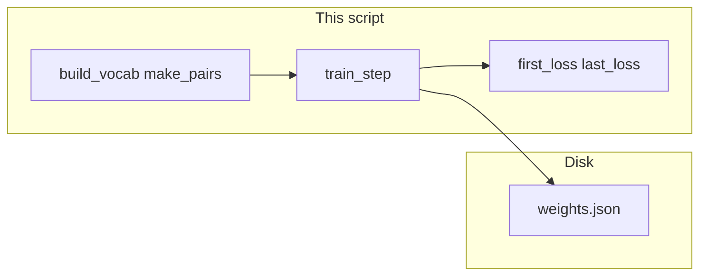

# Lab 0: Pretrain a tiny next-token table

A few strings are tokenized into character IDs. A CPU loop predicts the next ID, prints `loss` as a float, and writes a weight file. Loss goes down. There is no GPU and no Hugging Face.

## What you touch
- Script: `lab0_pretrain_tiny.py` (write it next to this brief; there is no reference `.py` yet)
- File: `weights.json` beside the script (`os.path.join(os.path.dirname(__file__), "weights.json")`)
- Texts: `aba`, `abc`, `cab`
- Functions: `build_vocab(texts)`, `make_pairs(texts, stoi)`, `softmax(logits)`, `train_step(W, pairs, lr)`, `train(texts, steps, lr)`
- `steps` is `40`. `lr` is `0.5`
- Print `first_loss` and `last_loss`. Confirm `last_loss` is smaller.
- CPU only. Use `math` lists (or `numpy` if you already have it). Do not import `torch`. Do not import `transformers`.
- No HTTP. This script does not read `OLLAMA_HOST` or `OLLAMA_MODEL`.
- This folder is optional. Finishing this lab does not unlock chapter 15.

## Steps


1. Write `build_vocab(texts)`. Collect sorted unique characters. Return `stoi` (char to int) and `itos` (int to char). For `aba` / `abc` / `cab` the vocab is `a`, `b`, `c` (size 3).
2. Write `make_pairs(texts, stoi)`. For each string, for each index `i` where `i+1` exists, append `(stoi[s[i]], stoi[s[i+1]])`. That is the next-token pair list.
3. Write `softmax(logits)`. `exp` each value, divide by the sum. Return a list of floats that add to 1.
4. Write `train_step(W, pairs, lr)`. `W` is a `V` by `V` list of lists (logits). For each pair `(i, j)`, take `logits = W[i]`, `probs = softmax(logits)`, add `-math.log(max(probs[j], 1e-12))` to a running sum. Then for each `k`, `W[i][k] -= lr * (probs[k] - (1.0 if k == j else 0.0))`. Return `loss` as the mean over pairs.
5. Write `train(texts, steps, lr)`. Build vocab and pairs. Init `W` as zeros (`V` by `V`). Call `train_step` `steps` times. Keep the first return as `first_loss` and the last as `last_loss`. Return `{ "first_loss": float, "last_loss": float, "W": W, "stoi": stoi }`.
6. In `__main__`, call `train(["aba", "abc", "cab"], 40, 0.5)`. Print `first_loss` and `last_loss`. `json.dump` `{ "stoi", "W" }` to `weights.json`. Confirm `last_loss < first_loss`.
7. Do not POST. Do not import `torch` or `transformers`. Do not start LoRA, GGUF, or GRPO.

## Data contract
Only the keys this script writes and reads.

**One train step**

```json
{ "loss": 0.0 }
```

**train return**

```json
{
  "first_loss": 1.098612,
  "last_loss": 0.4,
  "W": [[0.0, 0.0, 0.0]],
  "stoi": { "a": 0, "b": 1, "c": 2 }
}
```

The exact floats depend on the loop. `first_loss` on a zero matrix with 3 classes is about `math.log(3)` (`1.0986`). `last_loss` must be smaller.

**weights.json**

```json
{
  "stoi": { "a": 0, "b": 1, "c": 2 },
  "W": [[0.0, 0.0, 0.0], [0.0, 0.0, 0.0], [0.0, 0.0, 0.0]]
}
```

There is no request JSON and no HTTP route.

## Run
From the repo root:

```bash
python education/optional_training/lab0_pretrain_tiny.py
```

```powershell
$env:OLLAMA_HOST="http://192.168.1.29:11434"
$env:OLLAMA_MODEL="qwen3.6:35b-a3b-65k"
python education/optional_training/lab0_pretrain_tiny.py
```

This script ignores `OLLAMA_HOST` and `OLLAMA_MODEL`. They are listed so the lab Run block matches the other chapters. There is no HTTP call.

## What you should see
`first_loss` near `1.0986` (ln 3) and `last_loss` a smaller float. The path of `weights.json`. If `last_loss` is not smaller, `train_step` did not update `W` or `steps` is 0. If you see a Hugging Face download or a CUDA device, you added a stack this lab does not use. If you see a POST, you opened chapter 00 instead.

## Stop here
This folder is optional. Finishing this lab does not unlock chapter 15. Do not start a GPU train. Do not import `transformers`. Do not start LoRA, GGUF, or GRPO. Lab 1 in this folder is adapter math on a frozen base, not a pretrain loop.

## Notes
- Write `lab0_pretrain_tiny.py` next to this brief. There is no reference `.py` in the repo yet.
- `math` plus lists is enough. `numpy` is allowed. `torch` and `transformers` are not.
- Keys written and read match this brief. Do not edit other `.py` files in the repo.
